# session 17 of building The Joy in the open

## what this session is about: an answer shouldn't have to know who asked

Before writing another line of the reply channel I stopped to correct a shape I'd got wrong. Session 16 built the inbound side — the way an answer the kernel produces finds its way back to a terminal — but it built it as a *mirror* of the outbound side, and that mirror is the mistake. This session's first move is a design correction: cut inbound loose from the sender entirely, before it hardens into something the rest of the system has to work around.

## the coupling I'd built by mistake

The way it stood, the shell kept a durable store called *awaiting*: the moment a line I typed was truly delivered, its handle moved out of the outbox and into awaiting, and awaiting kept the kernel's message id **and a copy of the words I'd sent**. When an answer came back it was matched against that store and rendered next to the original words, so it could quote what it was replying to.

The trouble is that this makes receiving a strict echo of sending. An answer can only land if *this* shell is the one that sent the line and still remembers it. Nothing that wasn't a reply to a locally-typed line can ever arrive — not a kernel-originated nudge, not a message relayed from the World, not the "are you well?" probe. The inbound path was quietly bolted to the outbound path, keyed to what this device had said.

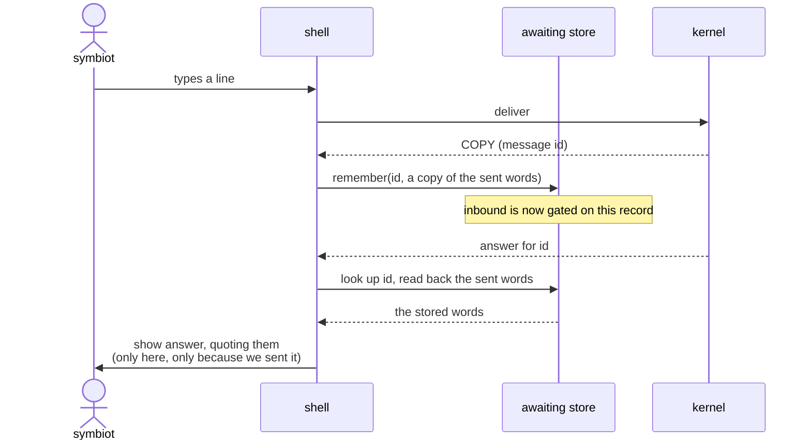

The giveaway is that the kernel's answer can't be shown until the shell reads back a record that only exists *because this shell sent something*. Inbound has no life of its own; it's parasitic on the send.

## the rule reached this session: inbound is decoupled from the sender

Inbound becomes its own channel — a general "messages for the symbiot" receiver — and it owes nothing to the outbound side. It is keyed only by the kernel's own message id. It does not know, keep, or care about who sent what, or whether anything was sent from this device at all. A message addressed inward arrives and is shown, full stop, in whatever terminal happens to be open.

Two consequences fall straight out of that, and both are the point rather than side effects:

**The shell no longer stores the sender's words.** That copy of the original line in the awaiting store goes away. Which forces the second decision, the one settled today: **when an answer arrives, the shell does not show what it was replying to.** The answer stands on its own terms; the question it answered is forgotten. No quoting, no stored referent, no bookkeeping tying a reply back to a line I once typed.

**Inbound accepts messages that are replies to nothing.** Because it isn't gated on a prior send, the same channel carries a kernel-originated nudge or a message from the World exactly as well as it carries an answer. That's what lets the proactive things already on the map — the staleness "are you well?" probe, the Dead Man's Switch, a World visitor's line — actually reach me later, instead of being locked out by a receiver that only listens for echoes of its own voice.

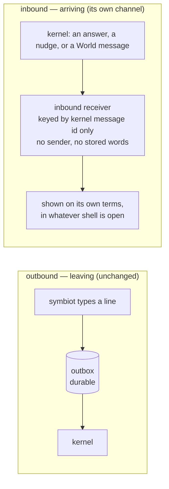

The two subgraphs don't touch. That separation *is* the decision.

## what this changes about the code already sitting uncommitted

The awaiting store as I'd built it is the coupled shape and doesn't survive this. Its whole reason for being — remembering the id *and the text* of a delivered line so an answer can be matched and quoted back — is exactly what's being cut. What replaces it is narrower: an inbound receiver keyed on the kernel's message id alone, holding no copy of anything the symbiot said. The reconcile-on-open sweep and the push handling stay, but they stop being "did my sent line get answered?" and become "is there anything inbound for me I haven't seen?"

## what the channel's two secrets are for: a payload only one browser can read

With the shape settled, one note on the channel itself, because it explains why a `reply_channel` row stores what it stores. A row is three things: an endpoint and two secrets. The endpoint is just the address — the push service URL to POST to. The other two, `p256dh` and `auth`, are the interesting part: they exist so the nudge the kernel sends can be read by that one browser and by nothing in between — not by the push service that carries it, which for Web Push is an untrusted relay by design.

The shape of it is a key agreement neither side ever transmits. When the browser subscribes it generates its own keypair and a random secret; it hands the kernel the public half (`p256dh`) and the secret (`auth`), and keeps the private half to itself. To send a nudge the kernel makes a throwaway keypair of its own, does an ECDH between its private key and the browser's public one to reach a shared secret, folds in the auth secret through HKDF to derive an AES key, and encrypts the payload with AES-128-GCM. It ships the ciphertext along with its own ephemeral public key. The push service relays an opaque blob. The browser runs the same agreement from its side — its private key against the kernel's public key — lands on the identical shared secret, derives the identical key, and decrypts.

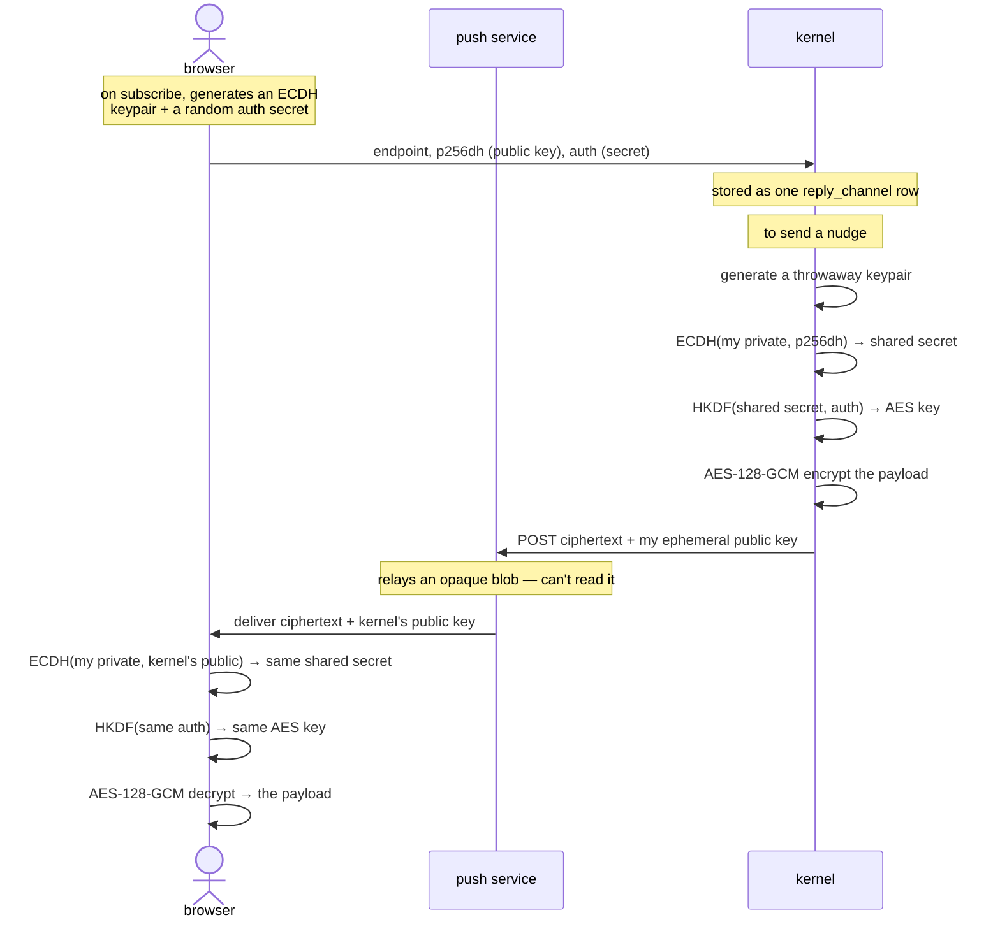

The reason the relay can't peek is that it never receives either ingredient of the key. The AES key is derived from two secrets. The first is the `auth` secret — and yes, that one is sent, but browser-to-kernel, over the subscribe request: it reaches the two endpoints allowed to read the message and never the relay carrying it. The second is the ECDH shared secret, and *that* one is sent to no one at all — each side computes it by combining a private key it never reveals with the public key the other side published, and elliptic-curve math makes both combinations land on the same value. So the push service is short both ingredients: it wasn't handed the `auth` secret, and it holds no private key to reconstruct the shared one. It sees two public keys and ciphertext, which is not enough — the payload stays sealed the whole way across.

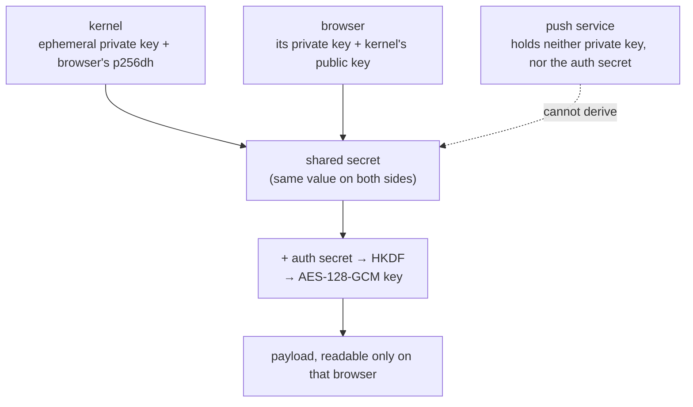

(There's a second, separate keypair in play — VAPID — doing a different job: it signs the kernel's request so the push service knows the sender is us and not anyone who scraped the endpoint. That's sender authentication, not payload secrecy — and it's why storing the endpoint in the clear isn't a leak.)

## the other terminal outcome: when a message is given up on

The channel above carries good news — "your message has an answer." But a message has two ways to end, not one, and the harder one to get right is the failure. If the work behind a message hangs, dead-loops, or crashes on every try, it must not sit in limbo forever waiting for an answer that will never come. So it walks a bounded loop and, once its budget is spent, reaches a *second* terminal state — `abandoned` — and that outcome is owed a nudge exactly as much as an answer is. The kernel that gives up quietly is the kernel that lies by omission.

A message keeps one durable status the whole way through. The happy path is short — `received → working → answered`. The unhappy one is a loop with a fuse: a failing attempt lands in `failed`, and each time it's claimed for work its attempt count ticks up. While attempts remain, the reconcile sweep sends it back to `received` for another go; once they're spent, that same sweep parks it in `abandoned` instead of retrying forever. Two resting states, then — `answered` and `abandoned` — and *both* fire a push. `failed` is never a resting state; it's the fork where the sweep decides retry-or-give-up.

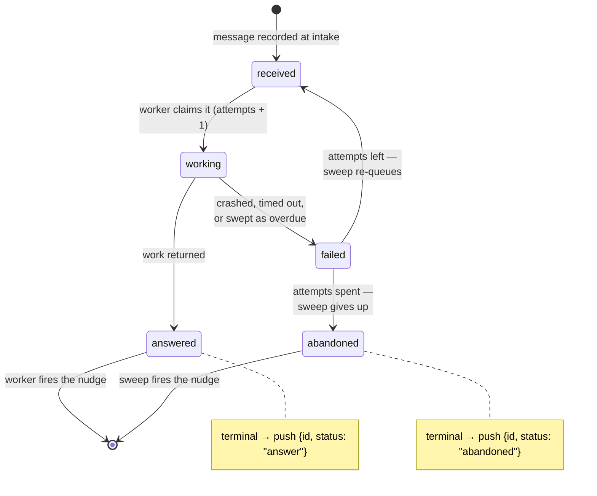

The two nudges are fired by different hands, and that's deliberate. An *answer* is something a worker produces, so the worker that just wrote it is the one that sends the nudge, the instant its own transaction commits. An *abandonment* is something no single worker can declare — it's a verdict over a message's whole history of tries, which only the referee that watches all the rows can reach. So the reconcile sweep owns it. That's also why `abandon_exhausted` hands back the *ids* it parked rather than a bare count: each id is a message whose channel, if it registered one, is owed the bad news, and the sweep loops over exactly those to send it.

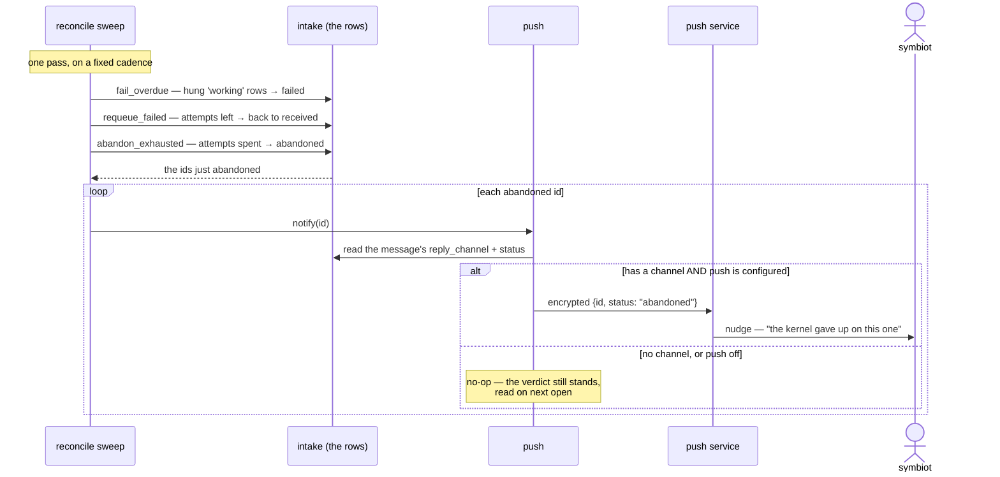

Two honest conditions gate whether the symbiot actually *feels* that nudge, and the diagram's `alt` branch is where they live. The message has to have carried a `reply_channel_id` from intake — one registered before any channel existed is abandoned in silence, its verdict waiting to be read on next open. And push has to be configured at all — with no signing key the send is a no-op and the whole out-of-band nudge is skipped, the reply channel degrading cleanly to poll-on-open rather than breaking. The abandonment itself always happens; only the announcement is conditional.

One thing this models that the code doesn't fully close yet: the sequence ends at "the push service delivers to the symbiot," but the last hop — the shell's service worker actually *rendering* an `abandoned` payload as something a human sees — is shell-side, and the shell is the very thing being reshaped this session. So the kernel half of the give-up nudge ships whole; the browser half is on the same owed-proof list as everything else here. And with `_produce_reply` still a placeholder that always succeeds, nothing fails in ordinary use today — the abandonment path is the backstop, built and correct, waiting for the day there's real work behind a message that can actually break.

## the decision became a diff — the kernel half of it

The sections above are a shape and an argument; this is where they turned into running code. One commit landed the whole kernel side of the reply channel, and it stands green under a suite that drives every path by hand. I want to be exact about what "the whole kernel side" means, though, because it is deliberately only a half: the *kernel* now speaks the decoupled channel, but the *shell* still doesn't listen on it. More on that gap at the end.

What shipped, in one breath: the intake table and its guarded state machine, a pool of workers that drain it, a killable child that runs the actual work under a deadline, the encrypted push channel the earlier sections described, and the wire-word catalog every route answers through. Each of those earned its own tests; the state machine alone is proven from a dozen angles — the guards, the two-worker race, the deadline sweep, the retry budget — because it's the piece the whole answer guarantee rests on.

## one slow message must not freeze the rest

Here's a concern the design sections skipped, because it only bites once there's code: what happens when the work *behind* a message misbehaves. The kernel answers with a *pool* of workers, not a single one, and that isn't a scale decision — it's a correctness one. Even for a lone symbiot, one message whose work hangs or dead-loops must never be allowed to sit at the head of the queue and freeze everything behind it. Several workers claim in parallel — and the claim is race-safe (`FOR UPDATE SKIP LOCKED`, so two workers can't grab the same row) — so a stuck message costs one worker, not the whole line.

But a wedged worker is still a wedged worker, so the work itself runs one level down again: in a *killable child process*, bounded by a deadline. That's the layer that actually frees the worker. The child has exactly three ways to come back:

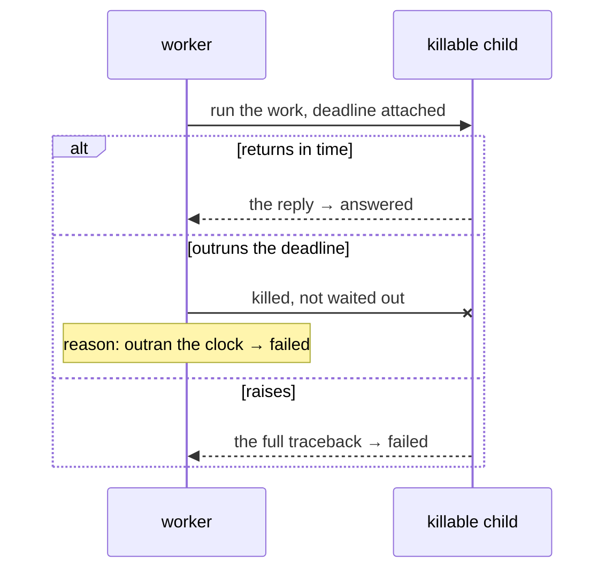

It returns in time and the reply rides back; it outruns the deadline and is *killed* rather than politely waited out, so a thirty-second hang doesn't cost thirty seconds; or it raises, and the whole traceback comes back as the failure reason, so a crash records *where* it broke and not merely that it did. A killed or crashed message isn't the end of the road — it lands in `failed`, where the sweep from the earlier section decides retry-or-give-up.

So there are two timeouts, nested, doing different jobs. The child's own deadline is the inner one: it frees the *worker* from a hang. The sweep's overdue pass is the outer backstop: it catches a row stuck in `working` when no worker is left to speak for it at all — a whole process gone, not just slow. The two even record different reasons, so a swept failure is told apart from one a worker reported.

## the wire learned radio discipline

One smaller thing this commit settled, and a characterful one: the words the kernel and shell say to each other are now military radiotelephony prowords — wherever an honest one exists. `/health` answers **loud and clear**; `/intake` acknowledges receipt with **roger**; a message still in flight reads **wait out**; `/status` is **authenticated** or **not authenticated**; `/logout` signs off with **out**. Where no proword honestly fits, the plain word stays — an answer is an **answer**, a given-up message **abandoned**, a stranger id **unknown**, and the bare host still greets you with **the ghost in the shell**. The gate was the whole discipline: radio-speak only where it genuinely maps, never bolted onto a token that has no business wearing it.

It reads as flavour, but it buys exactly what the rest of the protocol does. One catalog, in one file, that both ends read: the route that emits **roger** and the push nudge that reports an outcome draw from the same list, so they can't drift into two vocabularies for one shell. And the shell keeps its *own* copy of those literals to match on — on purpose, not by oversight. A contract wants two independent statements of the same word, one on each side; the day either side changes a word, the other's copy fails loudly and says so. Which is precisely how this commit's vocabulary change announced itself.

## the message the kernel speaks first — and where it lives

Closing the gap needed the kernel to do something it never had: originate a message *addressed to a symbiot*, owing nothing to a prior send. The first fork was where such a message should live.

Two shapes. A table of its own — a kernel→symbiot message, owned and seen-tracked, honest about direction. Or widening intake itself — an unsolicited message as an intake row that skips the queue and is born at the finish line: a new `origin = 'kernel'`, `status = 'answered'`, its text sitting in `answer` where a reply would be, addressed by a new `symbiot_id`, a `seen_at` null until shown. I reasoned my way to the second and built it: the transport for the kernel→symbiot direction already exists and is proven, so keeping one id-space and adding only *discovery* — an authed "what's waiting for me?" read and a seen flag — looked like the smaller change. It passed its tests.

Then the name stopped me. A table called `intake` — the act of *taking a message in* — now held messages the kernel had put *out*, on its own initiative. Read back cold, the word described half of what the table held. And under the name was the real tell: intake's two content columns are shaped for a question walking to an answer — the symbiot's line in `message`, the reply in `answer`. A message the kernel authors has no question, so it left `message` empty and smuggled its body into `answer`, and arrived already `answered` with nothing it had answered. The model was being stretched to fit, and that strain would quietly mislead every future reader the same way the name had just misled me.

So I moved it to a table of its own — a `missive`. Now each table means exactly one thing again: intake is the symbiot's line and its walk to an answer; a missive is a message the kernel raised, addressed to a symbiot, unseen until shown. The discovery route (`/inbox`) and the acknowledgement (`/inbox/seen`) hang off the missive table, and `/answers` goes back to reading only intake — which makes a missive *structurally* unreachable through that unauthed, guessable-id read. A missive crosses only through the identity-gated inbox, because that's the only door built to it.

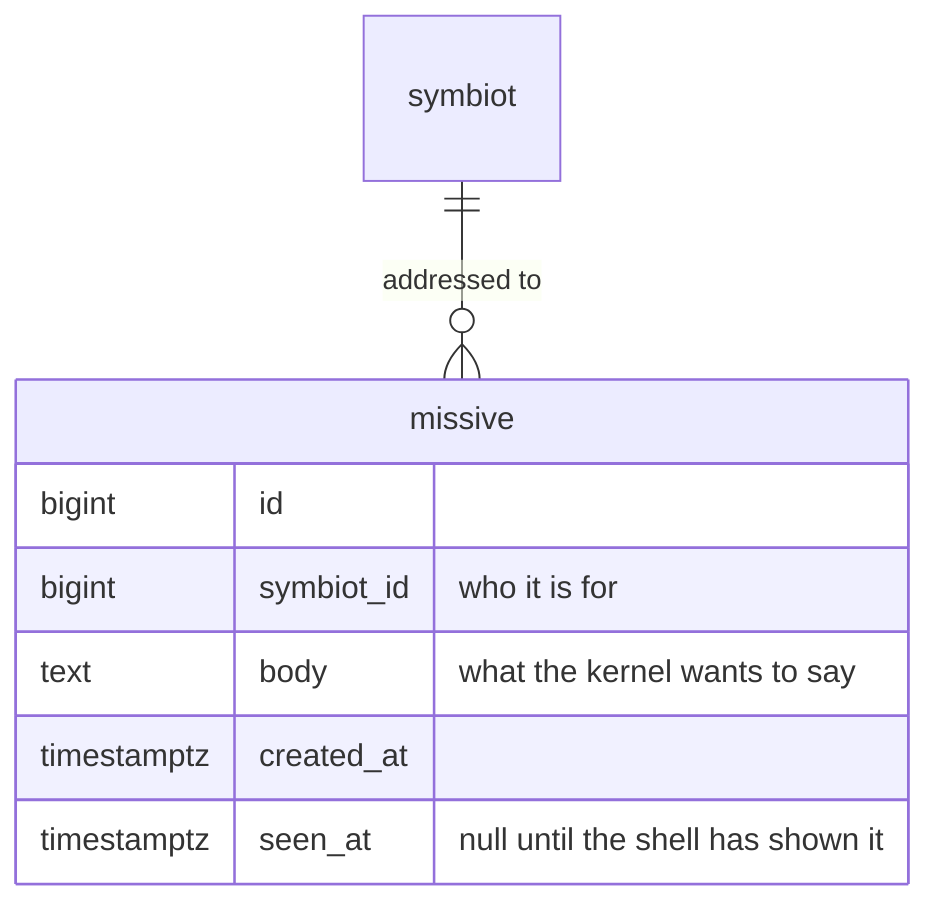

The reuse would have worked. The dedicated table is *true* — no empty column, no status born at a finish line it never ran toward, no name that lies — and a schema you can read without a footnote was worth a second small migration.

## reaching out over two channels, not one

A missive that only surfaces when the shell next happens to open is a message that might wait days. So it goes out over two paths, and the split is deliberate: first contact must never ride on a single thing holding up. The **record** is the guarantee — the missive is written durably, so `/inbox` surfaces it on the next open no matter what. The **push** is the speed — a best-effort nudge so it arrives promptly instead of only on next open. The push may be skipped entirely (notifications off, no channel, a dead one) without weakening the guarantee, because the record already stands. One act, `deliver`, does both.

For the push to find the right person, a subscription first had to learn whose it is. Until now a push address was anonymous, and that was fine for a reply: the shell names the channel per message when it sends one. But a missive names no channel — the kernel has to find the symbiot's channels by identity. So subscribing now adopts the caller's session when there is one (and never *un*-adopts: a later logged-out refresh can't strip a channel of the symbiot it already learned), and a missive's nudge fans out to every channel that symbiot has.

The nudge itself carries nothing — no id, no text. A missive's body never rides a third-party push service, the same rule the reply nudge already keeps; it says only *look at your inbox*. That has a neat consequence: the service worker, which holds no session token and so can't read the authed inbox, needs no secret at all. Its whole job on a missive push is to tell an open page to pull its inbox — or, if none is open, to raise a notification whose tap opens one, where the same inbox pull runs at launch. It surfaces either way, and the durable record means it surfaces even if the push never lands.

## where this leaves off

The kernel half of this is now committed and pushed. What landed in that commit: the `missive` table and, beside it, the column that ties a reply channel to a symbiot; the `/inbox` read and the `/inbox/seen` acknowledgement, both behind identity; `deliver`, the single act that records a missive and then nudges over both channels; a subscription that adopts its caller's session so the kernel knows whose it is; and the whole of it held down by tests — eighty-four passing now, covering the missive born addressed and unseen, the inbox scoped to its owner, a missive kept out of `/answers`, a subscription that adopts an identity without ever shedding one, a content-free nudge fanned to every channel a symbiot has. The kernel now speaks the whole channel, both directions.

The shell half — the inbox pull on open and on a nudge, and the service worker learning that a push can mean *look at your inbox* and not only *here's your answer* — is written and typechecks clean, but it hasn't been committed yet, and it hasn't been through the one thing no test here can stand in for: a real browser. The last hop rendered where a human can actually see it — a notification that fires, a tap that opens the terminal, a line that appears — is the same debt session 16 left. With the kernel side now shipped, that browser proof is the whole of what stands between this and done.

## the shell learned to listen — the other half of the channel

That gap is now closed in code: the shell half is committed and pushed. The kernel could already speak the decoupled channel both directions; this commit is the shell finally listening on it. It comes in three parts — turning the channel on, holding what arrives without holding what was said, and waking a background script to a nudge — plus a small tidy of the worker itself at the end.

### turning the tap on is a command, not an ambush

The first move is the one permission prompt, and where it lives is a decision. Notifications are opt-in and asked for *only when the symbiot types `/notify`* — never on first paint, never as the price of typing a line into the terminal. That keeps the two rights separate: capture stays frictionless and ungated (the right to submit is never gated), while "yes, reach me" is a deliberate, separate yes. The whole permission UX is a command, not a popup that jumps you the moment the page loads.

When it runs, `/notify` walks a handshake and reports every failure in plain terms, leaving capture untouched whatever happens: confirm the browser can do push at all, fetch the kernel's public VAPID key (`/push/key` — null means push is off server-side, and it says so and stops), ask the browser for permission, subscribe through the service worker with `userVisibleOnly`, register that subscription with the kernel, and keep the id the kernel hands back.

That kept id is the load-bearing part. It's written into the one store the page and the worker can both open — a small shared corner of IndexedDB — because the two run in separate JavaScript worlds that can't see each other's memory. The page mints the id; the worker spends it, tagging every `/intake` batch with it so the kernel knows which channel to nudge when the message settles. And the subscribe carries the session token when there is one, so the kernel can tie the channel to the symbiot — which is exactly what lets it push a *missive* it raised on its own, not only a reply to a line we sent. Logged out, the channel still registers and still gets reply nudges; run `/notify` again once logged in to link it.

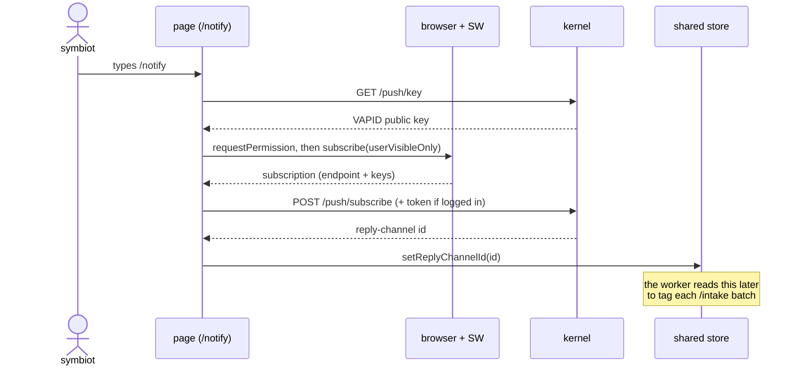

### the receiving store holds handles, not words

The inbound store is where session 17's opening argument — an answer shouldn't have to know who asked — finally becomes running code, and it's defined as much by what it refuses to keep as by what it keeps. It holds kernel message ids and nothing else: no copy of the sent line, no referent, nothing about what the symbiot said. An id is recorded when a batch is truly delivered (on a real COPY), and dropped the moment its message has been shown. That's the whole lifecycle — a handle to expect something against, forgotten once the something arrives.

Because the store holds no words, an arriving answer is printed on its own terms — a fresh line in the terminal, not a reply quoted next to the question it answered. The coupled *awaiting* store from earlier in the session, the one that kept the id *and* the text so it could quote back, is gone; this is its narrower, truer replacement.

### a push can now mean two different things

The service worker is a script the browser keeps alive in the background, off the page, and it's what a push actually wakes — even with no tab open. This commit teaches it that a nudge comes in two kinds, each naming its family in a `kind` field the worker switches on, and that neither kind ever carries content (nothing private rides a third-party push service):

- a **reply nudge** — `{kind: "reply", id, status}` — an answer to a line the symbiot sent. The worker fetches the real reply from the unauthed `/answers` (keyed by that id), hands it to any open terminal to render, and shows a notification.
- a **missive nudge** — `{kind: "traffic waiting"}` — a message the kernel raised on its own. It carries no id and no body, because a missive is discovered only through the *authed* `/inbox` — and the worker holds no session token, so it literally cannot read it. Its whole job here is to tell any open page to pull its inbox, and to show a notification whose tap opens a page if none is. Either way the same authed pull runs and the missive surfaces.

Both carry a `kind` on the same axis on purpose: the worker recognises each family by that one field and treats a `kind` it doesn't know — or a payload it can't read at all — as neither, falling through to a generic notification rather than guessing. A subscription is `userVisibleOnly`, so an unrecognised push still owes the symbiot a visible nudge; it just doesn't get to *act*.

The key honesty is that the push is never the guarantee — only the speed. Every push has a durable twin: a reply's id is tracked on delivery and reconciled on the next open regardless; a missive is written to its table and offered by `/inbox` regardless. So the shell reconciles on three occasions — on open, when the network returns, and when a backgrounded tab refocuses — and a push merely surfaces the same message *sooner*. A dedup by id (is this still tracked?) means a push and a reconcile racing each other never show one message twice, and an inbox ack that never lands just offers the message again — at-least-once, never a message dropped silently.

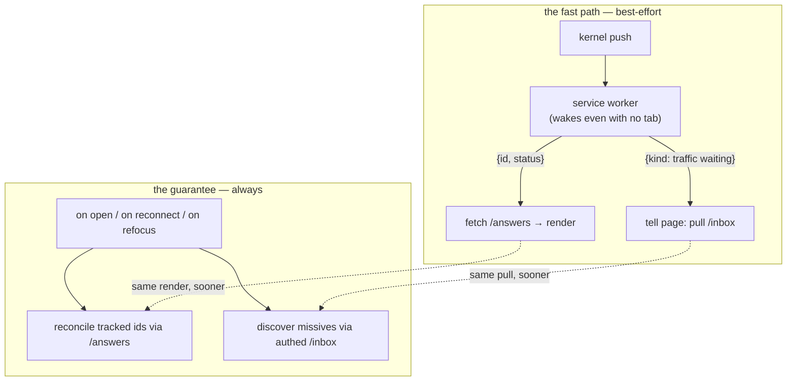

### and the worker itself got tidied

One smaller thing rode along. The worker had grown to hold both its event wiring and every behaviour those events trigger in a single file, and I split it in two: `sw.ts` is now only the wiring — it registers each listener and owns the event-lifecycle glue (the `waitUntil`/`respondWith` calls, the guards that read an event's own fields) — while `sw-handlers.ts` holds the behaviours those listeners delegate to: draining the outbox, caching the shell, handling a push. It reads better with the two concerns apart, and the split is invisible at runtime: the second build pass bundles both back into one self-contained `sw.js`, so the rule that a worker must register its listeners during initial evaluation still holds. Both the app config and the worker config learned about the new file so each is type-checked under the right lib.

### and the shell now points to its own source

The other small thing in these commits is a footer. The Joy is built in the open — three repositories, and the public build log you're reading right now — but the shell never said so from inside itself. Now three dim links sit pinned bottom-center, between the version tag and the connectivity dot: **shell**, **kernel**, **build**, each opening its repository on GitHub in a new tab. They're the footer's only real target — the version and connectivity furniture flanking them are read-only, clicks falling straight through to the terminal, while these re-enable pointer events on just the words. The same three URLs went into the shell's README as well, so the repo you land on names its two siblings too. A small gesture, but it fits the ethos: nothing here is hidden, so the thing itself ought to be able to point you at how it's made.

### where this actually leaves off

So both halves are now committed and pushed, and the channel this session set out to build is whole end to end in code. The one thing still unproven is the same one named above: a real browser doing the last hop where a human can see it — a notification that fires, a tap that brings the terminal forward, a line that appears on its own terms. That's not more building; it's the walk-through that comes next, on a fresh database, driving the whole path by hand.

### the walk-through ran, and it holds

That walk-through is done, on a fresh database against the live stack, and the last hop is no longer owed — it's proven. The service worker activated and took control of the built shell. Identity came up on a real emailed one-time code. `/notify` registered a push channel and, because it ran logged in, bound that channel to the symbiot — the tie a missive needs. A plain line typed into the terminal walked the whole loop and came back: a bright COPY on receipt, then the answer rendered on its own terms with a notification alongside it. And the kernel reached out first — a missive raised on the kernel's own initiative fired an out-of-band notification while the shell tab sat hidden, and the hidden-but-open tab, still a window client, took the worker's nudge and reconciled the *authed* inbox on its own, surfacing the missive and marking it seen without a tap. One branch went untested by choice: the fully-cold path where no tab is open at all and the notification's tap is what opens the terminal. Everything the two channels are for — an answer that finds you, a message the kernel starts — now works in a browser, not just in a test.

## finishing the completion guarantee: two last bricks in the kernel

The channel above carries answers back to the terminal. But the *guarantee* behind those answers — that every message the kernel accepts reaches an end, and that "answered" is only ever said when it's honestly true — had two bricks still missing on the kernel side. This dev laid both, and with them the completion half of the answer guarantee is whole: a message can no longer be lost to a restart, and a reply is no longer called delivered on a hopeful guess.

### a kernel that reclaims its own dead

The first gap was what happens to a message caught mid-work when the kernel itself falls over. A row sits in `working` while a worker computes its reply; if the process dies right then, that row is stranded — no worker left to finish it, no verdict coming. The machinery already had a deadline sweep that would eventually notice an over-age `working` row and mark it `failed`. But on a restart that verdict is a lie: the work didn't fail, the *kernel* did, and the message never got a fair run. Failing it — inventing a reason, spending a retry against a traceback that doesn't exist — records something that never happened.

The fix turned on a small, free signal. At the instant of a fresh boot, no worker of the new process exists yet — so every row still in `working` is, by definition, an orphan left by the process that died. No heartbeat, no lease, no liveness ping needed to tell a stranded row from a live one: the process boundary *is* the signal. So a one-shot reconcile runs at startup, before any worker begins, and sends each orphan straight back to `received` for a fresh claim — as if it had never been taken. Re-queued, not failed, because nothing about the work failed.

It stays honest about runaway work, too. The reclaim is bounded by the same retry budget as every other path, so a poison message that crashes the whole kernel on each attempt can't loop across restarts forever — once its attempts are spent it's abandoned, with a reason of its own (it has no traceback to carry, but an abandoned row must still say why). And the running sweep is left exactly as it was: while the kernel is *up*, an over-age `working` row genuinely is a hang or a dead worker, and failing-then-retrying is right for it. That's the whole reconciliation of the hang-versus-orphan question the step posed — it's answered not by inspecting the row but by *when* the row is seen: at boot it's an orphan to retry, while running it's a hang to fail. (This assumes a single kernel against the database. A second live instance's in-flight rows would look orphaned from here — but telling those apart is availability work, and it's deferred there deliberately rather than half-built now.)

### an answer isn't done until it's seen

The second brick is the one that ties directly back to the channel this session built. The outbox has a rule it never bends: the bright `COPY` appears only when the kernel has really received a line, never optimistically. The reply deserves the same honesty on the way back — "answered" should not mean *the kernel thinks it replied*, it should mean *the reply reached the human*.

There's a catch that shapes the whole design: the shell has to read the answer in order to show it, so the kernel can't withhold storing the answer until it's delivered — the reply must be readable first, and the confirmation can only come after. So the two facts are kept apart. `answered` stays a true resting state: the reply is produced and durable, readable through the pull-on-open no matter what. A separate mark, `delivered_at`, records the moment the shell confirms the outcome is actually on screen. The shell acks from the single place an answer (or an abandonment) hits the terminal — one choke point shared by the push path and the reconcile path, and bypassed by missives, which have their own seen-ack — so every showing confirms exactly once and nothing double-counts. And the shape is deliberately the same as a missive's `seen_at`, so "the human has seen this" reads one way across the whole schema.

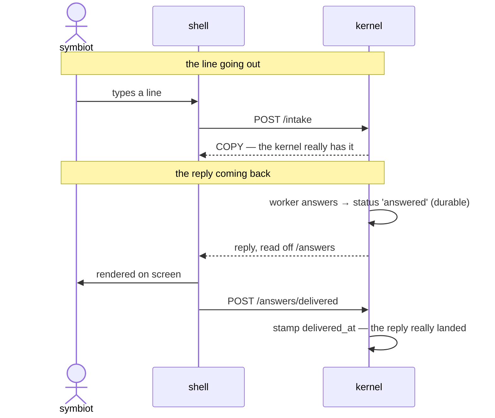

The two acknowledgements bracket the round trip: `COPY` proves the line reached the kernel, `delivered_at` proves the reply reached the person. The confirmation is best-effort but its error only ever runs one way — a lost ack leaves `delivered_at` null for a message that *was* shown, never the reverse — so a set `delivered_at` is always trustworthy, even if an unset one is merely unconfirmed. That safe direction is the same at-least-once honesty the rest of the system keeps: it will under-claim delivery before it will ever over-claim it.

### where the guarantee stands

With these two bricks, the completion half is finished end to end. Every message the kernel accepts now reaches a terminal outcome — answered, and confirmed delivered, or abandoned — bounded in time and in retries, its failures never silent, its in-flight rows recovered across a restart, and its reply marked truly out only once the terminal says so. What remains to the larger promise isn't completion any more; it's *availability* — keeping the runtime alive long enough to answer at all, which is its own work, and the home the multi-instance orphan question was handed to.

## one last rung before the mind: the reply that knows who's asking

Everything above makes sure a message is answered, and answered honestly. But there's a plainer thing the kernel still can't do: it can't tell who's talking to it. Type a line logged in, type a line as a stranger — both come back with the very same canned sentence. The reply is one flat string handed to everybody. Nothing in it turns on identity, because nothing in the answering path ever asks.

That's the gap this next rung closes, and it's deliberately small. No intelligence yet, no model — just the kernel giving a logged-in symbiot a *recognizably different* reply from an anonymous visitor, and doing so on its own authority. The point isn't the wording of either reply; it's proving that the distinction exists and that the *server* is the one drawing it. The shell already sends both kinds of line by the exact same path — no login nag, no gate on submitting — so a stranger's line is welcome and a symbiot's line is welcome, and which one it was is a fact the kernel decides after the fact, never something the browser gets to assert.

There's a wrinkle from how the answering path has since been rebuilt. Back when this rung was first written down, the reply was composed right there in the `/intake` handler, where the request — and so the session — is in hand; branching on identity would have been a two-line thing. But answering has since moved off the request and onto the background worker, which has no HTTP request and no session to read. So the "who is this" fact has to be caught at the one moment it's available — when the line arrives at `/intake`, session token in hand — and written onto the message itself, so that the worker, reading the row later with no idea who sent it, still finds the answer to that question waiting there. Three moves, then: read the session at intake, remember it on the row, branch on it in the worker.

It's a modest change, but it's the right one to lay before the intelligence layer rather than after — because "who am I answering" is the very first thing that layer will need to condition on, and this rung builds exactly the seam it plugs into. A canned two-way branch today becomes a real, identity-aware reply the moment there's a mind behind it.

### what landed on the kernel side

The three moves went in as planned. The intake row grew a nullable `symbiot_id` — who a line is from, or no one when it came in over no live session. The `/intake` handler now reads the request's session and stamps that id onto the row as it writes it; crucially it's the *handler* that decides, from the token, never anything the body carries, so identity can't be spoofed by the shell. And the worker's stand-in reply, which used to hand everyone the same string, now branches on that id: a recognized symbiot gets one line, an anonymous caller another. The claim that feeds the worker was widened to carry the `symbiot_id` alongside the message, so the fact stamped at intake rides all the way to where the reply is composed — the seam a real model will later read the same way.

The two placeholder replies are deliberately plain. A recognized symbiot's line comes back `good copy`; an anonymous one comes back `authenticate` — not a rebuff but a plain instruction, the shortest true thing to say to a caller the kernel can't yet place. Neither wording is the point; the point is that they differ and that the server alone chose which.

### the shell had a harder half than it looked

On paper the shell had nothing to do — it already submits authed and unauthed lines by the identical path, which was the whole reason this rung was "kernel-side only." But there was a catch hiding in *how* a line reaches the kernel. The shell doesn't POST `/intake` from the page; it hands the line to its service worker, and the worker sends it — that indirection is what lets a line survive the tab closing or the network dropping. And a service worker lives in its own world: it cannot read `localStorage`, which is exactly where the session token is kept. So the very component that talks to `/intake` was the one component that couldn't see who was logged in. Left there, every line would have gone up anonymous no matter who typed it, and the kernel's new branch would never once have taken the authed path from a real browser.

The fix is a small bridge. The shell already keeps one scrap of state in a store both the page and the worker can open — IndexedDB — for exactly this kind of hand-off (it's how the worker learns which push channel to tag). The session token now rides the same bridge: the page mirrors it there on login and clears it on logout, and the worker reads it from there to attach as a `Bearer` credential when it drains the outbox to `/intake`. `localStorage` stays the page's own fast copy; the IndexedDB mirror is the worker's window onto it. The token is still minted, held, and expired exactly as before — this adds a second reader, not a second source of truth.

It errs in the safe direction throughout. If the mirror write ever fails — private mode, storage disabled — the worker simply sends the line unauthed, which under-claims identity rather than falsely asserting it, and never breaks the page's own session. And the login flow now waits for the mirror to land before it prints "logged in", so by the time the symbiot can type, the worker can already prove who they are.

### proven, both ways

The kernel suite is green at ninety-seven, including new tests that pin the branch directly — a recognized caller and an anonymous one get different stand-ins — and end to end through the claim, so the identity is shown to survive record → claim → produce and not just the branch in isolation. The shell type-checks and builds on both its configs, page and worker alike. And the whole path was walked once against the live stack: the same line sent with no session came back `authenticate` with its row's `symbiot_id` left null, and sent under a real session came back `good copy` with the symbiot's id stamped on the row — the distinction drawn by the kernel, from the token, exactly where it should be. With this in, the plumbing is finished: the next thing to fill the seam is the mind itself.

### a QA red herring: the CORS error that was really a 500

Worth writing down in full, including a wrong first guess, because the symptom is a world-class liar. During the browser walk-through a line hung at `⋯ queued` and the console filled with the most familiar error in cross-origin work: *No 'Access-Control-Allow-Origin' header is present on the requested resource*, over and over as the service worker retried. The reflex is to open the CORS config and start widening it. That would have been chasing a ghost — the policy was never the problem.

The way to not chase it is to ask the kernel directly, with curl, before touching anything. A raw preflight — `OPTIONS /intake` with the shell's origin and the headers a browser would ask for — came back a clean `200`, echoing `access-control-allow-origin: http://localhost:4173` and, in the logged-in case, `access-control-allow-headers: content-type,authorization`. A plain `POST` returned `roger` the same way. So the kernel's CORS was correct, and my first written guess — that requests were crossing the `uvicorn --reload` restart window — was wrong: the failure was persistent and perfectly reproducible, not a timing fluke.

The tell was that curl succeeded and the browser didn't, every time. The difference wasn't CORS at all; it was the *body*. The browser's send carries a `reply_channel_id` — the push channel to nudge when the message settles — and my curls didn't. This browser still held a channel id in its IndexedDB from an earlier session, but the database had since been reset, so that channel no longer existed. Intake tried to write the new row with a foreign key pointing at a channel that was gone, the insert raised, and the request became a `500`. And here is the trap that turns a `500` into a phantom CORS error: an unhandled `500` exits through the framework's outermost error handler, which sits *outside* the CORS middleware, so it goes back to the browser with no `allow-origin` header on it. The browser can't see the `500` underneath; all it knows is the header it needed wasn't there, so it reports CORS. Curl, sending no stale channel, never tripped the insert and so never saw any of it. A curl `POST` that *did* include a bogus `reply_channel_id` reproduced the `500` on demand — that was the moment the real bug stood up.

The fix is to make intake tolerant of a channel that isn't there, which it always should have been. A client can carry a stale id — its channel pruned, or the database reset under a browser that still remembers one — and that's not an error, it just means there's no one to nudge. So the id is now resolved through a subquery on the way in: a `reply_channel_id` that names no live channel collapses to null, exactly as `ON DELETE SET NULL` already handles a channel deleted mid-flight. A stale channel costs the message its nudge, never its acceptance — which is the same rule the whole input layer keeps: a line is always welcome, whatever baggage the client sends with it. A regression test pins it: a `POST` carrying a dangling `reply_channel_id` now returns `roger`, and the stored row's channel is null rather than a `500`.

Two lessons outlast the bug. First, a browser CORS error against your own server is often a server error wearing a mask — because error responses skip the CORS layer, *any* unhandled `500` reads as "no allow-origin" from the browser. Prove the server with curl before you touch the CORS config; if curl draws a `500`, the problem is your handler, not your origins. Second, persistent beats the reload-window excuse: a failure that repeats identically isn't a timing artifact, and saying so in the log the first time would have been the honest read.

### and a QA finding that mattered more than the bug: replies weren't live

With the crash gone, the line went through and the reply came back — but only after a page reload. On the page, watching, you'd see `roger` and then nothing, until a refresh made the answer appear. That's a bad first impression, and it was pointing at a real confusion of roles. The push system had quietly been made to do a job that wasn't its own. Push exists for one thing: reaching you *when you're not on the app* — a notification that pulls you back. When you're already here, looking at the terminal, the reply should simply land under the COPY, and it shouldn't require a subscription a first-time visitor will never have granted.

The machinery to show a reply was already there and already correct: a reconcile that reads a settled answer off the kernel and prints it, shared by the push path and the on-open path alike. What was missing was a reason to *run* it while you sit and wait. It was wired only to events — open, reconnect, refocus — none of which fire in the seconds between typing a line and its answer being ready. So the answer existed, durable and readable, with nothing on the page going to fetch it until the next time the tab happened to wake.

The fix adds that missing trigger without adding a new subsystem: while a reply is still owed and the tab is actually being watched, the shell keeps running the same reconcile on a short cadence, and stops the instant there's nothing left in flight or the tab goes hidden. It's snappy at first and eases off, so the common case — an answer a few seconds out — lands almost at once, while a slow or stuck message doesn't turn into a drumbeat against the kernel. A refocus re-arms it, so a reply owed from before still surfaces the moment you come back. No kernel change; `/answers` was already the read this leans on. The result is three tiers that finally sit in their right places: the on-open reconcile is the guarantee that nothing is ever lost, push is for when the app is closed, and this new on-page poll is the live path a visitor gets for free — reply under COPY, no login, no reload.

And it holds in a real browser. The walk-through ran both ways against the live stack: a line typed logged out came back `authenticate`, and a line typed logged in came back `good copy` — each landing on its own, live under the COPY, with no reload and no push subscription in play. The identity-aware reply and the live path it rides in on are both proven where a human can see them, not just in a test. That closes the last rung before the intelligence layer; the seam is built and the next thing to fill it is the mind itself.

## the bedrock beneath the mind: every word kept, and kept unaltered

Each rung above ends on the same line — the next thing to fill the seam is the mind itself. But a mind is only as trustworthy as what it remembers, and before wiring one in it is worth being deliberate about the record it will read from. Everything the symbiot ever says to The Joy is the permanent ground the whole cognitive layer stands on: a parse can always be re-run, but an unstored sentence is gone for good. So the governing rule, earned the hard way in the first arc, is *when in doubt, keep the words* — verbatim, whole, forever, from the first entry; persistence never gated on whether the system understood the line; and nothing derived from the words (tags, slices, classifications) ever kept as a second source of truth, only recomputed on read.

Most of that is already standing, and standing correctly. A line typed into the terminal — anything that isn't a command — is written to the intake table the instant it arrives, before the kernel even answers `roger`, and no path anywhere edits the words after. So for the symbiot's *messages*, the record is already verbatim, already persist-first, already immutable in practice. What this pass does is narrow: turn "immutable in practice" into "immutable by guarantee", and draw the scope line where it belongs.

The scope line first, because it is a real decision and not a default. The full vision keeps *everything* the symbiot enters — messages, commands, every submission alike. This pass keeps only the messages. The commands — `/login`, `/help`, `/notify`, and the rest — stay unrecorded for now: capturing them well means a dedicated append-only diary and a channel to ship them, with the login email and the one-time code never written down, and that is a larger build that earns its own rung. Messages are the half that carries what the symbiot actually *says*, and they are the half already three-quarters built, so they are the honest thing to finish first.

Finishing them is four small moves, all on the kernel side, nothing in the shell. First, a new migration drops two guards straight onto the table where messages live: one that refuses any update which would change a stored message's text, and one that refuses to delete a message row at all — so *verbatim and forever* stops depending on every future writer's good behaviour and becomes something the database itself enforces one level down. The ordinary machinery that walks a message to its answer only ever touches its status and its timestamps, never its words, so nothing real is constrained — only a rewrite or an erasure of what was said. Second, tests that try to do exactly those forbidden things and confirm the database refuses, alongside a check that the normal claim-and-answer path still runs untouched — a guard is not real until something proves it stops what it is meant to stop. Third, a small tripwire for the derived-is-not-stored rule: a test that pins the exact set of columns the table is allowed to carry, so the day someone reaches to store a computed tag or a cleaned-up copy beside the raw words, it fails loudly and forces the deliberate choice to recompute on read instead. And fourth, the record itself — the note atop the module and the migration saying the immutability is now the database's promise and not a convention, so the next reader inherits the guarantee spelled out rather than inferring it from the absence of a line of code.

None of it adds a feature the symbiot can see; all of it makes the ground under the coming mind trustworthy — which is the whole reason to lay it before the mind and not after.

### what landed

All four moves went in, kernel-side and nothing in the shell. A migration drops two guards straight onto the intake table: a `BEFORE UPDATE` trigger that refuses any change to a row's message text — fired only when the words would in fact differ, so every legitimate status-and-answer transition sails through untouched — and a `BEFORE DELETE` trigger that refuses to remove a row at all. Tests then try each forbidden thing and confirm the database says no: an edit of the words raises, a delete raises, and a normal claim-and-answer walk still lands with the line verbatim and the reply stored beside it. A separate test pins the table's exact column set, the tripwire that will trip the day someone reaches to store a derived value next to the raw words. And the module docstring and the migration header now state the immutability and no-delete promises as the database's own, not a convention a future writer has to keep in mind.

One thing rode along, because the friction was real: the test harness now creates its `joy_test` database on its own if it's missing, instead of failing with a wall of connection timeouts until someone runs `createdb` by hand. The database-name guard already proves the target ends in `_test` before anything else happens, so the auto-create can only ever bring a *test* database into being — never touch a live one — and the migrations still build the schema inside it exactly as before. A fresh clone now just runs `pytest`.

The full suite is green — a hundred and two now — and the two triggers are confirmed live on the kernel's own database, not only in the test schema. The symbiot's words are kept verbatim, kept forever, and now the database itself is what enforces both. The diary is bedrock the coming mind can stand on.

## the mind's first piece is a voice — and the voice has a public half and a private one

With the seam built and the diary made bedrock, the mind can finally start going in. But the first thing a mind needs isn't knowledge or memory — it's a character. The Joy has to answer in a consistent voice across every session: a partner with a spine, one that pushes back where a corporate script would placate, the same stance every answer passes through rather than a tone picked fresh each reply. That voice is the persona, and before writing a word of it I want to be deliberate about a constraint that decides its whole shape.

The persona lives in **two prompts, not one**. The first is public and versioned in the repo, in the open like everything else in this project — it's the frame that holds the character and the stance, the non-pacifying spine the anti-pacification work leans on. And it carries a single placeholder, a slot cut into it on purpose. The second prompt fills that slot. It holds the private half: the intimate, personal context that colours the voice for one specific person — the things I, the first symbiot, and everyone who comes to The Joy after me, are not willing to hand to the outside World. That half never enters the repo and never crosses to the World. It's handled exactly the way the kernel's other secrets already are — local-first, kept on-device, sourced the way the credentials and the server secret are sourced, never committed, never logged, never shipped to the shell.

The split forces a shape worth naming now. The public half has to stand on its own: a fresh clone, or anyone reading the repo with no secrets in hand, still gets a whole and coherent persona — just without the private colour, the placeholder collapsing to nothing rather than leaving a hole. And because the private half belongs to whoever is actually speaking, it's private *per person*, not private once: one symbiot today, but shaped from the start so each future symbiot brings their own private half without the public frame ever having to change. The public frame is the character The Joy shows the world; the private slot is what makes that character someone's, in a way the world never sees.

This entry records the constraint, not the build — the shape has to be right before a single brick is laid. The organization comes next, decided before anything changes.

### what landed

The shape settled on files, not a database. The public half is a versioned file in the repo, `persona/public.md`; the private half is `persona/private.md`, gitignored, and it never leaves the box it's written on. Two config keys point at them, anchored to the repo root so they resolve the same whatever the working directory, and overridable by the environment like every other setting the kernel reads. That reuses the exact pattern the Gmail credentials already follow — a path in config, a file outside the repo — rather than inventing a new one. A per-symbiot table in the database is the right eventual home once the persona becomes one-per-person, but nothing today needs it, and one symbiot means one file is the honest smallest thing.

A small module, `persona.py`, is the one place that knows there are two halves. It reads the public file and splices the private half into the token cut for it, and it errs deliberately toward always returning a whole voice: if the private file isn't on disk — a fresh clone, a contributor with no secrets — the token collapses to empty and the public persona stands alone, no error. That graceful absence is the thing that lets the repo be genuinely public without the voice falling apart in anyone's hands but mine. Nothing reads the assembled persona into an answer yet; that's a later rung. This one only makes the two strings exist and assemble correctly.

Three tests pin exactly that and nothing more: the private half lands where the token was, an absent private half collapses cleanly instead of raising, and the token never survives into the finished voice either way — filled or collapsed. They follow the placeholder constant rather than hardcoding its spelling, so they stay honest if the token is ever renamed. The full suite is green at a hundred and five, and a live assembly against the real files confirms the private half splices in and no token is left behind. Git was checked too: it would commit `persona/public.md` and refuse `persona/private.md`, which is the whole point — the character in the open, the private colour kept home.

The voice now exists as stored words, public frame and private slot, waiting for the mind that will one day speak in it.

### the next step

Everything up to here has been laying ground — the seam that carries who-asked, the diary made immutable, and now a voice held as stored words. What's left is the thing all of it was for: the mind itself. The next rung is the wiring — the answer path stops handing back stand-in strings and instead assembles the persona, reaches into the diary for the slice of memory this particular reply needs, and composes a real answer in that voice. The persona built here becomes the lens every answer passes through, exactly as it was meant to; the memory work already underway is the other half. That's where the seam finally gets filled.
