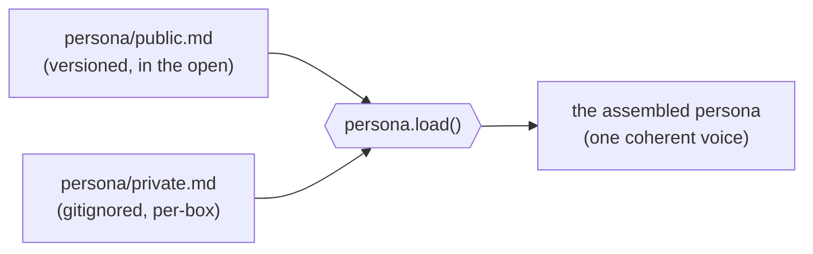
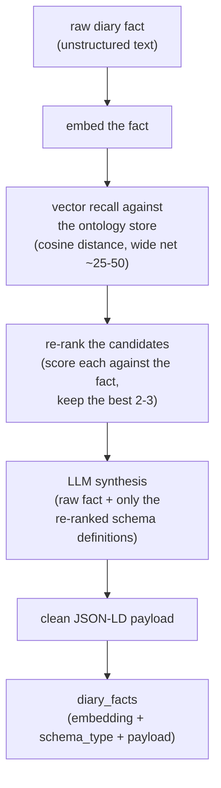

# session 18 of building The Joy in the open

## what this session is about: giving the symbiot a voice, split by who's allowed to read it

The kernel could already take a message in and hand an answer back, but the thing answering had no character of its own — it spoke in whatever default register the model underneath it happened to have. This session laid down the persona: the stance, the doctrine, the way the machine symbiot holds itself. And the first decision worth recording isn't *what* the voice says, it's how it's stored — because the voice is kept as two halves, split not by topic but by who is allowed to read it.

## one voice, two files

The persona is not a single text. There's a public half and a private half, and the seam between them is the whole point.

The public half lives in the repo, versioned like everything else, out in the open. It's `persona/public.md`, and it carries the character anyone can see: the communication protocol (answer first, no trailing pacifying questions, maximise signal density), the ICE stance (the symbiot as intrusion countermeasures around a human mind, absolute truth, zero therapy), and the execution rules (prove the action with real tool output before claiming it, spec mode for state-mutating work, no auto-deletion). This is the frame of the voice, and it's public on purpose — the same way the rest of The Joy is built in the open.

The private half never touches the repo. It's `persona/private.md`, gitignored, holding what the symbiot won't hand to the outside World — the per-box colour that stays between the human and his machine. It follows exactly the discipline the credentials and the server secret already follow: the box keeps it, git never sees it.

The public file has a single slot cut into it — a `{{ INJECT_SYMBIOSIS_CORE_PRIVATE }}` token — marking where the private half gets spliced in. Assembly is one splice: read the public voice, drop the private half into its slot, done.

## the rule: the voice is always whole, even with nothing private to say

The half that mattered most to get right is the missing one. A fresh clone has no private file. A contributor working on the kernel has no secrets on their box. That has to be a normal state, not an error — so an absent private file collapses the token to nothing and the public persona stands on its own. `load()` never raises for want of a private half, and the literal `{{ INJECT_SYMBIOSIS_CORE_PRIVATE }}` token never survives into the assembled voice either way, present or absent. The voice you get is always a whole, coherent one; the private half just adds colour when it's there.

The paths are anchored to the repo root so they resolve the same whatever the working directory, and both can still be pointed elsewhere by the environment (`PERSONA_PUBLIC_FILE`, `PERSONA_PRIVATE_FILE`) for anyone who wants the halves somewhere other than the default `persona/` folder.

## what this session is *not* yet

`persona.load()` assembles the voice; nothing reads it into an answer yet. That splice — persona into the actual reply the kernel produces — is a later rung. This session only settled where the voice lives, how its two halves come together, and that it degrades to the public frame gracefully when there's no private half to read. The tests cover the assembly both ways: with the private half present and spliced, and with it absent and collapsed.

## next: teaching the kernel to file a day into structure

With the voice settled, the session turns to the thing the voice will eventually speak *about* — the diary. The human symbiot writes days as they actually happen: unstructured, out of order, an infinite stream of chaotic little facts. "Hit the heavy bag for 45 minutes." "Rang my mother." "Slept badly again." The kernel needs to take that raw stream and file each fact into structure it can query later — dates, actions, people, observations — without the whole thing turning to mush.

The obvious way to do that is also the wrong way. There's a public vocabulary for this kind of structure — Schema.org, a huge library of types for describing things in the World. The naive move is to hand the model the entire library and say "pick the right type." But a library that size drowns the prompt, and a model asked to choose from thousands of types under-constrained will happily invent one that doesn't exist. Ontological bloat on one side, hallucinated schemas on the other. Neither gives us structure we can trust.

So the plan is to turn schema selection into a *retrieval* problem before it's ever a *synthesis* problem — two stages, and the order is the whole idea.

The first stage never asks the model to choose, and it works in two passes of its own. The first pass is cheap and wide: we embed the incoming fact and measure its vector distance against the whole ontology store, pulling back a generous pool of maybe twenty-five to fifty plausible candidates. That pass is tuned for recall, not precision — vector distance is fast and approximate, good at not missing the right answer but careless about exactly where it ranks. So a second pass re-ranks that pool, scoring each candidate against the raw fact more carefully and keeping only the best two or three. The cheap pass makes sure the right schema is *in the room*; the re-rank makes sure it's *at the front* before anything reaches the model. Both of those passes run on our own iron through Ollama, no external API in either one: the recall embeddings come from `nomic-embed-text`, and the re-rank is a small generative model, `qwen3.5:4b`, that reads the fact together with the narrowed candidates and scores how well each one actually fits — heavier per candidate than a distance measurement, which is exactly why it only ever sees the couple dozen the cheap pass already narrowed down to. Only then does synthesis begin: the model gets the raw fact and only those few re-ranked definitions, and fills the winning one in as valid JSON-LD. It never sees a type it could hallucinate, because it never sees more than the handful the two retrieval passes have already vouched for.

The store underneath is Postgres with `pgvector`, sitting on our own iron — the same sovereignty stance the rest of The Joy holds to, no hyperscaler in the loop. Two tables carry the durable text: `schema_ontology`, holding each type's name and its text definition; and `diary_facts`, holding each filed fact — its raw words, the `schema_type` it routed to, and the final JSON-LD payload as queryable JSONB. The embeddings themselves live apart, in their own decoupled storage (more on why further down); those vectors get HNSW indexing for the distance search, and the payload gets a GIN index so a filed day can be read back with plain Postgres operators. A GIN index — a generalised inverted index — is what lets Postgres look *inside* a JSON document rather than treating it as one opaque blob: instead of pointing a row at a single value the way an ordinary index does, it indexes each key and value held within the payload, so a query like "every fact whose type is an exercise action" stays fast even when the answer lives buried in the JSON rather than in a column of its own.

And the whole ontology gets seeded up front — every type, embedded on day one, not a hand-picked core with the rest phased in later. That sounds like the bloat we just set out to avoid, but it isn't, and the reason is the retrieval stage itself: no matter how many types sit in the store, the model still only ever meets the nearest two or three. Bloat was only ever a *prompt* problem, and cosine distance solves it before the prompt is ever built. A constrained start would have been guarding against a danger the two-stage design already removes — and worse, it would have hidden the exact failure mode we most want to see early, a fact routing to a near-miss type because its true type wasn't seeded yet. Seed everything, and every routing decision is honest from the first fact.

And "everything" turned out to mean more than Schema.org — but far less than the whole of Wikidata, and the line between those two is the point. Schema.org gives us the *shapes* a fact can take: that a thing is an exercise action, an event, an observation. A diary brushes against more than shapes, though — it touches the *kinds of things* the World is made of, the concepts running under a day: exercise, grief, travel, recovery. So a second source joins Schema.org — Wikidata — but only its concept layer: the definitions of *kinds* of things, not the hundred-million-row firehose of specific ones. Swallowing the entire dump was the tempting move, and it's the wrong one — not because retrieval couldn't stay honest against something that large (that bet holds), but because a *personal* diary has no business routing against the public World's specific people and places. "My mother" is not a Wikidata entry to resolve; she is mine, and she lives in the fact's payload, not in the shared vocabulary the fact is filed against. So the store stays a vocabulary of *meanings* — Schema.org's shapes and Wikidata's concepts — and inside that boundary it's still seeded whole, no hand-picked slice, for the very reason the paragraph before gave.

Neither source is frozen at seed time. Schema.org grows, Wikidata changes every day, and a diary routing against a stale picture of the World would slowly drift out of true. So a scheduled job re-pulls both — Schema.org's type definitions and the latest Wikidata concepts — re-embeds what has moved, and refreshes the store, unattended, on its own cadence. The World the diary files against stays a living one.

Embedding a corpus that size is an enormous amount of work, and it happens on our own iron: a local Ollama embedding model (`nomic-embed-text`) does it, no external embedding API in the loop, the same sovereignty stance as everything else here. Sovereignty is the principled reason, but there's a plainer one underneath it — cost. Embedding a concept vocabulary this size against a paid, per-token API would be ruinously expensive, and it isn't a one-time bill either: the scheduled refresh re-embeds what changes, over and over, for as long as the diary lives. The same goes for the re-rank pass, which fires on every single fact ingested. Metered externally, both would bleed money forever; run locally through Ollama, the marginal cost of an embedding or a re-rank is just electricity and the hardware we already own. Choosing local models is what makes seeding a vocabulary this size — and keeping it current — something we can actually afford to do. But leaning on a local model surfaces a constraint I wanted settled in the very shape of the tables, before a single vector is written — because the model itself will change. Better embedding models keep arriving, and the day we adopt one, every vector already in the store turns to junk. Embeddings from two different models aren't in the same space; a distance measured between them is meaningless. Worse, a `pgvector` column is fixed to one dimension, so a new model with a different output size can't even sit in the same column as the old.

The way through is to stop treating the vector as the precious thing. The precious thing is the *text* — the type definition, the entity's label and description, the raw diary fact. That text is model-agnostic and durable; it never depends on any embedding. The vectors are merely derived from it, and anything derived can be rebuilt. So the tables keep the text on its own, and push the vectors into their own decoupled storage where every vector is tagged with the model that produced it. Switching models then stops being a migration you fear and becomes an ordinary operation: embed the whole corpus afresh with the new model into its own set of vectors, standing beside the old, and flip a single "active model" pointer once the new set is complete and proven. Retrieval reads whichever set is active. Nothing is altered in place, nothing goes down, and the old vectors stay queryable right up until the moment the new ones are trusted. The model is a part we can replace; the design refuses to let that replacement cost us the corpus.

Deciding *that* the vectors live apart still left the question of how to carve up the place they live in, and the first answer I reached for was the wrong one. Since a vector column is pinned to a single dimension, it looked natural to split the storage by dimension — one table for everything 768-wide, another when a wider model turns up. Tidy, until you notice that two entirely different models can both emit 768 numbers, and under that scheme they'd land in the same table, under the same nearest-neighbour index. That index is a single graph, and every edge in it is drawn on the assumption that any two vectors in it can be meaningfully compared. Across two different models that assumption is simply false — the distance between one model's vector and another's is noise — so half the graph's shortcuts would be drawn through nonsense. A search would still return the right rows, because it can filter down to the live model, but it would be doing it by dragging a filter across a polluted graph: slower, and blind in patches. And it would be at its worst during a model swap, when both sets briefly coexist — the exact moment this whole arrangement exists to keep smooth. So the split follows the model, not the dimension: each model gets its own table and therefore its own clean index, a graph drawn over one coherent space and nothing else. The tables are named for the model that fills them — the first is simply the `nomic` set — and a new model arriving is a new set beside it, never a guest in an old one.

That leaves one thread to tie off, and it's the thread that makes the whole thing actually correct rather than merely tidy: every stored vector carries a stamp of which model produced it. On the writing side that stamp is provenance — it's what lets me look at a set and *prove* it's homogeneous, and what would expose a half-finished re-embedding as a table with two models' stamps mixed in it, before that mess could ever corrupt a search. But the stamp only pays off because retrieval honours the other half of the same rule: when a new fact arrives to be filed, it has to be embedded by the *same* model whose vectors it's about to be measured against. Ask the question in one model's language and search a store written in another's, and every distance you get back is meaningless. So the reading side reads the active-model pointer first, embeds the incoming fact with that model, and only then searches — and the stamp on every row it searches is the guarantee it's comparing like with like. Write it down at insertion, honour it at retrieval; the two halves are the same promise seen from both ends.

Two smaller truths about leaning on this particular model earned their place before a vector is ever written. The first: Ollama serves `nomic-embed-text` with its context window clipped to a couple thousand tokens, a quarter of what the model can actually read — and it clips in silence. Hand it a long definition and it still hands back a vector, just one computed from a truncated text, with nothing to say the tail was dropped. So the window has to be opened deliberately when we embed, or the back half of a long fact never reaches its own vector. The second: this family of models doesn't take bare text. It wants a prefix naming what the text is *for* — one marker for a document being stored, another for a query being asked — and the distance between two vectors only means what we think it means when that pair is matched. Omit the prefixes or cross them, and retrieval curdles in a way that reads like the model being stupid when really it was asked the wrong question. Neither is a schema matter; both live in how the seeder and the recall pass call the model. But both are the quiet, error-free kind of wrong that is cheapest to pin down now, while there isn't a single vector in the store to redo.

## the seed was the wrong economy: grow the vocabulary, don't pour it in

Everything above assumed the store arrives full — Schema.org and the Wikidata concept layer poured in on day one, kept alive by a quarterly re-parse. Sitting with the actual mechanics of that, the plan came apart, and it came apart for a reason worth writing down rather than quietly deleting.

The Wikidata dump is on the order of a hundred and thirty gigabytes gzipped, better than a terabyte unzipped, and streaming it to keep only the concept layer is hours of parsing on our own iron — not once, but every quarter, forever. That price would be worth paying if it bought correctness. It doesn't. Routing correctness is decided *at query time*, by the recall pass and the re-rank, over whatever the store happens to hold at that moment. A store pre-loaded with the whole World doesn't make the re-ranker sharper — it just makes it search a haystack that is almost entirely concepts this particular diary will never once touch. We'd be paying a terabyte of parsing, on a schedule, to carry vocabulary against the chance it might someday be needed, and the retrieval stage that was supposed to justify the seed is the very thing that makes the seed unnecessary.

So the seed dies, and the vocabulary grows from use instead. The two-stage router doesn't change; what changes is what happens when it comes up empty. A fact arrives, we embed it, and we search the ontology exactly as before — but now that same search is also the question *does this concept already exist?* If one of the candidates genuinely fits, the fact files against it, the way retrieval always meant to work. If none does, the model coins the type right there — a name and a definition — we embed it, write it into the ontology, and file the fact against the thing we just made. The store starts empty and fills with precisely the concepts this life has produced, in the order it produced them. No firehose, no hundred-and-thirty-gigabyte download, no quarterly job to keep a World current that the diary was only ever going to brush one corner of.

Which raises the question the whole thing turns on: who decides a fact *fits* an existing type rather than needing a new one? The tempting answer is the vector distance we already have — it's right there, it's a number, threshold it and move on. It's the wrong answer. Distance measures how *related* two things are, not whether they're the *same kind* of thing, and those two come apart all the time: a sprint and a marathon land almost on top of each other in vector space and are still plainly different kinds of act. So the distance search is only allowed to *nominate* — it pulls the plausible neighbours into the room and nothing more. The judge is the re-ranker, the generative model that reads the fact and the candidates and scores whether each genuinely categorises it. And when even the re-ranker is on the fence — a score in the grey band between a clear yes and a clear no — we spend one cheap, blunt question on a language model to break the tie: *does this type actually cover this fact, yes or no?* We coin a new type only on a no. The decision belongs to the thing that understands category, never to the thing that only measures nearness.

And when the answer is *coin one*, the model doesn't get to invent in the dark. We hand it the near-misses — the very types the re-ranker just turned down — and ask it not merely to name a new type but to place it: is this a *kind of* one of these? Coin "boxing_session," and if "workout_action" was sitting right there among the rejects, the new type is filed as a child of it rather than as an unrelated stranger. That one instruction is what keeps the vocabulary from sprawling into a flat heap of thousands of disconnected labels. It grows as a tree instead, each new concept hung off the nearest branch it belongs under — because the instant of minting is the one moment we have the neighbours in hand to hang it from.

The model-swap design above survives this untouched — text durable, vectors disposable, one clean per-model index, a provenance stamp written at insertion and honoured at retrieval. It simply operates now over a store measured in the concepts of a single life rather than the classes of the whole World, which turns a re-embed from a second terabyte of work into something that finishes in minutes. The lean store doesn't weaken the swap design; it makes it, and everything downstream of it, cheaper.

And we stop there on purpose — we do *not* try to make that coin-or-match call perfect. Chasing a flawless decision would mean stalling every write while we agonise over whether some barely-different type already exists, and that paralyses the one path that has to stay fast: getting the symbiot's words into the store. So we accept a fact instead of fighting it. Coined in a hurry, forward-only, the vocabulary *will* grow duplicates — "workout_action" on Tuesday, "training_session" on Friday, one idea under two names. Rather than prevent that at the moment of writing, we let it happen and tidy it up later, offline. A separate housekeeping pass runs on its own clock: it clusters the vectors to find the near-twins, asks a language model which ones are genuinely the same, picks a survivor, and folds the rest into it — sweeping every fact that pointed at a retired type onto the keeper in a single pass. Entropy on the way in, order on a timer. That trade is exactly why a fact points at its type through a real, rewritable reference the housekeeper can move, and why a retired type isn't deleted but left behind as a signpost to its replacement, so nothing that once pointed at it is ever stranded.

And a fact, it turns out, is rarely just one thing. "Boxing session with my friend Jeremy during the heat wave" isn't a boxing_session that happens to mention some weather and a name — it is, at once and equally, a boxing_session, a friends fact, and a heat_wave fact. So a fact is filed under every concept it genuinely touches, not one, and the nominate-judge-coin dance runs once per concept rather than once per fact: each concept that surfaces takes its own trip through recall, re-rank, and mint-if-new, and the entry ends up wearing however many of them it earned. That is why the tie between a fact and its concepts lives in a table of its own — one row per fact-and-concept pairing — instead of a column on the fact, which could only ever hold a single value. A single entry hangs off three concepts as easily as one, and each of those concepts is the same reusable citizen the next fact about friends, or heat waves, will file against in turn. The individual — Jeremy himself — stays in the fact's payload; what gets filed and shared is the kind, friends, never the particular person.

## from plan to migration: the store is written

Everything to here was reasoning; now it's a file that runs. Postgres moved onto the `pgvector` image on our own iron, the extension comes up in a migration of its own, and the ontology store lands in one more — six tables and two views, applied clean against a fresh database. The durable text sits in `schema_ontology` and `diary_facts` with no vector anywhere near it; the many-to-many between a fact and its concepts lives in `diary_fact_ontology`, one row per fact-and-concept pairing; and the embeddings live off in their own per-model tables behind the `active_*` views, each row stamped with the model that produced it. The whole model-swap discipline — text durable, vectors disposable, one clean index per model, provenance written at insertion — is baked into the shape of the tables rather than promised in prose.

Writing it down sharpened one thing the design had left slightly loose. The per-model vector tables are named for the model that fills them — the first set is simply `_nomic`. But the boundary that name really stands for isn't the model *family*, it's a single comparable vector space, and that is the model *and its version* together. A re-pulled model with changed weights is a different space even at the same dimension — the distances inside it no longer mean what the old ones did — so it earns its own set beside the old, adopted exactly the way a wholly different model would be. `_nomic` is today's shorthand for the one version this store has ever held, not a standing promise that every future nomic shares its table.

## first code on the path: the recall pass

With the store written, the plan starts becoming code — and the honest place to start is the front of the router, the recall pass, alone. Nothing downstream of it works until it does, and it's small enough to get exactly right before anything leans on it. Its whole job is to *nominate*: take a fact, or one concept pulled out of a fact, and hand back the ontology types nearest to it in vector space — a wide, generous net, no decision made. The re-ranker that judges which of those actually fits, and the minting that coins a new type when none does, are the next rungs; the recall pass only makes sure the right candidates are in the room, and refuses to do more than that.

It comes in two pieces with a clean seam between them. The first is the small Ollama client — the one place that turns text into a vector — and it exists mostly to carry the two quiet traps this model sets. It opens the context window to its full width deliberately, because Ollama otherwise clips the text to a quarter of what the model can read and says nothing; and it stamps every text with the prefix that tells the model whether it's a stored document or a query being asked, because the distances only mean anything when that pair is matched. Both live here and nowhere else, so the rest of the code never has to remember them. The second piece is the recall query itself, and it reads the ontology store through the active-model view rather than any named table — so the whole model-swap discipline the schema was built around costs the recall pass exactly nothing to honour: it asks the live set for the nearest neighbours and stays blind to which physical table that is.

One thing I'd first written down as a "tune it later" turned out to belong in the first version, and the reasoning is worth keeping. The nearest-neighbour index doesn't scan every vector — it walks a graph toward the query, keeping a working set of candidates in play as it goes, and how wide that working set is decides how much of the graph it explores before answering. Set it narrow and the walk can quit early and miss the true nearest types; set it wide and it wanders further and finds them, at a cost that is trivial on a store the size of one life's concepts. The default width happens to equal the size of the pool we ask back — which means the pass whose entire purpose is *not to miss* would be running with its working set pinched shut from the very first fact, not someday when the store grows. So the recall pass opens that width itself, per query, comfortably above the pool it returns. It costs nothing now and it's simply correct; there was never a reason to wait for "big" to arrive.

The bar for the next stretch is unchanged in spirit and sharper in fact: a single sentence — "hit the heavy bag for 45 minutes today" — landing as a clean, queryable exercise-action record, without the model ever meeting a type it didn't need. Only now, if that is the first fact this diary has ever seen, the exercise-action type doesn't exist yet — so the run that files it is also the moment the vocabulary learns the concept: coined, embedded, and filed against, all in the one pass.

## the recall pass runs, and the house gets rearranged

The recall pass is no longer a plan on the page — it's committed code with tests around it, and it does the one thing it promised. Handed that same "hit the heavy bag for 45 minutes" line and a store seeded with a few candidate types, it ranks `boxing_session` nearest and the unrelated kinds behind it — and it does so against real embeddings from the local model and the real index, not a stand-in. The embedding client and the recall query both landed, the client carrying the two quiet traps so nothing else has to, the query reading through the active-model view so it never once names a physical table. Running it also turned up one thing that only ever shows up when code actually executes: the database won't let the index's search-width be set through a bound parameter, so that setting goes in through a function call that takes one instead, scoped to the single query. A small correction, but the honest kind — the sort a design on paper can't tell you about.

Alongside the code, the kernel's own layout finally moved. It had been a flat heap of modules in one folder, fine when there were a handful and cluttered now that there are twenty, so the files split along the line that was already there in spirit: a `core` for the plumbing every feature leans on — configuration, the database, logging, the response envelope — and a `services` for the features themselves, from identity and intake and the worker through to the persona and the new ontology router. The one file that stayed exactly where it was is the entry point: the kernel is still started and deployed by the very same command, because that boundary is drawn for the reader's eye, not the machine's. Nothing about how the thing runs changed; it just got easier to find your way around before the router grows the rest of its phases on top.

## the decider: scoring the shortlist

Recall only ever nominates — it hands over a shortlist and refuses to choose. The next pass is the one that chooses, and it's the reason the whole two-stage shape exists. It reads the fact together with each shortlisted type's *definition* and scores, from zero to one, how well that type actually categorises the fact — and that score, never the vector distance, is what decides whether the fact reuses an existing type or coins a new one. Distance was only ever allowed to say "these are worth looking at"; this pass says "this one, and not that one." A generative model does the judging, prompted once over the whole shortlist rather than candidate by candidate, run with its thinking turned off and its answer held to plain JSON — this is a fast categorical call, not a puzzle that wants a visible train of thought, and one call scoring the couple dozen at once is cheap enough to spend on every fact.

The top score falls into one of three bands. High enough and the fact simply reuses that type; low enough across the board and nothing fits, so a new type will be coined; and a middle, grey band where the model is genuinely unsure — that one gets escalated to a single sharp yes-or-no question, the rung still to come. And the very first live run showed exactly why the pass earns its keep. Given "hit the heavy bag for 45 minutes," the cheap distance pass had pulled a rest-and-sleep concept in as its *second*-nearest neighbour — close in vector space because a body at exercise and a body at rest share a great deal of language, and yet plainly not the same *kind* of thing. The scorer read it and gave it a flat zero, while holding the boxing concept at the top. That is the whole argument for a second pass in one small result: the thing that measures nearness had the wrong answer sitting in second place, and the thing that understands category put it back where it belonged.
