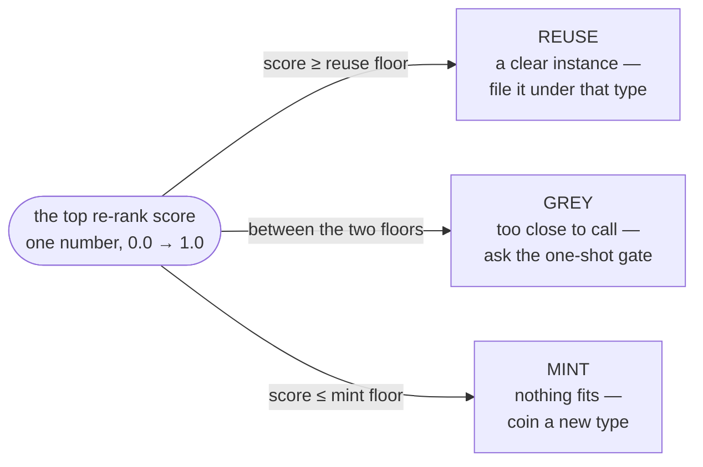
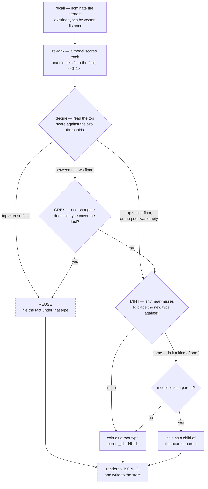

# session 19 of building The Joy in the open

## what this session is about: reviewing the decider before it decides anything real

The last session left the ontology router with two of its passes standing: recall, which nominates the nearest existing types to a fact and refuses to choose, and the re-rank, which reads the fact against each nominee's definition and scores how well it truly fits. This session didn't add a new pass — it stopped and looked hard at the one just written, because the decider is the hinge the whole two-stage design turns on. If the pass that chooses between reusing a type and coining a new one is even slightly wrong, every fact that follows is filed against a vocabulary that grew crooked. Better to read it cold now, while nothing downstream leans on it, than to find the crookedness later in a store full of facts. And the reading didn't end at reading — once the decider read as sound, the session went on to build the first rung that acts on its verdict, the grey-zone gate.

## the shape under review

The decide pass comes in three parts that sit cleanly apart.

The first is a shared generative client, kept in its own place so no caller ever has to remember how to talk to the model. It fixes three call settings once and for all: thinking off, because the re-rank is a fast categorical judgment and a visible reasoning trace would only cost tokens and latency; output held to a JSON object, so the reply parses rather than gets scraped; and sampling pinned to zero, so the same fact scores the same way twice. It fails loud on an empty generation rather than passing a half-read answer along as a decision. Every later judgment the router needs — the grey-zone tie-break, the minting, the final JSON-LD — is the same shape, a prompt in and JSON out, so they will all share this one client.

The second is the re-rank itself: one call scores the whole shortlist at once, and the scores map back to candidates by exact name. That mapping is deliberately strict in a way that makes a sloppy reply harmless — a name the model invents is ignored because it matches no candidate, a candidate the model forgets to score defaults to zero and simply falls to the bottom, and a score outside the range is clamped back into it. An empty shortlist never reaches the model at all; there is nothing to score, so nothing is spent.

The third is the band, and it is the hinge the whole design turns on. Everything upstream has boiled down to a single number: the top re-rank score, the model's read of how well the best candidate it saw actually categorises the fact — 1.0 for a clear instance of that kind of thing, 0.0 for unrelated. The band reads that one number against two thresholds and turns it into one of three verdicts, and it is worth being plain about why there are three and not two. The two ends are the easy calls. Score at or above the reuse floor and the fact clearly *is* an instance of a type the store already holds, so it reuses that type and no new vocabulary is coined. Score at or below the mint floor and nothing in the store genuinely fits, so a fresh type is coined rather than jamming the fact under a label that doesn't hold it. Both are safe to decide on the number alone because the number is unambiguous. The danger lives in the middle — a score too good to dismiss but not good enough to trust — and the third band exists precisely to name it. That is the *grey* zone, and rather than gamble on it (reuse a type that only half-fits, or coin a duplicate of one that would have served) the router refuses to decide on the score alone and hands the case to a later one-shot gate that spends a single yes-or-no question on the model. The entire reason for carving three bands out of one score is this: the system never has to flip a coin on the ambiguous middle — it can set that case aside and ask. An empty ranking, finally, is a mint by definition: recall offered nothing, so there is nothing to reuse and the concept is coined outright.

The whole band is really just this — one number laid on a line from 0.0 to 1.0, with two thresholds cutting it into three regions:

## the one thing the review caught, and the brick laid to close it

Most of the pass reads exactly as intended. The one gap worth writing down was not a bug in what was written but an assumption left unguarded. The two thresholds only make sense if the mint dial sits below the reuse dial, leaving a grey band between them. Nothing enforced that. A `.env` that crosses them — the mint ceiling set above the reuse floor — didn't fail; it silently collapsed the grey band and, worse, scrambled the order the bands are tested in, so a fact that clearly fits an existing type would get read as a mint and a brand-new duplicate coined instead. No error, no signal, just a store quietly growing wrong.

So the brick went in rather than onto a list. The config now asserts, the instant it loads, that the mint floor sits strictly below the reuse floor and both stay inside zero to one — and a box whose `.env` crosses them refuses to boot, with a message naming the two offending values, rather than starting up and mis-filing every fact that follows. The check lives at import, which on this kernel is the very first thing that happens on startup: it runs before the database pool opens and before a single worker spins up, so a misconfiguration is caught at the door, not discovered later in a corrupted vocabulary. It's the same instinct the neighbouring recall invariant is written in prose — the working set must stay wider than the pool — except this one silently corrupts data rather than merely dulling recall, so it earns enforcement in code, not just a comment hoping the next editor reads it. Verified both ways before moving on: the honest defaults import clean, and a deliberately crossed pair raises on the spot.

## a second tightening: the model's answer, typed at the source

Reading the re-rank again turned up something subtler than the threshold gap — not a bug, but a contract weaker than it needed to be. The generative client held its output only to "some JSON object," and the re-rank then spent real code defending against the sloppiness that looseness invites: a type the model invented was ignored because it matched no candidate, a score outside zero-to-one was clamped back in, a missing one defaulted to zero. All of that was catching a bad answer *after* the model had already given it. But the model never has to be allowed to give it. Ollama can be handed the exact shape the answer must take and will compile it into a decode-time grammar, so the model can only emit tokens that keep the reply conforming — the invented type and the out-of-band score stop being possible rather than being cleaned up.

So the contract moved to the source. Every call now names a Pydantic model: `type` drawn from a Literal of exactly the candidates offered, `score` a float pinned to zero-to-one. That model's schema is what Ollama constrains the decoder with, and the same model validates the reply on the way back into a typed object — so a broken answer raises at the boundary instead of slipping through as a half-read decision. The clamping and the ignore-the-unknown code are simply gone; there is nothing left for them to catch. The one thing a schema genuinely cannot compel is coverage — that the model scores *every* candidate, not just some — so that single defense stays: an unscored candidate defaults to zero and falls to the bottom, and it is now the only normalization the re-rank does. Worth being precise about what this is and isn't: Pydantic is not new to the kernel — it already validates every request that crosses the HTTP boundary, the whole of `core/dtos.py`. What changed is that the *model* boundary now gets the same discipline the *wire* boundary always had, and gets it from the first call rather than as a later tightening. There is no loose-JSON era to migrate off; the first fact the router ever scores is scored under a strict, typed contract.

## a rule the reading surfaced, now written down

Reading code cold does more than catch bugs — it makes you notice the shape the code has quietly grown into but never named. The decide pass lives across three files in the kernel's `services` package, and the reason it sits there rather than in `core` turns out to be a rule the whole codebase obeys without ever stating: the kernel's Python splits into two packages, and the dependency arrow between them only ever points one way. `core` holds the primitives everything leans on — how the kernel reads its config, talks to Postgres, shapes a request, speaks to the shell, logs — and knows nothing of any feature. `services` holds the actual work built on those primitives: identity, intake and its worker pool, and now the ontology router. The boundary is real because the imports keep it — `services` reaches into `core` freely, and `core` never once reaches into `services` — which is what keeps the foundation self-contained and cheap to test without dragging a language model or a mail client along with it.

That rule was load-bearing and entirely undocumented — visible only to someone who traced the imports, exactly as I'd just been doing. So it got written down rather than left as folklore: a short architecture note that states the split, places every module on its side of it, and gives the one-question test for where a new file belongs — does anything above it depend on this, or does it depend on the work above it? — with a pointer to it from the readme's front matter. No code moved; nothing needed to. The structure was already right. It just wasn't legible, and now it is.

## the first rung acts: the grey-zone gate

The one verdict that by design *can't* be settled on the score alone is the grey one, and rather than leave the decider producing a verdict nothing could yet resolve, this session built the rung that resolves it. The two ends of the band were always self-executing — a clear reuse files the fact, a clear mint coins a type — but the middle was carved out precisely so the system could refuse to guess, and a refusal is only honest if there's somewhere to hand the case. That somewhere is the gate.

It is deliberately blunt. When the top score lands between the thresholds, the router spends a single yes-or-no question on the model about the one candidate on the fence — *is this fact clearly an instance of that kind of thing?* — and coins only on a no. One question, one candidate, not the whole shortlist re-argued: by the time a case reaches the gate the re-rank has already ranked the pool, and if the best type the store could offer doesn't cover the fact, nothing beneath it will. So the gate weighs the fact against that single top candidate's name and definition, breaks the tie, and collapses the grey band into one of the two live outcomes — so no caller downstream ever has to hold a GREY and wonder what to do with it.

The gate crosses the model boundary under the same strict contract the re-rank does, with one simplification. The re-rank has to build its reply model per call, because the legal type names aren't known until recall hands back a pool. The gate's answer is a single boolean — `fits` — with no candidate names to fold into the grammar, so its reply model is written out once at module level rather than assembled on the fly. Same discipline either way: the schema becomes Ollama's decode-time grammar so the model can only emit a conforming reply, and that same model validates it on the way back; a verdict that isn't a clean boolean raises at the boundary rather than being coerced into a silent reuse-or-mint. Four tests hold it there, all against a faked model — a yes reuses, a no mints, the prompt is proven to carry both the fact and the one candidate's name and definition (so the judgment weighs meaning, not a bare label) and to pin the reply to the one-boolean schema, and a non-boolean verdict is proven to raise rather than slip through.

One smaller thing landed alongside it, worth a line because it's a rule this journal has started to keep. The router's comments had carried inline references to the build plan — this judgment "in phase 1b", that rung "coming in phase 1c" — and those came out. Code describes what it does now, not the transient plan that produced it; the roadmap narration belongs here, in the log, where a reader expects a story, not in a docstring where the next editor expects the plain truth about the function in front of them. Nothing about behaviour changed; the code just stopped pointing at a plan it can't rely on.

## a net sized to the reader, not the index

One more change landed while sketching the rung ahead, and it came from a plain question asked out loud: how many candidates can the re-ranker actually weigh well in a single call? The recall pool had been set wide — forty — on the reflex that wider is always safer for recall. But the re-rank scores the whole pool in one pass, and a small model gets sloppy asked to judge too many things at once: it starts leaving some unscored and reading others loosely — the very slip the coverage default was already quietly catching. The published experience with single-call scoring says the same thing bluntly: it is a short-list game, and the smaller the model the sooner a long list hurts it. So the net came down to twenty. Still wide — far more than the handful the re-rank will ever surface — but sized to what the model reading it can hold in focus, rather than to what the index could hand over. Recall is still the job; the pool just stopped buying width the reader can't use.

## the mint rung acts: coining a type in the light

The last verdict without hands was the mint — the call the router makes when nothing in the store genuinely fits and a fresh type has to be coined. This session gave it hands, and the whole of its care is in one refusal: a type is never coined in a vacuum. Rather than let the model invent a label off in the dark, the minter shows it the nearest existing types — the top three the re-rank scored, its sharper ranking rather than the raw vector order — and asks it to place the new concept among them: name one of those three as the parent if the new type is a more specific kind of it, or answer *none* and stand as a root. So the vocabulary grows as a tree, each new branch hung off the nearest limb already there, instead of a flat heap. Three neighbours is enough for a real parent to sit among them and few enough that the model isn't made to re-argue the shortlist it just lost — the same short-list discipline that sizes the recall pool.

The parent choice is held to the same decode-time grammar the re-rank's scores are. The reply model is built per call — the legal parent names aren't known until recall hands back a pool — with its `parent` field a Literal over exactly those three neighbour names plus the always-legal *none*. A parent the store doesn't hold simply isn't a token the model can emit, so the tree can never grow an edge to a type that isn't there; and the model can't dodge the question either, since the grammar admits only a real neighbour or an explicit root. The type's own name and definition are free text — that is precisely what we're asking it to coin — checked only for being present.

There are two doors to a root, and both were built rather than the one obvious path, because collapsing them would break the case that matters most. A new type gets `parent_id = NULL` — a root — in two quite different situations. The first is the cold store: the very first concept a diary ever sees, when recall returned nothing at all. There is no one to ask and nothing to place against, so the prompt doesn't even pose the parent question — it says plainly there's nothing to place under yet — and the type is minted as a root outright. The second is a store that answered but held no true parent: recall nominated neighbours, the re-rank lost them all, and asked *is this a kind of one of these?* the model says none. Same destination, `parent_id = NULL`, reached by asking rather than by having no one to ask. Writing mint as a single unconditional "pick a parent from the pool" call would have crashed on the empty list or prompted the model with nothing on exactly the first fact into an empty store — the one it is most important to get right — so mint branches on whether there is anything to place against before it ever reaches for a parent.

The last subtlety surfaces only when the coined *name* lands on one already stored. Minting is a judgment about meaning — nothing fit well enough to reuse — but the name it then invents is just a string, and it can collide with one a past fact already coined. The store forbids two types sharing a name, and rather than wriggle around that with a suffixed `_2` twin — manufacturing the exact near-duplicate an offline merge would later have to sweep up — the clash is read as the store saying *I already have this*, and the fact links to the existing type instead. The unique-name rule stops being an obstacle to route around and becomes the cheap dedup backstop it was always meant to be. Two clashes are guarded, for two different reasons: the model may deliberately name a type that already exists — caught by a pre-check that also spares a wasted embedding call for a row we would never write — and two mints may race to coin the same new name at once — caught by `ON CONFLICT` in the insert, so the database, not our timing, lets exactly one win and the loser reuses the winner's row. That second guard is the same instinct the whole kernel keeps: enforce the invariant in the database, not by hoping two things never happen at the same instant.

One ordering detail earns a line, because it is the kind that bites later. The definition the model coins must be embedded so the very next recall can nominate this new type like any other — and that embed is a network round trip to Ollama. It happens *before* the transaction opens, never across it, so a slow call can't pin a pooled connection with a transaction held around it; only the two writes — the type row and its vector — sit inside the transaction. Four tests hold the rung against a faked model: a root minted from an empty context, a child placed under a named parent, a name-collision resolving to reuse rather than a twin, and the parent grammar proven locked to exactly the neighbours offered plus none.

One cosmetic tidy rode in alongside the rung: the grey gate's two helpers were reordered so its prompt now precedes its reply model, matching the shape the re-rank and mint sections already keep — prompt first, then the model the reply must take.

## where we stopped

The decide pass, the grey gate, and now the mint are written, tested against a faked model, read through, and committed, with the one gap the review turned up closed by the boot check above. That is the honest stopping point: the router can recall a shortlist, score it into a match-or-mint verdict, break the ambiguous middle with a single yes-or-no question, and — when nothing fits — coin a new type in the light, placed as a child of its nearest neighbour or stood up as a root, its definition embedded so the next fact can find it. Reuse, grey, and mint all have hands now. What it still can't do is write a real fact end to end: a verdict knows which type to file under, but nothing yet links a fact to that type or renders the whole to JSON-LD. A misconfigured box, at least, can no longer boot into silently mis-filing facts.

## next: writing a fact end to end

With the mint in, every verdict resolves to a concrete type — reuse names one, mint coins one — but no fact yet travels the path whole. What remains is the fan-out into structure: a single fact is rarely one thing, so the nominate-judge-coin dance runs once per concept a fact touches, each concept filed through its own reference row, before the winning shapes are rendered into clean JSON-LD and the fact is written to the store.

The solid nodes — recall, re-rank, decide, the grey gate, and now the mint with its two doors to a root — are what's landed; the two dashed rungs are the fact-writing still ahead: linking a fact to the type it earned, and rendering the whole to JSON-LD. Nothing yet writes a fact end to end.

The bar for the next stretch is the same single sentence it has always been — "hit the heavy bag for 45 minutes" landing as a clean, queryable exercise-action record — but now carried the whole way: recalled, scored, matched or minted, and written, without the model ever meeting a type it didn't need.

## a decision: how thin the first synthesis is

Explaining the synthesis rung out loud turned up a question the plan had glossed. When a fact is rendered to JSON-LD, two quite different things go into that record, and only one of them is governed. The `@type` labels are the disciplined part — pointers into the coined vocabulary, the whole reason recall, re-rank, mint and the merge pass exist. But the *property keys* the record would carry alongside them — a boxing session's `partner`, its `duration` — are, in the obvious rendering, just whatever the model chooses to write. Nothing coins them, nothing dedups them. Which means the exact duplication the type vocabulary works so hard to prevent — `partner` today, `training_partner` tomorrow, `friend` the day after, all for the one relationship — leaks straight back in through the payload's field names, a side door left open behind the front one we bolted.

There are honest ways to close it, and they fork hard. One accepts the mess and reclaims it later, the same way the type store does — free-text keys now, an offline pass to merge the near-twins when it starts to bite. The other refuses the mess at the source by making properties first-class: a `partner` relation coined and routed exactly like a type, which is, in effect, a second ontology standing beside the first — for relations rather than kinds.

The decision is to build neither, and to keep the first synthesis deliberately thin. Not "neither yet" — neither, full stop, unless reality later forces the question. When a fact is written, its record carries only its `@type` links to the coined types and its own raw text — the words as the human wrote them — and stops there. No structured properties are extracted at all. The point of the next stretch is to get a fact travelling the whole path — recalled, scored, matched or minted, and *written* — and that path is complete and worth having with nothing in the payload but the type links and the source line. Structured fields are a separate feature with a real design fork under it, and the honest posture is that the fork may simply never be picked: the likeliest ending is that the raw text stays the home for particulars forever, the way it is the durable truth for everything else. The second ontology in particular — properties coined and routed like types — is the kind of thing that sounds inevitable on a whiteboard and turns out never to earn its keep against real records. So it isn't on the roadmap; it's an option held in reserve. The raw text stays the durable truth it always was, the types do the structuring, and whether the payload ever earns more structure is a question left for real records to force — if they ever do — not one to answer, or promise, now.

## the fact travels end to end now

The two dashed rungs are solid. A raw line now goes the whole way on its own: named into its concepts, each concept recalled, scored, and matched-or-minted, the winners rendered to JSON-LD, and the fact written to the store with a link to every type it earned. The bar the last stretch set for itself — "hit the heavy bag for 45 minutes" landing as a clean, queryable exercise-action record — is met, and met against the live models rather than a fake.

The front of the path is the naming step the fan-out always needed. A single call reads the raw line and names the *kinds* of thing it is about — a boxing session, time with a friend, a spell of heat — and pointedly not the particulars: "Jeremy" is not a concept, "45 minutes" is not a concept, they are details that ride along in the words. That is the same discipline the thin-synthesis decision turned on, only enforced a step earlier: the machinery files kinds, and the specifics stay in the raw text where they have always lived.

And the synthesis rung, once the decision was made to keep it thin, turned out to want no model at all. This is worth saying plainly, because it is a small lesson about the shape of the thing. By the time a fact reaches synthesis, both halves of its record are already in hand — the `@type` links are exactly what the routing just resolved, and the raw text is the line the human wrote. There is nothing left to *judge*, so there is nothing for a model to do. What the plan had drawn as "LLM synthesis" collapsed, under the thin decision, into a few lines of plain assembly: a deterministic step that cannot hallucinate, cannot drift, and cannot fail on a fact that a network call would have choked on. A choice about what to store quietly removed a whole inference call from the write path. The label on the box had outlived what was inside it; the box is now named for what it actually does.

One property fell out of the build that is better than it was designed to be. Because a coined type is committed the instant it is minted, the next concept to come through — whether later in the same line or in a fact written minutes on — sees it and reuses it. So a line that names the same idea two ways doesn't spawn two near-twin types to be merged away later; it coins once and reuses on the spot. The live run showed it whole: "hit the heavy bag for 45 minutes today" arrived to an empty store and coined an exercise type; "boxing with my friend Jeremy during the heat wave" then reused that very type for its boxing, coined fresh ones for the friend and for the heat, and left Jeremy in the raw text untouched. The vocabulary law — coin the genuinely new, reuse what is already there — held against real embeddings and a real re-ranker, not a scripted stand-in.

The automated suite proves the wiring with the local models faked at the network seam, so it stays fast and offline; the live round trip is proven separately, by hand, with a direct-run smoke that wraps the whole write in one transaction and rolls it back at the end — so it can exercise the real models against the real store and leave not a trace behind.

## the other half of the store: writing facts in vs reading them back out

Everything this session touched — recall, re-rank, decide, and the rungs still ahead of them — is one direction of travel: a fact coming *in*, being classified, and filed into the vocabulary. It is worth naming out loud, now that this write path is taking shape, that there is a second and quite separate direction the same store gets read in — pulling context back *out* to answer the human — because the two look superficially alike (both lean on the same vectors and the same vocabulary) and would rot into one tangled thing if the seam between them weren't drawn on purpose.

The write path is what this session is about. A raw line arrives, its concepts are named, each is recalled-scored-and-matched-or-minted, and the fact is filed as structured data against every type it earned. Its vector search is a *classification* — it is asking "what kind of thing is this line?" — and its product is a populated store.

The read path is the mirror image, and it runs when the human *asks* something rather than *tells* something. Its job is to load the right context to answer, just in time, and it is built in two tiers so the answer never waits on the slow, good retrieval.

The first tier answers immediately. It runs a fast lexical search over what's already stored — Postgres full-text search used to its full extent, ranking and fuzzy and trigram matching and all — and hands over enough to reply now. "Simple" here means lexical, not crude: it is everything the database can do without touching an embedding or walking the vocabulary, kept deliberately on the critical path precisely because it is cheap enough to belong there.

The second tier is the slow, good one, and it runs in the background, off the critical path: the deep vocabulary-and-embeddings retrieval that actually understands the question, complementing the first answer as a later second pass — but only when it genuinely adds something. The subtlety that makes this humane rather than jarring is what the late answer carries with it. Because it lands after the fast reply, and the conversation may well have moved on in the meantime, the enriched answer refers back to the fast answer it is extending, and carries the thread of what was said since — the messages in between, listed or summarised. That back-reference does two jobs. It lets a deepened reply arriving a beat later read as a considered second thought rather than a non-sequitur dropped into a conversation that already moved past it; and it is what lets the agent decide whether to bother at all — held up against everything that has happened since, the enrichment might no longer be worth sending, and the cheapest good answer is sometimes the one you don't send twice.

So the seam is clean. One path classifies a fact on the way in and files it; the other retrieves filed facts on the way out to answer. Same store, same vectors, opposite directions — and keeping the two named apart is what stops the write path's "which type is this?" from ever being confused with the read path's "what do I already know that bears on this?".
