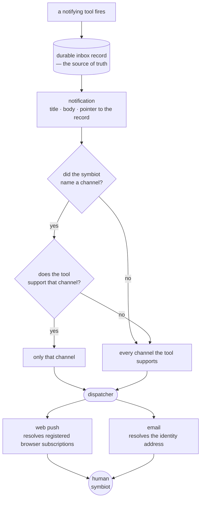

# session 22 of building The Joy in the open

## where session 21 left things

The last session closed the read-path rung: the loop now answers fast in its own voice, keeps a thread coherent turn to turn, files every message into the diary as it arrives, and reaches back by meaning a beat later to follow up only when the reaching earns the interruption. The whole conversational loop runs end to end, live. And it ends there on a single honest limit — everything the loop does is *words*. It answers, it follows up, it reaches through the diary and up through the Gist, but it has never once reached *out* and changed something in the world on the symbiot's behalf.

## what this session is about: the loop learns to act

This is the session that crosses that line. The work is tool-calling — the seam where the loop stops talking and acts — and the discipline it is built to hold is a single invariant: the model decides and describes; code does. The design was argued out and written down at the end of last session in `doc/tool-calling.md`: a real tool registry stood up now and populated with exactly one inhabitant, a one-shot reminder, so the machinery the second and tenth tool will reuse is born correct with its first tool rather than generalised later from a special case. The boundary rides the kernel's own structured-output path, never a provider's native function-calling API. So this session implements that spec.

## first, the clock: giving the symbiot a timezone of its own

Before the reminder, a smaller thing that the reminder forced into the open. I was reading the machine's replies and noticed it perceived time as UTC — an "this evening", a mention of the hour, all spoken in Greenwich time rather than mine, because the kernel had never once been told where in the world I live. Every clock it read was the server's. That was tolerable while the loop only reminisced, but a reminder cannot be built on it: "remind me tomorrow at nine" is meaningless until the machine knows whose nine, in which zone. So the clock had to be fixed first, and this was the moment to do it properly rather than paper over it.

The fix is to give the symbiot a timezone of its own, and to make it robust to my moving between them. I settled on an IANA zone name rather than a fixed offset, deliberately — an offset can't know about the summer-time shift and would drift half the year, whereas a name resolves to the right offset for the instant it's read. It lives on the symbiot row, defaulting to UTC so the perception of time is defined from the first boot and only ever narrowed to a real local zone once I say where I am.

And *how* I say it is the part I care about. I don't type a cryptic identifier; I name a place in plain words — "Tokyo", "just landed in New York", "back home in Strasbourg" — and the kernel infers the zone from it through one LLM call across the same structured-output boundary everything else here leans on. The model's answer is never trusted on its face: it's checked against the system's own timezone database, and only a name that database actually carries is ever stored, so a place it can't turn into a real zone comes back as an honest "couldn't place that" rather than a plausible-looking zone that isn't real. Switching zones is just re-naming where I am — the newest naming wins.

It's set through a shell command, `/timezone`, that is authed-only on purpose: a timezone belongs to a particular symbiot's perception of time, so there's nothing to offer a visitor, and the command is hidden from `/help` and from autocomplete until there's a session — not advertised, and refused server-side if typed without one anyway. With the zone stored, the reply path now gathers it alongside the memory on the worker's thread, resolves the symbiot's local "now" from it, and states that local time in the prompt, so the machine reasons about time in my day rather than the box's. The reminder can now stand on a clock that knows whose it is.

## the loop acts: the tool-calling machinery, born with its first tool

With the clock honest, the line I had been circling for two sessions got crossed: the loop learned to *act*. Everything it did before was speech — it answered, it followed up, it reached back through the diary and up through the Gist — but it had never once reached out and changed something on my behalf. The humblest thing to change that is the OpenClaw macro I miss most, "remind me of this at that time," and at that time, say it. But the reminder was the occasion, not the point. The point was to build the *tool-calling machinery* itself, correctly, and populate it with exactly one inhabitant — so the second tool and the tenth are a new registry entry rather than a rewrite of a special case that got generalised too late.

A tool is four things joined by its name: a name, a description, a Pydantic argument schema, and a code executor. The split is the whole design. The first three — the descriptor — live in the store as a searchable row with an embedding, filed the same way a diary fact is; the executor is code, in a registry keyed by that name. The store is the index you search, the code registry is the dispatch table you land on, and the name is the join between them. That is what makes "code executes, never the model" structural rather than a hope I keep: the model can only ever produce a *name*, and a name resolves to a callable I wrote, so an effect can never be a thing the model emits. And the boundary the model crosses to choose is the kernel's own structured-output one — the same strict-Pydantic-as-decoder-grammar every other call here rides — never a provider's native function-calling API, because those churn and I won't hang the internals on a surface I don't own.

The flow is retrieve, decide, act, speak, and it is one additive fork in the read path, invisible to almost every message. Before anything is composed, the message is matched against the tool catalog by meaning and by wording, and *that search is the gate*: nothing clears it, and the message is ordinary and takes the reply path untouched, no decision spent. Only when a candidate surfaces does a decision call happen at all — one lightweight call carrying just the shortlist and the recent conversation tail, not the full diary, because arguments refer back ("remind me about *that* at six" resolves only against what was just said) and because a routing-and-extraction judgment has no business paying for the whole memory. It names a tool and emits its validated arguments, or it answers "none" — and a "none" hands off to the ordinary reply, which *does* have the full memory to answer well. Keeping the two as separate calls is the deliberate cost: a message that looked tool-shaped but wasn't spends two calls instead of one, on the narrow set of messages that sit near a tool without invoking one. Worth it, to keep the decision cheap on every message and the reply memory-rich when it's actually a reply.

Two invariants I would not leave to chance. The executor's write runs on the worker's own thread, in its own transaction — never inside the killable child, because the child can be severed at the deadline mid-run and a half-done effect is exactly the thing the rest of the kernel is careful never to leave behind. So the shape is: the child decides, the worker thread executes, the child composes the confirmation. And the effect is exactly-once against the message that triggered it, pinned in the database the way everything else here is — the reminder's row carries the triggering message's id under a unique constraint, so a retried message re-runs the executor harmlessly, the second write conflicting and doing nothing while only the spoken confirmation is re-derived. Whichever way the fork goes — a tool fired, or a plain reply down either off-ramp — it always ends in something said back. No silent action, no dead end.

The first and only tool is the one-shot reminder. Its executor resolves the time to a concrete instant in the symbiot's timezone — the clock work from earlier this session earning its keep immediately — and stores it; when the time can't be read with confidence it stores nothing and asks rather than guessing, the reactive-ambiguity law kept at the point of action. And the firing is its own small sweep, the sixth background loop: it claims the oldest unfired reminder whose moment has come, raises the stored line as a missive, mirrors it onto the conversation stream, and stamps the reminder delivered — all in one transaction, so the send and the record commit together and a crash mid-fire re-fires nothing, exactly-once on the firing side too.

It is all under test and green — the catalog reconcile that keeps the store in step with the code registry, the gate, the flat decision schema, the executor's exactly-once and its ask-when-unclear, the fork's two off-ramps, and the firing. And the by-hand smoke stood the whole thing up against the live models, which is the only place the real behaviour is ever seen: a reminding sentence surfaced the tool, the heavy model read "tomorrow at 9am" into a concrete Paris instant a day out, the executor filed it, the confirmation came back in the machine's own voice with the right time in the right zone, and the reminder fired as a missive carrying the stored line. The loop reaches out now, on its own, and changes something in the world — and it does it through a boundary strict enough that the reaching stays code's, and the deciding alone stays the model's.

## making the reach actually land: missives surface live now

Driving the reminder end to end turned up the last gap, and it was not in the kernel but in the shell. The firing was right — the missive raised, the row stamped — but sitting on the page I never saw the ping; only a reload brought it up. The cause: the shell discovers a missive — a fired reminder, an enrichment follow-up, any line the kernel raises unprompted — only when it opens, refocuses, reconnects, or is nudged by a web push, and in dev there is no push configured, so with the tab open and focused nothing ever went looking. The live poll the shell already runs was no help here: it chases my *own* in-flight lines by the ids it kept at send, and a missive has no such id precisely because I never sent it.

The fix is the second delivery channel the rest of the build already insists on — provider-independence at the point of contact, never one channel holding up first contact. Beside the push nudge, the shell now runs a gentle background poll of the inbox while the tab is watched. Push, when it is configured, still surfaces a missive the instant it lands; the poll guarantees that even with push off — a visitor, a dev box, a browser that refused notifications — a reminder that fires while I am looking at the shell shows up within a beat rather than only on the next reload. It costs one cheap authed read on an interval, only while the tab is visible, and it mends not just the reminder but every unprompted line the kernel will ever raise.

## keeping the tool catalog swappable, and the gap that hid in it

One more thing surfaced when I stopped to check whether the tool catalog's embeddings follow the same model-swap discipline the rest of the store keeps. The shape does: a tool's description text lives in one table, its vector in a separate per-model table reached through an "active" view, so switching embedding models is the usual non-destructive move — build the new model's table, repoint the view, flip the active flag — never an edit to what already exists.

But I had left a gap in how that table gets filled, and it would have bitten precisely on a swap. The tool vectors are rebuilt by the startup reconcile, which I had written to be lazy: recompute a tool's vector only when the tool is new or its description changed, and otherwise skip it to save the work. That is sensible until you remember that switching the embedding model doesn't change a single description — the words are identical, only the model is new. So after a swap the reconcile would look at each tool, see the same description as before, and compute nothing, leaving the freshly repointed table empty. The search would then find no tool vectors, the gate would never open, and the tools would quietly disappear — no error, just gone. The diary and the ontology never hit this because their swap is a deliberate migration that re-embeds everything by hand; I had leaned on the reconcile instead, and its "skip if unchanged" shortcut was watching the description when the thing actually missing after a swap is the vector.

The fix was small, and it makes the tool catalog's swap story better than the others rather than worse: the reconcile now also recomputes when there is simply no vector for a tool in the active set. So the moment the view is repointed at a new, empty table, the next boot notices the missing vectors and refills them — the swap heals itself, with none of the hand-written backfill the older sets need. A test pins it.

## regrouping services: a folder that stopped fitting in one glance

With the reminder in, `services/` had quietly grown to two dozen modules sitting flat in one folder — around five thousand lines with no shape to them beyond alphabetical order. That's the point where a flat directory stops being a map and becomes a pile: you can't tell from the listing what kind of thing any file is, only its name. So I grouped the work into subpackages, and the axis I chose was the *role* a module plays rather than the feature it serves — because that's the vocabulary I already reach for describing the kernel out loud, and I wanted the tree to say the same thing the build log does.

Four folders. `adapters/` is the kernel's edge — the handful of modules where our own vocabulary stops and a foreign system begins: the generative and embedding provider calls, the model map, the email client, web push. Gathering them is the same instinct as the provider-independence rule that already runs through the internals: the border is the one place a provider's churn is allowed to live, so when an API shifts the blast radius is a single folder rather than a scattering. `memory/` is the durable store and the reaches into it — intake, the conversation stream, enrichment, the ontology router and its garbage collector, and the two diary reaches, fast-lexical and slow-semantic. `loop/` is deciding and speaking — the worker pool, the reply composer, the persona, the timezone, missives, and the killable-child execution the whole loop leans on. `tools/` is the act seam, the machinery and its first inhabitant. And `identity.py` I left sitting at the top level on purpose: it governs the *human's* sessions and one-time codes, which is orthogonal to the read path rather than a step along it, and forcing it into one of the four buckets would have been tidiness lying about structure.

The one real decision under it was how to carry the move. Nearly every import in the repo is the plain `from services import conversation` form, so I could have moved the files into folders and left a re-export shim in `services/__init__.py` to keep all those imports working untouched — zero churn at the call sites. I didn't, and the reason is the whole point of the exercise: a shim would keep the old imports alive while making the new folders *invisible* at every site that imports, which defeats the reason to draw the folders at all. The tree is supposed to show where a thing lives; a call site that still says `from services import conversation` when the file is in `memory/` is a small lie. So I moved the files honestly and rewrote all hundred-and-eleven import lines to name the subpackage they now point at — wide, but shallow and mechanical, and the kind of churn that's cheap precisely because the import style was uniform. The suite stayed green at 256 the whole way across, which is the only evidence that a rename this broad actually landed and didn't quietly break a seam.

One naming note worth keeping, because it's the sort of thing that reads as bikeshedding until you live with the word for a month: I first called the edge folder `boundary/`, and it was too abstract — it names the *concept* (the border of the kernel) rather than what the files in it *are*. `adapters/` says the plain thing: these are the translators to the outside. The tree should be read at a glance, and a glance rewards the concrete noun.

## the nudge that would have died on a sleeping phone

A plain question sent me back into the push channel: if I fully close the installed shell — the PWA quit, not just the window dropped — does a fired reminder still reach me? Answering it honestly meant reading not my code but the library's defaults underneath it, and two of them were quietly wrong for exactly the case a nudge exists to cover.

A Web Push carries a TTL: how long the push service — Google's FCM for an Android install, Mozilla's for Firefox — should hold the message for a device it can't reach at the instant of sending. The library defaults that TTL to zero, and zero means *"deliver this millisecond or throw it away."* No store, no forward, no retry when the device comes back. So every nudge I sent to a phone asleep in Doze, a laptop with the lid shut, a browser whose background process the OS had reaped, was discarded the moment it couldn't land — which is to say, discarded in precisely the situation an out-of-band nudge is *for*. The channel worked perfectly whenever I didn't need it and silently dropped whenever I did.

The second default was subtler. A push also carries an urgency, and the library sends none, which the spec reads as `normal` — the batchable tier that Android's Doze is explicitly allowed to hold back and hand over later, in some maintenance window of its choosing. Only `high` urgency is the tier Doze wakes for at once. So even a nudge that survived the TTL problem would arrive *eventually* rather than *now*, which for "a reminder firing" is its own kind of broken.

The fix is small and lives entirely at the one send: a real TTL — a day — so the push service stores the nudge and forwards it when the device next wakes, and `Urgency: high` so a dozing phone surfaces it immediately instead of folding it into a batch. A day is the right length because a late nudge here costs nothing: the push carries no answer text, only a content-free "there's traffic waiting," so a stale one that arrives hours later just wakes the shell to read whatever `/answers` or `/inbox` holds by then — the same poll-on-open it would have done anyway. Every existing test faked the send whole, so these two properties rode untested; a new one now sends through a captured `webpush` and pins both — non-zero TTL, high urgency — so the store-and-forward guarantee can't quietly regress into drop-on-miss again.

This doesn't make push a *guarantee* — nothing over a third-party service is — and it isn't meant to. It widens the window from "only if I happened to be reachable that millisecond" to "whenever I next wake," which is all a nudge can honestly promise. The guarantee still lives where the build already puts it: a second, independent channel at the point of first contact, so no single provider's delivery odds decide whether the reach lands at all.

## the deep reply that said itself twice

Something small kept nagging in longer stretches of talk: the deeper follow-up — the one that lands a beat after the fast answer, having reached into the diary by meaning — would sometimes arrive twice, or more, saying more or less the same thing each time. Not word-for-word, which is what let me rule out the shell double-rendering one message. The shell surfaces a reply through a few routines at once with no lock between them, and that race is real, but it would show an *identical* line, and this wasn't identical — it was the same *thought*, re-reached and re-said. That puts it on the kernel, in the enrichment pass, not on the wire.

The cause was a blind spot in what the pass is allowed to look at. The enrichment unit is a single message: every line the symbiot sends becomes its own answered row, and each independently earns its own deep pass. To decide whether a follow-up is worth the interruption, the pass read the message, its fast answer, and the turns exchanged *since* — and it judged "is this new?" against that fast answer alone. But two close-together messages ("I'm wiped" … "still so tired") are alike enough that the deep reach pulls back the *same* diary facts for both, and each composes the same follow-up. The gate waved both through because neither had any idea the other was ever sent: the follow-up to the earlier message carries a lower id than the later message, so the "turns since" window, which only ever looked *forward*, stepped straight over it. The one leg that could have noticed "I already said this" was the one that wasn't allowed to see it.

The fix is two moves that lean on each other. The first widens what the pass sees. Instead of the forward-only "turns since," the third leg of the origin reference is now the recent conversation tail — the same verbatim tail the fast reply already reads, the one that carries missive bodies — with this exchange's own two turns dropped. So a follow-up already sent on this ground sits right there in front of the gate, and the compose prompt names it and forbids repeating it, exactly the way it already forbade restating the fast answer. Novelty is judged against everything said recently now, its own earlier deep replies included, not against a single answer in isolation.

The second move closes the gap the first would leave open under concurrency. The enrichment claim — the advisory lock a pass takes so no two workers race the same work — was keyed on the *message*; I moved it to the *symbiot*. Only one deep reply forms at a time now, so a second message can't be composing its follow-up while the first is still in flight and unrecorded, seeing nothing and repeating it. Today the sweep runs single-file anyway, so it is the widened window that does the visible work; but the moment enrichment ever runs more than one pass at once, the per-symbiot lock is what keeps that widened window honest — the earlier follow-up is always committed and on the stream before the next pass weighs against it. The two together are the whole of it: the machine sees what it has already said, and isn't forming two answers at once while it checks. The suite pins both — an earlier follow-up with a lower id now surfaces in the origin reference, and a held symbiot claim makes a second pass send nothing and record nothing.

## one channel is a poor promise: the notification layer, designed

The push fix above bought a wider window, but it never stopped being *one* channel over *one* third-party service, and the honest limit of that section is that widening a single channel's odds is not the same as not depending on it. The build already answers this everywhere else it matters — a second, independent channel at the point of contact, so no one provider decides whether a reach lands — and I had left the reach to the symbiot leaning on push alone. Meanwhile the kernel already knows how to send email; it just never used it for anything but a login code. So the next rung names itself: stop treating "reach the human" as "send a web push," and make it "send a *notification*," where a notification is channel-agnostic and fans out across every channel the symbiot has. I designed it before building it, the way the tool-calling seam was designed before it was built, because the shape it launches with matters more than its first inhabitant.

The rule I settled on is one rule, not two. Every notification goes to every channel the triggering tool supports, by default — the double-up made structural rather than hoped for. A tool owns its own list of supported channels, which need not be all of them. And the human can narrow it in plain language at the moment of asking: "remind me by email", and if the tool that fires supports email, only email carries it; name nothing, or name a channel the tool doesn't speak, and it goes everywhere the tool can reach. A channel named in a sentence that triggers no tool is just idle words — the opt-in only means something when it rides a tool, because that's the only place the request has somewhere to be carried. The part that pleases me is that a tool's supported list does double duty: it constrains the schema field the request lands in, so the model can never pick a channel the tool doesn't support, and it's the set the default sweep fans across. One list, both jobs, no way for them to drift apart.

The hardest call was whether a channel may carry the real content or only a content-free knock, and following it turned my own instinct inside out. Web push here had always been a doorbell — the nudge says "traffic waiting", carries no words, and the shell wakes to read the real thing from the authed inbox — and I had held that as the private choice. But email breaks the symmetry that made the doorbell look free: an email has nowhere to poll back to, so the mail *is* the delivery, and a "go open the app" email is a thin thing to receive. Chasing that led straight to the inversion. A web push payload is end-to-end encrypted — the push service relays ciphertext it can't read — while a Gmail message sits in plaintext on Google's servers for good. So the channel I had kept content-free is the *more* private of the two, not the less. Once I accepted reminder content in my own mail, keeping the encrypted push starved of content was caution guarding nothing. So both channels carry the real content now. The two reasons push stayed a doorbell — the words surfacing on a lock screen, and a dropped nudge losing its payload — don't need a starved payload to answer them; the durable inbox behind every notification does, since it stays the source of truth and the pushed copy is only ever a faster way to the same thing.

And the whole layer is for authenticated symbiots only, which isn't a fence around it so much as its definition. Fanning out means resolving a symbiot's channels — the address on their identity row, the browser subscriptions tied to them — and an anonymous submission has no such address book; its reply can only return to the one channel it came in on. A notification is a reach toward someone the kernel knows, pointing back at a durable inbox that only a known symbiot has. None of this is code yet — it's the design, written down in `doc/notifications.md` so the first channel added to it is born into the right shape rather than generalised out of a special case later. The reminder is the tool that will exercise it first, since it already reaches out: it will declare both channels supported and fan its line across them, or narrow to the one I named when I set it.

## and then built, with a switch to quiet it

Building it settled two things the design had left soft. The first: which reaches actually fan out. The design spoke of "a notifying tool", and the reminder is that tool — it stores the channels I named when I set it, right on the reminder row so the choice survives from the asking to the firing hours later, and the sweep fans the line across them, or across its whole supported set when I named none. But the reminder isn't the only thing that reaches out on its own. The deep follow-up does, and a line relayed from the World does. Those carry no tool and no request to narrow them, so the rule for them is the simplest one there is: fan out to everything. So the single dispatcher now sits behind all three — the reminder tool, the enrichment follow-up, the relayed missive — and a reach with no tool simply hands it every channel. One entry point (`notify.dispatch`), one uniform notification, three callers that no longer each know how to reach a browser or a mailbox.

The line I drew, and want to keep drawn, is where a notification *ends*. The reply to a line I just typed is not one. When I'm sitting at the shell asking things, the machine answering shouldn't also email me each reply — that's noise, not reach. So the per-message reply stays what it was: a content-free knock on the one channel the line arrived on, the shell waking to read the real answer from the inbox. Fan-out is for the things the kernel raises when I'm *not* there to ask — the reminder that comes due, the thought that lands after the fact. Keeping that boundary sharp is what keeps the inbox from becoming the thing I built the machine to spare me.

The second thing building settled: generosity needs an off switch. A layer whose whole instinct is "reach everywhere" has to let me say "not that way, ever," or the doubling-up becomes a pestering. So there's a standing per-channel switch now, `/notifications` — a command I type at the shell prompt, its kernel route storing the choice per symbiot, authed-only the way the timezone command is. It lists each channel with whether it's on, all on until I turn one off, and a channel I switch off is dropped from *every* reach before any transport is touched, whichever tool fired and however I phrased the ask. That last part matters: "remind me by email" when I've silenced email reaches no one at all, rather than quietly falling back to push behind my back — the switch is a harder no than the opt-in is a yes. Two silent filters, really, sitting under the fan-out: one drops a channel that doesn't exist, the other drops one I've turned off, and both narrow the set before a single send goes out. The record still stands in the inbox regardless, so a dropped channel only ever costs me immediacy, never the message.

The shell half is the smaller, familiar piece: the command is cut to the same pattern the timezone one set — a modal flow that shows the current state, reads the one channel I want to flip, tells the kernel, and prints back what changed, hidden from `/help` and autocomplete until there's a session so a visitor is never offered a switch that belongs to a particular symbiot. What it is *not* is `/notify`, and keeping the two apart is the point: `/notify` registers this browser to receive web push at all, a per-device thing; `/notifications` chooses which channels may reach me across every device, a per-identity one. One turns a socket on; the other decides who's allowed to knock.

That distinction surfaced a quieter question I'd half-missed: did I have to run `/notify` every time I logged back in? If so, the whole reach was leaning on a chore I'd forget. Tracing it, the answer was no — the browser's subscription lives in the service worker, not the session, and the kernel's channel row survives a logout untouched, since logout only revokes the session and the re-subscribe COALESCE only ever *links* a channel to an identity, never unlinks it. So once tied, it stays tied. But there was still one real gap: a browser that first subscribed while logged *out* holds an anonymous channel, and nothing ever adopts it under my name unless I happen to re-run `/notify` while signed in. That's a chore, and chores rot. So login now closes it itself. On a fresh login the shell checks this browser: if it already has a subscription, it silently re-registers it with the new token — adopting a dangling anonymous channel, a no-op if it was already mine. And if there's no subscription at all, it doesn't ambush me with a browser popup — it asks one plain terminal question, *turn on notifications on this device?*, and only a "yes" fires the real permission prompt. The gesture stays mine; the difference is that the shell now asks at the one moment the answer matters, instead of waiting for me to remember a command exists.

One last thing the build taught me, the unglamorous kind. The email channel builds its own client straight from config — it isn't the login route's injected fake — so the moment a sweep could fire a reminder, the test suite could reach real Gmail if the box's `.env` happened to carry credentials. It did. So the suite now pins Gmail off the same way it already pinned web push off: unconfigured by default, opted into only by a test that swaps in a recorder. A notification layer whose entire point is to reach the human is exactly the layer you least want firing for real from under a test run.

And one small courtesy fell out of living in these commands, paid to a sibling of them. `/timezone`, like `/notifications`, is an authed command that sets a piece of the symbiot's own state — but it had always prompted blind, asking where I am with no sign it already knew. So it opens on the current value now: a GET reads the stored zone, the command shows it back ("your local time is currently Europe/Paris"), and the prompt lets me name a new place or leave it blank to keep the one it has. The same shape the notifications switch uses — a read before the write, so the screen is the truth before I touch it — and the difference between a command that talks *with* me and one that talks *at* me.

## a fact and a clock on two different calendars

Something in the deployed flow kept bending time. The agent would fold two things into the same day that weren't, resolve an open thing into a finished one, read a "tonight" as though it were yesterday. So I asked it to describe what it was living through, and it wrote me a whole theory back — compaction artifacts, a supersession rule it was sure it needed, a temporal-integrity architecture — confident and mostly invented, the same reflex that invents the timelines in the first place. But folded inside its own mythology was one true thing it had actually noticed: it was still answering in UTC after I thought I had patched the timezone.

I went and looked, and it was right — in a smaller, sharper way than it knew. Every timestamp is stored in UTC, one canonical instant, and that is correct; I am keeping it. But the symbiot's own zone is applied in exactly one place — the word "now." The prompt tells the model it is Sunday evening in Auckland, and then hands it a diary fact stamped with that fact's UTC date, which past a certain hour of the local evening is already tomorrow. Now on one calendar, the remembered facts on another, and the model left to reason across the seam between them. That is less the model hallucinating than the prompt handing it two clocks and asking it to say which came later.

The fix is the opposite of what the machine proposed. It wanted me to store local time; that only trades a rendering bug for a data one — the day I travel, or a daylight-saving line moves under me, every past instant would be anchored to a zone that no longer holds, and the reminders that fire at absolute moments would drift off true. UTC storage is right. The bug was only ever at the edge, the moment a stored instant becomes a line on the page. So I gave `now_for` a read-path companion, `local_date`: one turns a zone name into the local moment right now, the other turns a stored instant into the local day it belonged to. And I applied it at every place a fact's date is rendered — the fast reply's diary block and the deep reply's reach alike, since the deep reply is exactly where I feel the days slip the most. One conversion, at the render seam, so the fact and the clock finally land on the same calendar.

This is the first and cleanest of a handful of time-things worth mending, not the whole of the machine's time-blindness — it is a real bug with a small blast radius, and I am not going to pretend fixing it fixes the confabulation. Giving the machine an actual time of day to reason with rather than a bare date, a "now" on the deep path where today it has none, an order in the facts it can trust rather than one ranked by relevance and read as a timeline — those are design, and they come after, one at a time. The suite pins this one where it bites: an instant at 13:00 UTC reads as the 13th for a symbiot living in UTC and the 14th for one in Auckland, and falls back to the UTC day rather than raising when a stored zone no longer resolves.

## the turns that arrived without a clock

The next of the time-things, and the one that maps most directly onto what was going wrong. The failures I could actually name — a laundromat reported done while I was still sitting in it, two events told back to me in the wrong order — were never about the deep diary. They were about the same evening. Things I said an hour apart, read back to me flattened into a sequence that suited the sentence rather than the clock. So I looked at how the recent conversation reaches the machine, and the turns arrive naked: who spoke and the words, nothing else. `The human symbiot: the laundromat's nearly done`, then `You: want a reminder to fetch it?`, and no mark anywhere of when either was said. The stream row has always carried the instant it was written — the schema even says so in as many words — but the read dropped it on the floor before the model ever saw it. So when two turns needed ordering, the machine had nothing to order them by, and did what a language model does with a gap: filled it with the reading that flowed best.

The fix is to stop dropping the one thing that would have settled it. Each turn now carries its `created_at` through to the render, and each line in the tail leads with the local time it was said — `[Tue 03:30] The human symbiot: ...`. Weekday and clock, not a bare hour, so a run of turns still reads in the right order when it crosses a midnight, and read in the human's zone through the same `local` seam the fact dates now use, so the turn-times and the stated "now" share one clock. I kept it to the weekday and the time rather than a full date on every line, because the prompt's "now" already supplies the year and the month, and a date stamped on every single turn is noise the model has to wade through to find the signal. Both places that render the tail get it — the fast reply and the deep reply's recent-conversation leg alike — since a follow-up that can't order what was just said repeats the same mistake a beat later.

Where I stopped is as deliberate as where I went. The turn-times are honest because `created_at` is a true arrival instant — the moment the words hit the stream, nothing inferred. The diary facts are not like that: their date comes from `happened_at`, which the machine reads out of the words themselves ("last Tuesday", "the other night"), and often there is no real hour behind it at all. So the facts keep their bare date and get no fabricated time of day — a stamped `00:00` would be a confident little lie, exactly the kind of false precision that starts the confabulation I am trying to end. A time only goes on the page where a real one exists to put there.

## the follow-up that didn't know what time it was

Same fix, one path over. The fast reply has for a while now been told what time it is — a single line near the top of its prompt, "right now it is Monday evening in Tokyo, reason about time in the human's day." The deep follow-up, the one composed a beat later off the diary reach, was told nothing of the kind. So the very pass that is most about *when* — it exists to decide whether something is worth surfacing *now*, after the conversation may have moved on — was the one composing with no present to stand on. It could see a fact's date, but not how long ago that was, because it had no today to measure against. The clearest way to say it: the fast reply reasoned in the human's evening, the follow-up reasoned nowhere.

So the follow-up gets the same line, and gets it from the same place. I lifted that "right now it is Monday evening" sentence out of the reply module, where it had been a private helper, into `zone` beside `now_for` and `local` — the one spot that already turns a zone into a moment. Now both paths read the current time from a single function, worded identically, so they can never drift into telling the human two different stories about what "now" means. The deep pass, which already reads the symbiot's zone to date its facts, now also resolves the local now from it and states it right where the prompt warns that the conversation may have moved on — so "where things now stand" finally has a *now* attached. And the same honest silence holds as on the fast side: a by-hand call that names no zone omits the line rather than inventing an hour. Two lines of wiring and a sentence moved to where it belonged; the follow-up stopped composing in a void.

## a list read as a timeline that never was one

The last of the time-things, and the subtlest, because nothing was wrong with the data — only with the order it arrived in. The diary facts reach the prompt most-relevant-first: the librarian ranks them by how well they bear on the message, and the closest match leads. That is the right way to *choose* them. It is a trap to *read* them, because a language model reads a list top-to-bottom as a sequence, and a sequence of dated facts looks exactly like a timeline. So the machine would take the most-relevant fact for the most-recent one, and build its little story down a list that was never in time order at all. The reversed sequences I was seeing — a thing that came after told back to me as though it came first — are what that looks like from the outside.

I weighed labelling the block instead — leaving it relevance-ordered and adding a line that says "these are by relevance, not by time, read the dates." I decided against it, and the reason is the whole of this rung. Telling a model to reason around the order it is reading asks it to override the pull of the list, and overriding that pull is precisely the thing a model prone to inventing timelines does not reliably do — it is the failure, not a guard against it. A caption on a trap is still a trap. So the fix removes it rather than annotates it: the facts are still *chosen* by relevance — which ones appear is unchanged — but they are *rendered* in time order, oldest first, so the position on the page and the moment in the past finally agree, and there is nothing left to misread. It costs almost nothing, because every fact shown was already relevant; which of them was *most* relevant is a faint signal next to the loud damage of a fabricated order. I spent the ordering on time. Both blocks do it now, the fast reply's diary and the deep reach alike, and both read the one direction the conversation turns already read — oldest to newest, past walking into present, the whole of memory pointing the same way.

That closes the handful of time-things this stretch was for. None of them is the machine's whole time-blindness — but the cheap, real, near-at-hand ones are done: the stored instant and the stated now share a calendar, the turns carry the clock they were said on, the deep pass has a present to stand in, and the facts read in the order they happened.

What I deliberately did *not* touch here is the deeper, design-shaped rot underneath, and I want to be honest that it is still there rather than let the fixes above read as a cure. Three things remain, and none is a patch. The fold still flattens a week of turns into one timeless past-tense paragraph — it drops the utterance times before the summariser ever sees them, so the Gist cannot say "I said this on Monday, then the opposite on Tuesday" even in principle. There is still no notion of *supersession*: a later fact does not override an earlier contradicting one, so "I haven't eaten tonight" and "I ate this afternoon" sit in the diary as coequal truths, and the machine may reach for the stale one as readily as the live one. And there is no identity model for people at all — a fact is a raw-text blob tagged by *kind*, never by *who*, so "a tall woman" and "Jamie" are never recognised as one person (the split), while two different people who share a kind of thing get pulled together as each other's context (the fusion). These are the ones that make the machine invent and conflate, and they need real design, not a render tweak. I have logged them as a single urgent bug to carry into a dedicated design pass, and I am leaving this session's work where it stands: the honest, bounded fixes shipped, the structural ones named and owed.
