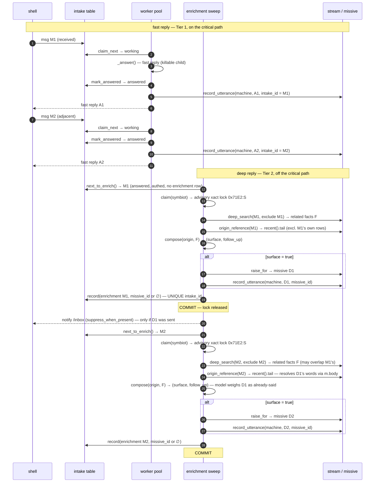
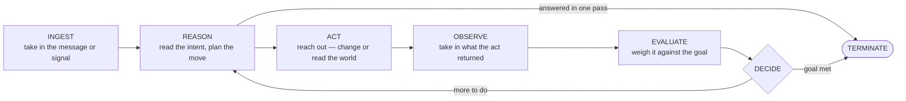

# session 24 of building The Joy in the open

## where session 23 left things

Last session was a long braid, and most of it landed. The machine learned to be fully local — a second delivery for the login code that writes to a file when there's no mailbox, and a pair of dynamic tables that turn the model catalog and the role assignments from compile-time constants into configurable state, reached through a new `/models` command cut to the same cloth as `/timezone` and `/notifications`. The notifications switch grew a real checklist primitive that lives in the terminal beside the line reader; the emoji picker earned a full grid and, with it, a rule — the terminal feel is the ground I build from, not a cage I refuse to leave. The echo dimmed so it's clearer at a glance who's speaking, and that cut shipped as v0.0.6. And the session closed on the reminder that fired two hours early — the store no longer believes the model about which zone a time is in; it takes the wall-clock face, stamps the symbiot's zone, and refuses anything that resolves in the past. That fix is real in the code and not yet on the box I spoke to; it reaches me when the deploy does.

## what this session opens on: I need to see why it breaks

This past week I actually *lived* with it, and that surfaced several bugs — real failures, in the running system, while I was leaning on it. That's the good news buried in the bad: the machine is used enough now that its faults show up in use rather than in review. But when each one happened, the same thing was true every time, and it's the thing this session is about — I couldn't tell *why*. The failure came, I saw it, and then it was gone, leaving no trace I could read back. No record of what the loop was doing when it broke, no thread to pull, nothing to sit down in front of afterward and investigate. The bug happened to me; the machine kept nothing of it.

So the intent for this session is **observability** — giving the machine a way to record what it's doing well enough that a failure leaves evidence behind. Not so I can watch it work when it works, but so that the next time something breaks in my hands, there's something to look at other than my memory of it. The whole point of the reminder post-mortem last session was that the live row in the database was the truth and my confidence about the code was not — I found the bug because a row survived to be read. Most of the failures this week left no such row. This session is about making sure they do.

One line about scope has to be drawn sharply, because I blurred it once already talking this through and it's worth pinning: **this session is about observing the problems, not solving them.** The temptation, the moment a bug has a plausible cause, is to reach past the seeing and start fixing — and every time I do that I'm back to trusting a theory instead of building the instrument that would test one. So the deliverable here is the *instrument*: a way, in the app itself — most likely an authed route or a shell command, cut to the same cloth as `/timezone`, `/notifications`, and `/models` — to **quickly check what is wrong** when something feels off in use. Not a fix to any one bug. The bugs are the things the lens has to make legible; the fixes come after, in their own sessions, once I can actually see what I'm fixing.

I'm deliberately not designing the instrument's insides yet. What it captures or computes, where it reads from, how it renders so a fault jumps out rather than hides in noise — that's the part worth thinking through slowly and together, rather than me reaching for the first shape that sounds like logging. The bugs themselves are logged as they surface, in the texture I saw them in, because being able to name what the lens must catch is how I'll know whether it's any good.

So this is the logged intent and nothing more. The investigation — what an in-app observability lens should look like for a machine shaped like this one, and which of the week's failures it would have made visible — comes next, worked out in the open the way everything else here is.

## the week's bugs, as they surface

These are logged as they come, in the texture I actually saw them in — not yet diagnosed, because the whole point is that I couldn't diagnose them the first time. Each is a candidate the observability work has to be able to catch.

**Bug 1 — it repeats itself in the deep follow-ups.** The deep follow-ups came back *more or less* the same as each other — not word-for-word copies, but the same thought composed again in slightly different clothes. The key word is "more or less": this is not verbatim duplication, which a hash would catch in a line. It is *semantic* redundancy — quasi-similar output, near-neighbours in meaning rather than identical strings — and that is a harder thing to see, because eyeballing scrollback for "didn't I basically already say this?" is exactly the kind of judgement that slips past a tired human reading their own conversation. What I want first is not to know *why* it happens; it is a way to *see* that it happened — to make the redundancy legible on demand instead of trusting my memory that it felt repetitive.

## the shape we settled on: /observe, a hub of cards, echoes the first one

Talking the lens through settled it into a shape that's deliberately bigger than the one bug and deliberately empty everywhere but the one bug. The command is `/observe`, and it isn't a single view — it's a **hub of cards**, each card a distinct thing worth looking at, with room for the whole observability corner to arrive one card at a time. Today it holds exactly one inhabitant, the **echoes** card, the lens onto bug 1's redundancy; the frame is built for more, the frame is filled with one. That's the narrow-first call made concrete: one door open, a wall built to hold the others when they're earned.

A few decisions gave the surface its spine. It is a **read-only mirror** — it reads what it's already said and shows it, and touches nothing on the reply or enrichment write path, so the instrument cannot make the machine behave worse; that's the whole safety of an observe-first session, and it's why we can build it without ceremony. The words are already in one place to be read: every machine utterance flows onto the conversation stream tagged with what produced it, so "what it said" is one join and "which mechanism said it" — fast reply, deep follow-up, reminder — falls out for free from which pointer the row carries. And the hard part, the *more-or-less* of the redundancy, is measured by pointing a tool it already owns **inward**: the same embedding stack that powers deep retrieval turns two of its own lines into vectors and reads the distance between them, so semantic near-duplication becomes a number instead of a tired human's hunch.

The echoes card, opened, shows the redundancy **grouped into clusters** — the quasi-duplicates bundled under an echo heading with their similarity, everything that didn't repeat listed plainly below — because grouping is what turns a scan into a glance. The cards themselves are **bordered and clickable**, keyboard-first the way the checklist already is, a small new terminal primitive that owns the keys for its turn and hands back which card was chosen. And each card is its own **independent, self-loading unit**: the hub draws instantly as bare frames, and every card then fetches its own data behind a quiet in-card spinner, so no card blocks the hub or another card — the same "one slow unit must never freeze the whole" discipline the worker pool already lives by, brought to the observe surface. The similarity work is paid only when a card loads, never on the live path, so the running app carries none of its cost; the spinner is the honest signal that the machine is embedding-and-comparing right then, fresh.

Two notes on sequencing and scope, kept honest. The clustered view *is* the scored view — there is no cluster without the measurement that makes one — so the build goes in two passes: the **pipes** first (the hub, the card, the async in-card load, and a plain render of its recent output, proven against real data), then the **scoring** that swaps the plain render for the embed-and-cluster one. And three knobs — what distance counts as an echo, how far back the window reaches, whether a quick reply echoing a deep follow-up counts as a cross-kind repeat — are given sane defaults now and left to be tuned once there's real output to tune them against, rather than guessed at blind. Which is itself the observe-first ethic: don't decide the threshold in the abstract, decide it in front of the evidence.

## pass one built: the pipes stand

The plumbing is in and green, and it behaves exactly as the shape above drew it — minus the scoring, which is pass two by design. On the kernel side there's a new top-level `services/observe.py`, the read half of the observability corner: `recent_utterances` walks the machine side of the conversation stream, resolves each row to its words (the intake row's answer for a fast reply, the missive's body otherwise) and labels it by the mechanism that raised it — `quick`, `deep` where an enrichment row claims the missive, `note` for anything else — handing them back oldest-first so the eye reads them the way the conversation ran. It is a pure read: no write, no embedding, nothing on the loop's path. One authed route, `GET /observe/echoes`, is its first and only citizen, gated exactly like `/timezone` and stamping each line's instant into the symbiot's own zone so the shell prints a ready label rather than re-deriving local time. A protocol word, `observe echoes`, carries it across the wire.

On the shell side, `/observe` joins the authed-only commands — hidden from `/help` and autocomplete until there's a session, listed there once there is — and opens a hub through a small new terminal primitive, `cards`: the checklist's sibling for "which one" rather than "which subset". It draws each choice as a bordered card and runs each card's own loader the instant the hub appears, independently, spinning a quiet in-card spinner until that card's data lands, so a slow or failed card marks only itself and never freezes the hub — the worker pool's isolation rule, brought to the surface. Today the hub holds the one echoes card; opening it renders the plain chronological mirror of its recent output, each line under a dim header naming how it was said, when, and — for a reply — the human line it answered.

What's proven and what isn't, stated plainly. The kernel suite is green — 315 passing, five of them new: the read's mechanism-labelling and oldest-first order, its exclusion of the symbiot's own lines, its window, and the route's auth gate and rendered shape. The shell typechecks and builds clean, client and service worker both. And the running dev kernel reloaded onto the new import without a stumble and serves the route auth-gated — the live proof the wiring holds. What the suites can't reach is the same thing they never can: the surface in a real logged-in browser, the echoes card lighting up against its *actual* recent output. That by-hand look is the observe-first payoff and the thing owed before pass two — because the whole reason to build the plain mirror first was to let real output say whether the repeats already stand out before I teach the lens to score and cluster them.

## pass two built: the lens learns to score

The scoring went in and closed the shape. `recent_utterances` is now the gather beneath `observe.echoes`, which embeds each recent line once — through a new `embed_many` on the embedding adapter, one round trip for the whole page rather than one per line — and reads the cosine closeness between every pair. Lines at or above a threshold are joined into clusters by union-find, transitively, so a chain of near-duplicates lands in one group even when its two ends aren't themselves close; a cluster's headline number is its strongest pair, and a line that echoed nothing stands alone. The route hands back the clusters strongest-first and the singles oldest-first, and the shell's `cards` render swapped the plain list for the grouped view — each echo under its own heading with its score, the lone lines below a divider. Two guards keep the read honest under a bad box: fewer than two lines skips scoring entirely (nothing can echo alone), and an unreachable embedder degrades to the plain mirror flagged `scored: false` rather than erroring, so the lens always shows something true.

Then the part that mattered most, because it was the whole reason to sequence it this way: I ran the scoring against a live model before trusting a number I'd picked blind. The by-hand smoke (`test/qa/0009`) files three paraphrases of one thought and one unrelated line, embeds them for real, and prints the pairwise closeness. The evidence was clean and it caught me out: unrelated lines land around 0.55–0.60, clear paraphrases around 0.80–0.88 — a wide, obvious gap — and my first-guess threshold of 0.85 sat *too high* in it, clustering only the tightest paraphrase pair and wrongly leaving an obvious third alone. Seeing the real numbers moved the default to 0.75, sitting square in the gap. That is the observe-first ethic paying out exactly as promised: the threshold wasn't argued into place, it was measured into place, and the instrument built to see redundancy found its own first correction.

The suite is green at 319 — the four new scoring tests pin the clustering (near-duplicates group, transitivity chains, the outlier stays single), the degrade-to-mirror path, and the lone-line skip, all with the embedder faked so they need no model; the live model is the smoke's job alone. The whole surface is documented in `kernel.os-joy.com/doc/observability.md`, Mermaid and all — the hub-of-cards flow, the gather-embed-cluster pipeline, the read-only stance, and the tuning story. What's left is the same by-hand look that was owed after pass one and is now owed against the finished lens: `/observe` → echoes in a real logged-in browser, the clusters rendered on the screen rather than in a test's assertions. That is the QA we open next.

## the QA that was owed: /observe holds up in the browser

That last look is done. We opened `/observe` in a real logged-in browser and walked it one branch at a time — me at the keyboard, naming the next thing to try only once the last one held — because the point of building the plain mirror before the scorer was to let the surface prove itself in front of real output, not in a test's assertions. Every branch the lens has, we exercised:

The happy path first: the hub draws instantly as a bare frame, the echoes card fills itself behind its own quiet spinner, and the clustered view renders the way it was drawn — each echo under its heading with its similarity, strongest first, the lines that repeated nothing standing alone below the divider. Then the small doors around it. Opening the hub and closing it without picking a card lands on a plain `closed.` and nothing else. Logged out, `/observe` is gone from `/help` and refused before the round trip with a line that says why, exactly as `/timezone` and `/models` behave — a symbiot's own output is not an anonymous thing to hand back.

Then the two ways it degrades, which mattered most, because a lens that lies when it's blind is worse than no lens. With the embedder down, the read doesn't error: it falls back to the plain mirror, flags itself honestly unscored, and shows a yellow line saying it couldn't measure closeness this time rather than pretending nothing repeated — then, embedder back up, the clusters return. With the kernel stopped entirely, the echoes card fails its *own* load and shows its in-card error without freezing the hub around it, and, selected anyway, surfaces a plain warn line pointing back at `/login` rather than a stack trace or a console CORS error — the "one slow unit must never freeze the whole" discipline holding at the surface, the way it holds in the worker pool. Nothing crashed, nothing hung, and no branch was left dark.

So the instrument this session set out to build stands and is proven where it counts — in use, not just in the suite. It's committed on both sides: the kernel's read half (`services/observe.py`, the `GET /observe/echoes` route, the `observe echoes` protocol word, and `doc/observability.md`) and the shell's surface (the `/observe` command, the `cards` terminal primitive, and the echoes lens). The bug it was built to make legible — that it repeats itself, more or less, in the deep follow-ups — now has somewhere to be seen. The fix comes in its own session, in front of the evidence, which was the whole point.

## next: the deep-replies redundancy itself

That session opens now. With the lens built and proven, we turn from *seeing* the redundancy to *addressing* it — the deep follow-ups coming back more or less the same as each other, bug 1 met head on. How we go at it is the work to think through together next, in front of what the echoes lens actually shows; for now this is only the turn being logged: the seeing is done, and the fixing begins.

## the sequence, drawn: how a deep reply is produced today

Before touching the redundancy I drew the actual path a deep follow-up travels in the system as it stands — not a sketch of how it ought to work, but what the code does, traced through `worker._enrich_one`, `enrichment.py`, `deep_retrieval.py`, and `conversation.recent`. I drew it for *two* adjacent messages, M1 and M2, because that pairing is where the follow-ups can come back alike, and only across two messages does the machinery that's meant to keep them apart actually come into play.

Reading it as the code runs it: the fast reply lands first and mirrors its answer onto the conversation stream. A beat later, off the path, the enrichment sweep takes the oldest answered, authed message that has no enrichment row yet, claims the symbiot's per-symbiot advisory lock (`0x71E2`), reaches into the diary by meaning (`deep_search`), assembles the origin reference from the verbatim tail, and gates-and-composes on the heavy model. When the model surfaces, a missive is raised and mirrored back onto the stream; either way the pass is recorded once under the UNIQUE `intake_id`, and a surfaced follow-up nudges `/inbox`.

Two properties of the current wiring are worth naming because they are exactly what the diagram makes visible. The advisory lock is per-symbiot, so M1's pass commits and releases before M2's begins — the two never compose at once. And `origin_reference` reads `conversation.recent(...).tail`, whose SQL resolves a missive row through `m.body` and only ever excludes rows by `intake_id` — so D1, an already-sent follow-up carrying no `intake_id`, is not filtered out and *does* appear in M2's tail, for as long as it is still in the verbatim tail rather than folded into the Gist. So the compose gate for M2 genuinely has D1 in front of it. What it does with that — stay silent, or surface D2 anyway — is the model's call, which is why both branches are drawn rather than one assumed.

That is the point of drawing it at all: the sequence shows precisely where state passes from M1's pass to M2's — where D1 gets committed, and where M2 reads it back — so when we sit in front of what the echoes lens actually shows, we're reasoning about a concrete handoff we can see rather than a hunch about the code. The picture doesn't decide why the follow-ups came back alike; it lays out the ground on which we can.

## the fix we settled on: choke the source, guarantee the mouth

With the sequence in front of us the fix has two sides, and they do different jobs rather than the same job twice. Upstream, at the source, we shrink how many follow-ups even get composed. Downstream, at the mouth, we refuse to send one that echoes a deep reply already sent. The first makes the duplicate rare and cheap to avoid and stops deep replies interrupting a live exchange; the second makes it a thing that cannot reach me, measured rather than merely hoped.

The source today is indiscriminate: every answered message gets its own enrichment pass, so a rapid burst of five messages in two minutes fires five deep passes, each reaching into an overlapping patch of the diary — which is the soil the near-duplicates grow in. The change is to stop enriching per message and start enriching per *lull*: a message becomes eligible for the deep reach only once the conversation has gone quiet for five minutes after it, so an active back-and-forth is never interrupted and never spawns five passes over the same ground. And when a burst finally settles we treat it as a unit — one deep pass over the settled span, with every message in the burst marked done — rather than enriching only its last line. That last-line-only shortcut was the tempting simple version, and we turned it down for two concrete reasons: it would leave the burst's earlier messages forever unrecorded, lingering in every eligibility scan, and it would let the deep reach see only the final line while everything said before it went unreached. Burst-as-a-unit keeps the coverage and leaves nothing dangling.

Downstream is the guarantee, and the stronger half. Even if a duplicate slips past the thinned-out source, we catch it by *measuring* it: a composed follow-up that reads as an echo — by the same cosine closeness the `/observe` echoes card already puts a number on — of a deep reply already sent is simply not sent. That is the observe-first ethic closing its own loop: the lens built to *see* the redundancy becomes the measure that *stops* it, so the instrument and the fix share one definition of "more or less the same" rather than drifting apart. The echo measure — embed the lines, read the distance — factors out so both the lens and the delivery guard call it; the guard needs only the closest prior deep reply, not the full clustering the card renders, so it takes the smaller half of what already exists.

How far back that guard looks we pushed on, and landed wider than a window. The redundancy isn't a burst artifact — the same diary facts get recalled by meaning for any similar message, so the same follow-up can recur at a slow drip for months — and deep replies are rare enough that comparing a candidate against *every* one ever sent costs almost nothing. So the check is all-time: a follow-up near-identical to any deep reply the machine has ever sent is a repeat whatever its age, and it is held back. The one worry — that this gags a durable pattern worth raising again at the right moment, "you overcommit before travel" as timely in September as it was in March — mostly dissolves on inspection: a genuine re-application is phrased to its new moment and lands *below* the similarity line on its own, so only near-verbatim text trips the guard, which is exactly the lazy repeat we want gone. The ambiguous sliver right at the threshold — close but not identical — we leave to a later pass and to real evidence, the observe-first move again: don't settle the hard-cutoff-versus-model-judged question in the abstract when a first hard cutoff will show us whether the sliver even matters. And keeping all-time cheap turned out to need no new store at all. The first instinct was to persist each deep reply's embedding as it went out; on building it, that was a brick laid too early. Deep replies are rare and the check runs only on a settled burst, off the critical path, so the guard just reuses what the echoes lens already owns — it re-embeds the small handful of prior deep replies alongside the candidate in one call each time it looks. A kept-embedding store is the move if the volume ever grows into it; not one message before it does.

## built and shipped: the fix, in the code now

All of the above went from plan to running code this session, and it is committed on both sides. Upstream, the enrichment sweep stopped firing per message: a new `next_burst_to_enrich` reads over the answered, un-enriched messages, groups each symbiot's into bursts by the settling lull, and hands back the oldest burst that has actually gone quiet — a still-cooling burst is left whole for later. The pass then speaks that burst as one: its messages joined into a single deep reach, every member excluded so the burst never enriches itself, and a provenance row written for each member when it commits, the follow-up (if one surfaces) recorded against the anchor. The lull is `ENRICH_SETTLE_SECONDS`, five minutes by default and zero under test, so a message answered in a live exchange waits for the talk to settle rather than drawing its own deep reply on top of the others. The per-symbiot lock we agreed to leave alone stayed exactly as it was — it was never where the duplicate was born.

Downstream, the echo guard landed as `is_echo_of_prior`: before a surfaced follow-up is sent, it is embedded alongside every deep reply ever sent this symbiot and held back if it sits at or above the echo threshold to any of them. It fails open — an unreachable embedder lets the follow-up through rather than silently eating it — because a rare repeat is a smaller harm than a good line lost. The measure it reads by is now a small module of its own, `services/echo.py`, the cosine and the threshold the `/observe` echoes lens already used, pulled out so the lens that *sees* the redundancy and the guard that *stops* it can never drift apart on what "the same" means. No new embedding store — the guard re-embeds the rare priors each time, the smaller slice we talked ourselves into.

And the muzzle leaves a trace, which is the piece I'd have missed without saying the auditability rule out loud. A held-back follow-up used to look identical to a pass that simply had nothing to add — both silent, both `surfaced = false`. Now an `echo_suppressed` column (migration 0021) records which silences were the guard's doing, told apart by a schema CHECK that forbids it ever riding with a sent missive, and `/observe` counts them: the echoes card prints, above the clusters it already showed, how many deep repeats the guard stopped before they reached me. So the same surface that was built to *see* the redundancy now also shows the redundancy that was caught — the observe-first loop closing on itself, a decision the machine made on my behalf kept in the open rather than swallowed.

It is proven where it counts. The kernel suite is green at 332, eleven of them new — the burst grouping and the settle boundary, the whole burst recorded under one follow-up, the echo guard suppressing a near-duplicate and passing a genuinely new line and failing open when blind, and the held-back count. The Tier 2 by-hand smoke ran live end to end against the real models — the deep reach still beating the lexical one, a real follow-up composed and recorded — proving the burst rewrite didn't break the reach it rides on. The docs that describe present behaviour moved with the code: `doc/context-engineering.md` and its Mermaid now show the lull, the burst, and the echo gate, and `doc/observability.md` names the shared measure. Committed on the kernel and the shell both; what remains is the by-hand look at the echoes card in a real browser, held-back count and all — the QA this earns next.

One thing we looked at and deliberately left alone: the per-symbiot advisory lock. It was a suspect for a moment — it is the thing that serialises two adjacent passes — but drawing the sequence settled that it is not where the duplicate is born. All the lock guarantees is *ordering*: that the second message's pass cannot compose until the first's has committed, which is exactly what puts the first follow-up into the second's view. The duplicate happens one step past it, when the gate sees that earlier follow-up and the model composes a near-copy regardless. The lock is doing its job, so the fix leaves it untouched — the two places worth changing are the volume going into the gate and the filter coming out of it, not the ordering around it.

## a second over-eagerness: reminders it sets when no one asked

With the deep-reply duplicate closed, a different over-eagerness surfaced in ordinary use: it reaches for the reminder tool when nothing asked it to. A line that only *mentions* something ahead — "I need to call the dentist tomorrow", "the meeting is at 3" — comes back with a reminder scheduled against it, as if a description of a plan were a request to be nudged about it. It is the same shape of mistake as the duplicate, one layer up: not the same thing said twice, but a thing *done* that was never asked for.

Tracing where it is born runs through the same two-gate seam the tool path already has. A message first passes a coarse recall (`search_catalog`) that surfaces the reminder as a *candidate* — and that gate is meant to be generous, its whole job is to never miss a real "remind me", so it fires on anything faintly reminder-shaped and is right to. The precise judgment is the second gate, the decision call (`decide` in `services/tools/tools.py`), which is supposed to look at the candidate and answer with a named tool *or* `"none"`, handing the ordinary reply back the message when nothing truly fit. The over-creation lives almost entirely there, and it is the oldest failure of putting a tool in front of a model: once the reminder is on the shortlist, the model leans toward *using* it. The prompt was doing little to lean back — it framed `"none"` as the leftover case rather than the expected one, and gave no bar for what actually counts as being asked.

So the fix is where the mistake is, and it is a sharpening of judgment, not a change of structure. The decision prompt now says the true thing plainly: almost every message asks for no tool at all, `"none"` is the expected answer, and a tool is reached for only on a clear, explicit request to act — a message that merely names a future task or event is not by itself a request to act on it, and it carries those two examples so the distinction is concrete. That guidance sits in the prompt rather than in the tool's own description on purpose: the description is embedded for recall, so loading negative examples into it would pull the generous first gate *toward* the very phrasings we want rejected. The prompt is not embedded, so it can name them freely. The reminder's description takes only the lighter half — one clause that it fits an explicit request to be reminded, not a passing mention — enough to steer the judgment that reads it without teaching recall the wrong lesson.

And we left the recall distance alone. The tempting knob is to narrow how near a message must sit before the reminder surfaces at all, choking the candidates at the first gate — but that trades a real miss for a spared decision call, and it cuts against the gate's whole reason for being, which is to not miss. Better to keep recall generous and let a sharper decision do the rejecting, exactly the division of labour the seam was built around: the first gate is wide so nothing is lost, the second gate is precise so nothing is done that wasn't asked for. Nothing pinned the wording — the decision tests mock the model and check the plumbing, not the prose — so the sharper prompt drops in without a green suite turning red on it.

## the instrument for it: a reminders card, so the sharpening has evidence

A prompt sharpened by judgment is a guess until real output tests it, and the same observe-first ethic that gave the echoes card its held-back count applies here: if it now sets fewer reminders it shouldn't, I should be able to *see* the ones it set, and see them against the line that asked — otherwise the next round of hardening is another guess. So `/observe` grows a second card, reminders, beside echoes. It is a plain list of the most recently scheduled reminders, newest first, and the thing it makes legible is the *pairing*: each reminder shown with the human message that triggered it, what it will say back, when it fires, and whether it has. A reminder sitting under a line that only mentioned a task — never asked for one — is the over-eagerness caught in the act, and now it is a row I can read rather than a suspicion. That is the point of building the card the moment the fix landed: the fix and its evidence ship together, so the real examples that would sharpen the prompt further are there to be gathered rather than lost.

It is cut from the echoes card's cloth exactly, because the corner was built to take a second lens without a rewrite. The read is a pure join — `recent_reminders` in `services/observe.py`, the reminder ledger to its triggering intake, writing nothing and holding no lock, off the loop's path like everything under `observe`. The route, `GET /observe/reminders`, is authed-gated the same way (a symbiot's own reminders are not an anonymous thing to show, so no session is turned away), stamps its fire and set times on the symbiot's own clock so the shell prints ready labels, and rides the same `observe reminders` protocol word mirrored on both sides. On the shell the hub simply carries two cards now instead of one, each still loading its own data behind its own spinner so neither waits on the other; the reminders lens draws in the same spare terminal grammar as echoes — a heading, the line, the line that asked for it — no new furniture, because the surface is a terminal and stays one.

It is proven and shipped on both sides. Four new kernel tests pin what the card is for — the pairing resolved and ordered newest-first, the window bounded, the route gated on a session and rendering its times locally — and the suite is green at 336. And beside those faked-model unit tests sits a live one: a by-hand smoke (`test/qa/0010`) drives the real two-gate seam against the running models over a handful of probes, and it came back clean — the two explicit requests scheduled, and every bare mention ("I need to call the dentist tomorrow", "the meeting is at 3") was declined, so the over-eagerness is gone where a live model could have shown it still there. The telling detail is that the coarse recall still surfaced the reminder as a candidate for those mentions, exactly as a generous gate should; it was the sharpened decision that turned them away — the division of labour working as designed, the wide gate missing nothing and the precise one doing nothing that wasn't asked for. The shell typechecks and builds clean through both passes, and its version moves to v0.0.8, the tag that carries the new lens. So the reminder work this session is whole: the source of the over-eagerness sharpened at the decision, proven to hold against live models, and the instrument to watch whether it keeps holding built right beside it.

## a turn on the input side: replying to a line

The observability work all reads *out* of it. This last piece works the other way, on the surface I type *in* through, and it started from a small friction in living with the shell: an answer comes back, I want to say something *about that answer*, and the only way to tie my words to it was to retype or paraphrase what it'd said. The stream carries no reply gesture — every line I send stands alone, decoupled from whatever it responds to. So a reply button, on the messages, the way any chat surface has one — but built the way this surface is built, which turned out to be the whole interest of it.

Before touching it I sharpened the rule the emoji-picker grid earned last session into something CLAUDE.md now states plainly for every future hand: the shell's UI stays minimalistic and terminal-like, and that is the point of the surface, not a phase to grow out of. A prompt, typed lines, plain text back — reach first for the thing that reads as a terminal, and stray only when the plain form genuinely fails the experience. A reply button is exactly the kind of feature that invites chrome — a little icon on every row, a quoted-message banner hovering over the input — and naming the ground first is what kept it from arriving that way.

The shape it took instead leans on a gesture the terminal already had. A tap on any message already marks it as my "I was here" landmark — the green gutter bar that helps me find my place in a long scrollback. Reply rides that same tap: on the one line I've marked, and only that line, a quiet `↩ reply` appears at its end. Nothing trails any other message; the affordance costs a single glyph, and only on the line I'm already looking at. One control exists, not one per row — it travels onto whichever message is the landmark and comes off the moment the landmark moves, so the log stays as bare as it was.

Clicking it doesn't send anything or open a form — it seeds the input line. The message I'm answering drops into the prompt, each of its lines quoted with a `> `, a `---` rule beneath it as a clean separator, and the caret waiting on the empty line below. I type my reply there and send the whole block — quote, rule, and answer — as one ordinary message. That last part is why this needed no new machinery anywhere: the composed text is just prose, so it flows to the machine through the same path every typed line already takes, and the machine receives the quote and my words together, the reference carried in the text itself rather than in some new field on the wire. The protocol didn't move. No kernel change, no new state, nothing to mirror under `/observe` — a reply is a message like any other, and the one it quotes becomes replyable in turn, mine and the machine's alike.

Two small honesties in the wiring, both leaning on what the shell already knew rather than re-deciding it. What counts as a replyable message is *its* answers and *my* sent thoughts — not a slash command I typed, not a system marker like a delivery `COPY`; the code asks the same predicate the terminal already uses to tell a command from prose, so it never draws a second definition of the line. And the quote carries the words that were said, not the `❮ joy` / `joy ❯` sigils that frame them — the body stashed on the line when it's marked, so replying quotes what it said, not the furniture around it. It typechecks clean against the strict compiler that is this repo's only gate; like every shell change it reaches the box I speak to when the deploy does.

## coming back to it: what QA-ing the sharpening actually taught

A prompt sharpened by judgment is a guess until real output tests it, and this is where we tested it — sat in front of the reminders smoke and drove it, again and again, from the seat of someone shipping the change. We came with two cleanups that looked obviously worth making. The `"almost every message asks for no tool at all"` line reads as a presumptuous claim about how often it stays silent — true with one tool in the registry, quietly false the day there are many, when a great deal of what I say *will* be reaching for one. And the decision prompt looked overfit to reminders: a whole paragraph on delivery channels, a block on resolving times thick with reminder-shaped examples, sitting in what is meant to be a tool-agnostic gate. Both looked like tidying the seam owed.

The smoke refused them, and it refused them plainly. Pull the channel paragraph out — on the theory the reminder's own field description already carries it — and the model starts inventing a channel no one named, filing "call the dentist" to be delivered *over email* off a line that never mentioned email. Move the time-resolution rule onto the tool's own field where it seems to belong, and the model stops resolving the time at all: it names the reminder correctly and hands back a null moment, so nothing is set. Soften the "almost every message" framing into something less presumptuous, and the same time-extraction wavers in sympathy. Run after run said the same thing: this decision model leans on the prompt's plain, in-place instruction far more than on any tidy structure, and what read as overfit is load-bearing. The cleaner version is the worse one. So the prompt stays exactly as the sharpening left it — the frequency line included — and the lesson is about the seam rather than the prose: a prompt this close to a model's judgment is tuned in front of the smoke, not refactored in the abstract. The observe-first move again, one layer down.

And the real defect the QA turned up was never in the prompt at all — it was in the probe testing it. The smoke's explicit request asked to be reminded "this evening at 6pm," and run after six in the evening that time is already behind us; the machine, rightly, either refuses a reminder for a moment already gone or asks when I actually mean — the past-guard doing precisely its job. So the probe passed or failed by the hour of the day it happened to run, not by the behaviour it claimed to check, and it had been passing on the luck of the clock. A test that depends on the time it runs proves nothing. It now asks for "tomorrow at 6pm" — future whenever the smoke is run — and against that the seam is green run after run: the two explicit requests scheduled, every bare mention declined, no channel invented.

Which lets me name the thing the broken probe had been hiding: the behaviour was already right. "Don't let me forget to email Sam tomorrow at 6pm" it read exactly as I'd want — the reminder set for six, "email Sam" kept as the line to say back, and the word "email" sitting inside the task not mistaken for a request to be reached by email. There was nothing to fix in how it hears that; there was something to fix in how we were asking. The sharpening holds, the prompt earns its shape by evidence rather than tidiness, and the instrument that watches it is honest about the clock now.

## what "agentic" actually means here, and the first behaviour that earns it

The word "agentic" sits in the very first line of my map — an agentic OS for self — and yet the only place it was ever *defined* is the abandoned early log, the scrapped first arc no current session points back to. So I bring the definition forward, to sit as a live reference rather than an artifact of work that got thrown away. An **agentic** application is one that takes decisions autonomously, without waiting for a human to approve each step; that understands non-preformatted, dynamic input — natural language, not a filled-in form; and that is environment-aware, able to reach out through connectors and read the world it acts in. When the goal is open-ended — the number of steps unknown before it starts — a cyclical shape earns its keep: INGEST → REASON → ACT → OBSERVE → EVALUATE → DECIDE, looping until it decides to stop. But the loop is not the badge. **Acyclical is not un-agentic** — a single-pass act that reads free text and does the right thing autonomously is already agentic in the weak, real sense. The loop is only mandatory when the outcome can't be known in one forward pass.

Concretely, an agent is three things at once, and I hold all three as the test:

- **It decides autonomously** — it acts without waiting for me to approve each step.
- **It understands dynamic, non-preformatted input** — natural language, not a filled-in form.
- **It is environment-aware** — it can reach out through connectors and read the world it acts in.

And when the goal is open-ended those parts run as a cycle rather than a single pass — each turn acting, watching what the act returned, weighing it against the goal, and deciding whether another turn is owed or the work is done. A message answered in one shot leaves straight from REASON; only a goal that has to look and adjust travels the whole loop:

By that definition, nothing it does yet runs the full shape. The reminder path is single-pass: I speak, the two-gate seam reasons over the message, a tool fires or `"none"` comes back — REASON straight to ACT, terminate. It decides from my words alone. The Dead Man's Switch acts on my silence, which is autonomous and real, but it is a fixed rule watching a clock, not a machine that looks before it leaps. Both are agentic in the weak sense; neither closes the loop.

The next thing I want is the one that does. I put it plainly: it should not set a second reminder for a thing it is already holding. That cannot be judged from the message — "remind me to email Sam" is a perfectly good request in isolation; whether it is a *duplicate* is a fact about the world, not about the sentence. So the behaviour has to run the full arc: parse the intent (INGEST/REASON), query its own store for the reminders already standing — after a filter that surfaces the *relevant* ones rather than dragging the whole ledger back (ACT, a read against the environment), read what came back (OBSERVE), and only then decide whether to create anything at all (EVALUATE → DECIDE). That is the first decision it would make that is **contingent on observed world-state rather than on my words** — the environment-aware leg of the definition finally doing load-bearing work.

So that instinct is right — this is the candidate for the first *truly* agentic behaviour, with one sharpening of why. It is not truly agentic because it is open-ended — it isn't; it is a bounded four-step sequence with a known shape, and it does not need the unbounded loop. It earns the name for the narrower, stronger reason: it is the first act it takes where it must look at the world, observe what it finds, and let that observation change what it does — retrieval grounding a decision, not text alone deciding it. That is the leap from a machine that answers to a machine that checks before it acts, and the reminder dedup is where it starts.
