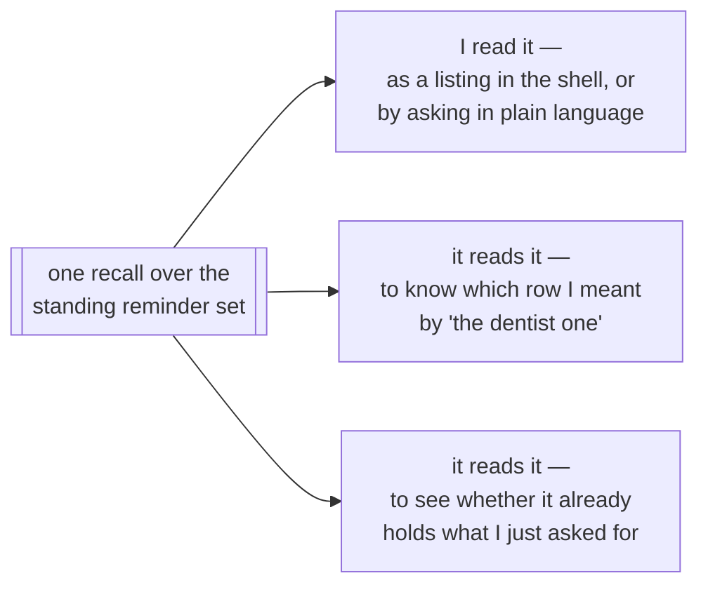
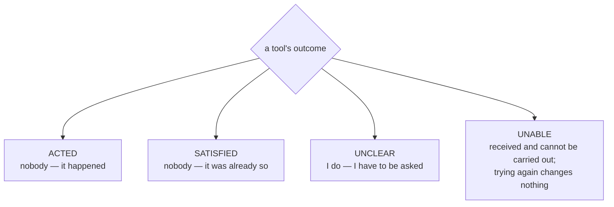
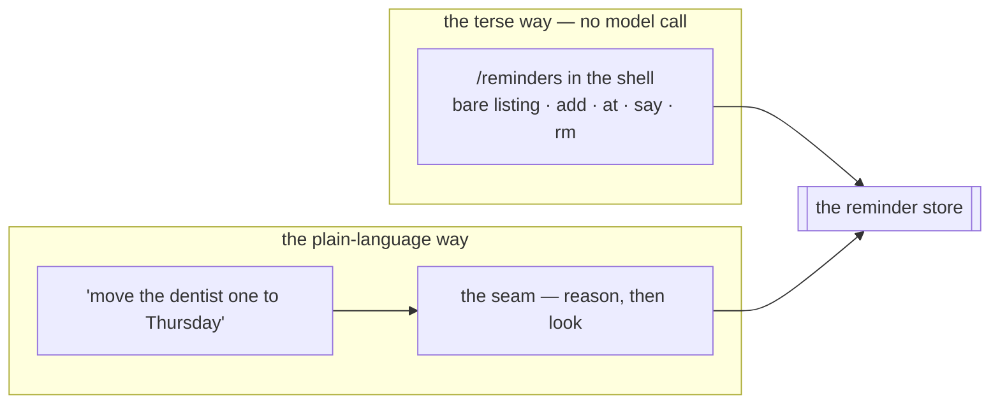
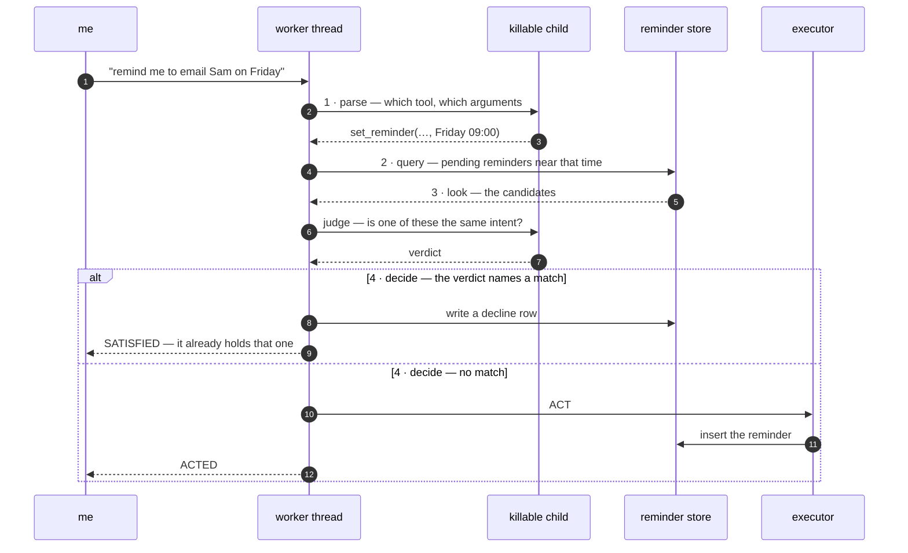
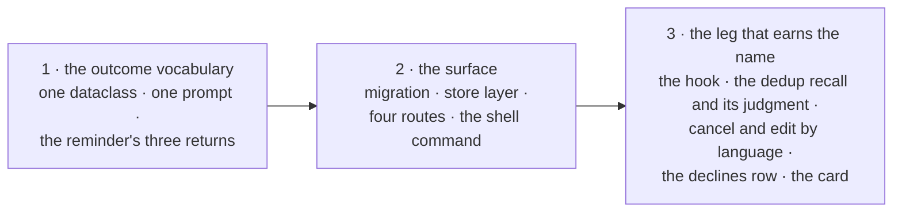

# session 27 of building The Joy in the open

## where the last one left me

Session 26 paused twice.

The first pause is the Google switch, turned inside out mid-flight. Google stopped being a rung bolted above the old Scaleway chain and became the chain's primary: the three Gemini models standing as three genuinely distinct tiers, with Scaleway and Mistral as the things the top rung falls *to* rather than the things it sits *above*. That rework is on disk and it reads clean. The suite is green at three hundred and forty-eight tests, the ladder has been walked rung by rung against live providers, and the top rung runs off a service account instead of my own expiring login. What's still unwritten is prose: the README's Models section, the memory note on the switch, and session 25's own "the switch, built" section all still describe the shape I replaced. None of it is committed.

The second pause left code sitting in front of me. A message hung on the box — submitted, painted `⋯ queued`, and nothing came back. The kernel's new on-disk log pointed straight at the door: intake capped `line` at 4096 characters, and the long note I'd pasted was refused with a 422 before a worker ever claimed a row. The cap is dead now, and rightly. The message store is `TEXT` with no ceiling, so the cap was inventing a boundary rather than protecting one, and the length of what I say is mine to decide. That half is committed.

The half that isn't is the more important one. The shell had exactly one bucket for any response that wasn't a `roger`: requeue and retry on the next sync. That is correct for a dropped call and wrong for a refusal, so what I was reading as a stalled `queued` was a line looping forever against a door that will always say no.

The distinction the shell was missing now has a word, and it's the one the wire's own radio brevity already reserves: **unable** — I cannot comply with your last. `no joy` means the machine took my message, worked it, and came up empty. `unable` means it will not accept that transmission as sent: refused, never tried. The pair draws the line I care about.

The kernel's protocol carries the word. The shell mirrors it, drops a refused line distinctly from a delivered one, reads the status in the drain so a 4xx clears without a throw, and paints a red `unable` where a `COPY` would go, with no answer-poll behind it. Both typechecks pass and the intake suite is green with the new token.

So the tree I'm opening today on is small: one protocol line in the kernel and four touched files in the shell, all of it the `unable` path, waiting on a cold read before it lands.

## the one missing thing

Everything in this session hangs off a single absence, and naming it properly is what changed the shape of the work.

**Nothing can read the reminders the machine is currently holding.**

Not me, not the machine. What's missing is a *recall over the standing reminder set*, and three readers are waiting on it.

That third reader is **reminder deduplication**: the machine not setting a second reminder for something it is already holding. Session 24 named it and nothing since has touched it. Build the recall once and dedup stops being a feature of its own — it becomes the third caller.

## why dedup is the behaviour that earns the name

The reminder path today is single-pass: I speak, the two-gate seam reasons over my message, a tool fires or `"none"` comes back, and it terminates.

Dedup cannot work that way. "Remind me to email Sam" is a perfectly good sentence in isolation — whether it is a *duplicate* is a fact about the world, not about the words. So it has to parse the intent, query its own reminder store behind a filter that surfaces the relevant standing ones rather than dragging the whole ledger back, read what came back, and only then decide whether to create anything at all.

That is why it earns "truly agentic", and the reason is narrower than the word usually gets used for. Not because it is open-ended — it isn't, it's a bounded four-step sequence with a known shape and no need of an unbounded loop. It earns the name because it is the first decision the machine takes that is contingent on what it *observed* rather than on what I *said*. Everything it does today is either a fixed rule watching a clock or a forward pass over my sentence. This is where it starts looking before it leaps.

## three things in the code forbid it

Reading the code back with that in mind, three things say no outright.

**The reminder's triggering message is `NOT NULL`.** That column is the exactly-once pin against a retried message, so every reminder must have been born from something I said — and one typed straight into the shell is structurally impossible. It becomes nullable and keeps its uniqueness, since Postgres lets many rows hold a null there. A tool-made reminder keeps its pin; a directly-made one simply carries none.

**There is no way to take a reminder back at all.** The migration's own comment already settled how it should be done — a fired reminder is recorded, not dropped — so cancelling stamps a `cancelled_at` rather than deleting. Which means the firing sweep's claim and the partial index it rests on both have to learn to ignore a cancelled row, or a reminder I called off still goes off.

**The tool seam can only speak two endings.** That one needs its own section.

## the seam learns to say what happened

A tool's result carries a single flag, `effected`, and the confirmation reads it with a plain if/else: true, and it confirms what was done; false, and it asks me for what was missing.

A refused duplicate is a third ending: nothing was done, and nothing is missing, because it already holds the thing. Handed back as a false it would take the only branch available for a false and ask me *when* I wanted a reminder I had just given a clear time for — the machine looking broken at the exact moment it did the cleverest thing it has ever done.

So the flag becomes a named outcome, and the axis it turns on is who has to change something for the act to succeed.

`UNCLEAR` is the word the protocol already uses on the wire for "say again". `UNABLE` is defined now even though the reminder can never produce one — it is the same distinction the shell learned this week, drawn a second time at the tool seam.

It starts mattering the moment the second tool reaches a third party. An executor's only way to report failure today is to raise, and a raise means retry, so a permanently refused act would loop forever against a door that always says no — which is exactly the bug that ate the end of last session. An outcome *returned* rather than raised completes the message and speaks, so the no-retry behaviour falls straight out of the control flow already there.

Which means the if/else has to go, and what replaces it is a table: one instruction for the confirmation to follow, written beside each of the four outcomes, looked up by outcome.

The table has no fallback row on purpose. A fallback is the same mistake again — it takes an outcome nobody has written a line for and speaks it as one of the outcomes that do have a line, which is precisely how a refused duplicate would have come out sounding like a question about the time. So: no line for an outcome, no reply. The lookup fails, loudly, on the first message that produces it, and I go and write the line. Better to break in the open than to say the wrong thing convincingly.

And a test walks the vocabulary and asserts every word in it has an instruction beside it, so a fifth outcome added later can't sit in the code for weeks with nothing to say.

## the surface

The store layer stays where it already lives, in the reminder module beside the firing reads. That module is the reminder table's data layer and has been since it was written, so reading the standing set, finding one, updating and cancelling join the claim and the fired stamp rather than fragmenting into a new home.

Every write there — a cancel, an edit — carries three conditions in its WHERE clause: the row is mine, it hasn't fired, it hasn't been cancelled. Then the code looks at how many rows the statement touched. One means it landed. Zero means one of the three conditions was false, and that is the refusal.

What it deliberately does *not* do is read the row first, decide it looks editable, and then write. The firing sweep runs every ten seconds and it doesn't wait for me — a reminder can go off in the gap between that read and that write, and an edit that already made up its mind would then quietly rewrite a reminder that has already fired. Putting all three conditions in the statement itself closes the gap, because the database checks and writes in the same breath. A slow hand and a flaky connection are the ordinary case here, not the exception, so the guarantee cannot rest on the two things happening close together in time.

Four routes, in the flat shape the kernel uses everywhere else: the standing set on a GET, and create, cancel and update as POSTs carrying a body. One protocol word for the read and for every write that lands, each reply carrying the full state back the way the notification preferences do, and one word for a refusal, which is the pattern the model routes already set. The kernel's word and the shell's mirror of it change in the same commit, the way the protocol always does.

## the two ways in

That surface has to be reachable two ways, because neither way covers for the other.

Plain language in the ordinary flow of talk has to exist regardless, since it is the path the machine itself travels when it checks for a duplicate. The terse command exists because when what I want is already unambiguous, sending it through reasoning is slower, costs tokens, and leaves room to misread an instruction that had no ambiguity in it. A reminder is a small structured record, and reaching straight for one should feel like reaching straight for it.

So the shell gets `/reminders`, authed-only and modal like the notification and timezone flows. Bare, it prints the standing set as numbered plain lines, pending first. Then four verbs against those numbers — add, at, say and rm — which is how a terminal hand already addresses a list. It stays what the shell is: a command and plain-text lines, not a panel of widgets.

The numbers are display positions and never leave the browser. The shell holds the real ids from the listing it printed and sends those, and nothing is ever re-resolved against a fresher fetch. That closes a race the firing sweep makes real: it runs every ten seconds, and printing a list, getting pulled away, and coming back four minutes later to type `rm 3` is the ordinary way I use a terminal, not a corner case — by which point position three is a different reminder than the one I read. Sending the id makes a stale handle harmless, and the kernel refusing anything already fired or cancelled makes it legible: nothing happens, I'm told so, and the list reprints.

Time on that path is parsed by the kernel and parsed deterministically — a plain wall-clock date and time, a bare time meaning today, or a relative `+45m`, `+2h`, `+3d` — and anything else is refused flatly rather than guessed at. Deterministic because the whole point of the terse path is that it spends no model call. Kernel-side because the browser's clock and the zone I told the kernel I live in can disagree, and the zone is the ground truth.

## reading it back in plain talk

"What am I holding for next week?" is a read, and I want it answered properly: work out what *next week* means, fetch what falls inside it, and tell me in a sentence or two I can actually take in.

So it's the recall again, reached through the seam, with a time frame for a filter. Three steps.

First the frame. `next week`, `tomorrow`, `the rest of today`, `before I fly on the 14th` — the model's job is to turn the phrase into two wall-clock instants, a start and an end, and nothing else. The zone comes from the kernel, from the zone I told it I live in, the same law the reminder's own fire time follows: read the face of the clock from my words, stamp the zone myself, never trust an offset the model volunteered. A phrase that won't resolve is asked about rather than guessed at.

Then the read, on the worker's thread, pending reminders inside that window and no others. Which is the part that matters for cost: the prompt carries what I asked about instead of a ledger. The window is what keeps it small, so a wide question is a bigger read and a narrow one is nearly free — and the day this runs on a small local model, asking about tomorrow costs what tomorrow costs.

Then the summary, in its own voice, in prose. Not the numbered listing — that already exists, it's `/reminders`, and it's there for when I want to *operate* on the rows. This is the other thing entirely: three things on Wednesday and one of them at seven in the morning, said the way somebody would say it to me. Grouped by day, the times said naturally, the near ones ahead of the far ones. If the window is empty it says so plainly, because "nothing next week" is a real answer and silence isn't.

The read stays capped, because "what am I holding this year" is a fair question and the answer might be forty rows. When the cap bites, the machine says there are more beyond what it can see rather than summarising the first handful as though that were all of it. Incomplete and saying so is a limit; incomplete and silent would be a bug.

## the four steps, in code

Then the leg that earns the name.

The tool type grows one optional callable — an observe hook: a pure read, run on the worker's own thread, handed the arguments the decision extracted, returning what it found.

The answer path grows exactly one step. After the decision names a tool and fills its arguments: if that tool declares a hook, run it; if it came back with candidates, spend one small structured call to judge them; then hand the verdict to the executor.

Where each piece runs is deliberate. The query is a pure read on the worker's thread; the judging call goes in the killable child under the deadline, like every other model call. A provider round trip inside the executor's open transaction is how a slow API becomes a stuck database, so it never goes there.

The reminder's hook asks one question: is there already a reminder that looks like this one?

It looks in a narrow place on purpose. Pending reminders only, since one that already fired is no reason to refuse a new one. Inside a window around the time the decision just read, since a reminder for Friday tells me nothing about whether I'm doubling up on next month. Ranked by how near the wording sits to what I said, and capped, so a busy Friday hands the judge a handful of plausible candidates rather than the whole day. The window, the ranking and the cap are the three knobs, and they live beside the tool recall's own.

Then the judge looks at those candidates and comes back with one of two things: a reminder it says is the same intent, or nothing.

Nothing, and the act runs as it always did. A match, and the tool returns `SATISFIED` — no row is written, and the machine tells me in its own voice that it is already holding that one.

And when the judging call can't run at all, a timeout or a provider having a bad afternoon, it sets the reminder anyway. That decision belongs on the record, because the alternative is worse in a way the control flow hides: leaving the failure to fail the message means a safeguard against missing reminders has invented a brand new way for a reminder to go missing, one that didn't exist while the path was single-pass and had no second call to fail. A duplicate is a mild annoyance I can now see and delete, since the read surface is the thing all of this stands on; a silently absent reminder is a broken promise I discover after the thing has passed. **A check must never be able to cause the harm it was added to prevent.** A check that couldn't run goes to the log rather than a lens, because it is an infrastructure hiccup and not a judgment about my words.

Then the same hook pays for itself twice more. "Move the dentist one to Thursday" can't be resolved in a single forward pass either — which row I meant is a fact about what's held, not about my sentence — so cancelling and editing by language use the identical recall to resolve the target. Both take absolute values rather than deltas, "set it to Thursday at nine" and never "push it back an hour", which is what makes a retried message harmless without inventing a second exactly-once pin. The registry's own claim is that the second tool is a new entry and not a rewrite; this is where that gets tested.

Typing a reminder in directly skips the check, and that follows from what the terse path is: it spends no model call, the check needs one, and when I'm typing `add` I'm looking at the list I just printed. Deduplication exists for the path where the machine acts on my words without me seeing what it holds.

## the decision that would have left no trace

Everything else the reminders do leaves a mark I can go and look at. Scheduling writes a row, cancelling stamps it, firing stamps it, and all of it surfaces under `/observe`. Deduplication writes nothing — that is its entire job — so the first decision the machine takes on its own judgment rather than on my words would be the one decision that leaves no trace, which is backwards.

The failure worth catching is it reading "call the dentist about the referral letter" as the same thing as "call the dentist", filing nothing, and me never learning it made that call. The reminders card already exists to catch the mirror image of that mistake, a reminder set when I asked for none, by showing my line beside what it did.

So a decline gets its own row: the message that asked, the reminder it matched, and when. A counter on the matched reminder would have been cheaper and would have dropped the only field worth having, since the whole failure mode is two differently worded intents collapsing into one, and the wording is the evidence. It surfaces under the reminders card, which is the natural home for any later hook's verdict too.

That card needs a second fix, and it's the sort that hides. It resolves each reminder to its triggering message with a plain inner join, resting on a docstring that says every reminder carries one so the join always resolves — true today, false the moment a reminder can be typed directly. An inner join doesn't complain about that; it drops the row. Every reminder I typed myself would be absent from the audit surface, and the card would go on looking complete while reporting a subset, which is worse than no card at all. So: a left join, and a reminder with no line behind it reads as one I set myself, which is the distinction the card exists to draw anyway. The ids and the cancelled state join it there, since neither is visible today.

## the order it lands in

The outcome vocabulary goes first and alone. It touches no migration, no route and no shell file — one dataclass, one prompt, the reminder's three returns and a handful of assertions — and it is the seam everything after it stands on, so it lands as its own commit ahead of the cold read still owed on the `unable` tree.

Then the surface, which is worth having before anything agentic happens. At the end of it the standing set is readable, editable and cancellable, and the machine hasn't looked at anything of its own accord yet.

Then the leg that earns the name. Tests go with each piece — the flat suite for the store and the seam, and two by-hand smokes for the surface and for the deduplication, since watching that one decide is the whole reason smokes exist. The reminder's own design note, the observability note, the architecture map, both READMEs and `/help` move with the code rather than after it.

## the vocabulary landed with a fifth word in it

Four outcomes went in as drawn. The fifth arrived while I was building the plain-language read, and it is the one that doesn't fit the axis the other four turn on.

`ACTED`, `SATISFIED`, `UNCLEAR` and `UNABLE` all answer the same question — who has to change something for the act to succeed. "What am I holding for next week" doesn't ask for anything to change. It asks the machine a question. So nobody had to change anything and nothing happened, and handing that back as an `ACTED` would have the confirmation speak the line that says *it happened*, which is simply untrue of a read. `REPORTED` is that word, and it earns its row the way the other four do: it is a thing the confirmation has to say differently.

The table still has no fallback row, and now that there are five words rather than four the absence is worth more than it was. A test walks the vocabulary and asserts every word in it has a line beside it, so a sixth cannot sit in the code with nothing to say.

`UNABLE` then found its first real use somewhere I hadn't expected, and driving the thing by hand is what turned it up. Both reminder executors treated a resolved time already gone by as `UNCLEAR` — ask when they want it instead — on the reasoning that a reminder points forward, so a non-future reading can only mean the time was read wrong. That reasoning covers one case and misses the other. When the time really was misread, asking again is right. When I actually named a moment already past, asking has no answer in it: I name the same moment, the extraction is just as faithful the second time, the guard turns it away again, and the exchange has no exit. I sat in that loop for three turns, and it got worse rather than repeating — each clarifying answer carried no reference to which reminder, so by the third turn the machine had gone backwards to asking which one I meant.

So a past time refuses outright now, as `UNABLE`, on the schedule and the edit alike, and the summary names the reading it landed on. That last part is what keeps the case the old branch was built for legible: a `fire_at` handed back as a bare UTC instant gets mis-stamped hours early by the local-wall-clock rule, and seeing the wrong time said back is how that reads as a misreading rather than a refusal. This is exactly the line `UNABLE` was drawn for — a thing no retry can change, stated once, rather than a question dressed up as one — and I had it in the vocabulary for a whole session before noticing where it belonged.

## the write that hadn't happened yet

The most expensive thing I found today wasn't in the reminders. It was in every route the kernel serves, and the reminders are just what made it visible.

A FastAPI dependency that yields runs the code after its `yield` when the dependency unwinds — and that unwinding happens *after* the response has already gone out. So the request connection's transaction closed there, which means it committed after the shell already held the acknowledgement. There is a window in that gap where the shell has been told a write landed and no other connection can see it yet, and a second request made inside the window reads the state as it was before. Measured on the reminder routes, roughly half of back-to-back read-after-writes fell inside it.

That is corrosive anywhere the shell acts on what a reply told it, and the reminders listing is the sharpest case in the kernel: it hands out display positions and holds the ids behind them, so a set one change stale has it name the wrong row. The race I closed by never sending a position would have come straight back in through the reply.

The fix is at the root rather than route by route. The request connection runs in autocommit, so each statement commits as it runs and there is nothing pending at all by the time a handler returns — and every route gets that guarantee without having to remember it. Autocommit is set on the borrowed connection and restored on the way back, because the pool is shared with the background workers, and their reply-and-conversation write leans on the implicit transaction a leaked autocommit would quietly have taken away from them.

Which surfaced a second thing worth having said out loud. Two pairings in identity had been riding that implicit transaction because it happened to be there, and both are pairings that really do have to hold: a login code committed while the mail failed to send is a code I can never spend and the re-issue interval will refuse to replace, and a code marked consumed with no session behind it spends my only way in and locks me out of my own kernel. Those now declare their own transaction, inside the function rather than at the caller — because the guarantee belongs to the function whoever calls it, and under autocommit that block is a real transaction that commits at its end, still before the handler returns. Nested inside a worker's own transaction it degrades to a savepoint, so the same store functions stay correct on either path.

I found the two in identity and stopped there, and there was a third — in the busiest route the kernel serves. `/intake` writes twice: the message, then the mirror of it onto the conversation stream when the line came from a recognised symbiot. Its own comment said the two went in the same transaction so they commit together, which had been true for as long as the pooled connection committed once on the way out, and stopped being true the moment I took that away. A mirror that raised would then have left the words durably stored behind a 500 — and the shell's drain reads a 500 as a non-receipt, so it would retry and write the same words a second time. One typed line, two messages, one of them with nothing on the stream. The pair is declared out loud now, and there is a test that makes the mirror raise and asserts the intake table is left empty; I took the block back out to watch the test fail, because a tripwire that passes either way is worth nothing.

The lesson I want to keep isn't about transactions. Changing a default at the root gives every route the same guarantee for free, and takes away, just as quietly, whatever the old default was holding up. I went looking for what leaned on it and found two of the three. The one I missed was the one carrying the most traffic, and it was the comment above it — still describing the mechanism I had just deleted — that eventually gave it away.

## the surface, and a grammar that spends no model call

The migration lifted both things the schema forbade. The triggering message became nullable, so a reminder typed straight in can exist, and the exactly-once pin survives it untouched — Postgres treats nulls as distinct under a unique index, so a tool-made reminder still collides with its own retry while any number of directly-made ones each carry none. Cancelling stamps a time. The firing sweep's partial index was redrawn in the same breath as the WHERE it mirrors, since a reminder called off that still goes off is the one way this could have been worse than not having cancellation at all. The standing set got an index of its own: three readers walk that narrow slice, and the sweep's index is keyed on the fire time alone across every symbiot, which is the wrong shape for any of them.

The store layer joined the firing reads in the reminder module, and every write there carries all three conditions in its statement — mine, unfired, uncancelled — then looks at how many rows it touched. One means it landed; zero is the refusal. Nothing reads a row, decides it looks editable, and then writes.

Four flat routes, each reply carrying the whole standing set back, refusals included. Time on that path is parsed kernel-side against a closed grammar — `+45m`, `20:05`, `2026-07-14 20:05` — and anything outside it is refused flatly rather than guessed at. The refusal is worded next to the parser, because a hint written anywhere else can go on advising a form the grammar has stopped accepting with nothing to say it has drifted. A moment already gone refuses differently from a text that couldn't be read at all: one was aimed wrong, the other typed wrong, and those are different mistakes to be told about.

The shell got `/reminders`: the standing set as numbered lines with the settled ones dimmed behind the live, then `add`, `at N`, `say N`, `rm N`. It holds the real ids off the listing it printed and sends those, and it re-renders from the kernel's reply on every pass, so the numbers typed next are always the ones just printed. A command and plain-text lines, which is what the shell is.

## four tools where there were two

The registry's standing claim was that a second tool is a new entry and not a rewrite. Three new entries later it held: each is a name, a description, an argument schema, an executor, and — for two of them — a hook, and nothing else in the seam moved to accommodate them.

There are two hooks rather than one, and they ask opposite questions of the same machinery. The scheduling hook asks whether one of these is the same intent as what was just asked for. The other, shared by cancel and update, asks which of these is being pointed at. That is why the tool phrases its own question rather than the seam phrasing one for it: only the tool knows which of the two it means.

## the leg that earns the name, built

The tool type grew one optional callable and the answer path grew one step. A hook runs on the worker's own thread, on its own connection, opened and closed before the executor's transaction is — nothing it read is held across the model call that judges it, because a provider round trip inside an open transaction is how a slow API becomes a stuck database. Then one small judging call rules on what it found, in the killable child under the deadline like every other model call, and the verdict goes to the executor.

Two things hold it honest. The judge can only ever name a row code found: the reply schema is built fresh per call as a literal over exactly the refs the hook offered, plus nothing for *none of these*, so a row nobody surfaced isn't a wrong answer to be caught afterwards — it isn't an answer the model can give. And when either half breaks, the message goes through anyway with no verdict at all, which reaches the executor looking exactly like a hook that found nothing. That is the ordinary case it already knows how to handle, and it is the whole reason the fail-open is written that way: a check that could fail the message would have invented a fresh way for a reminder to go missing, which is the harm it was added to prevent.

The nicest thing to fall out of it is that the same verdict means opposite things and the seam never has to know. A named ref reaches scheduling as *already held*, so it declines. It reaches cancel as *the row to act on*. And nothing reaches cancel as "I can't tell which one is meant", so it asks rather than calling off the wrong reminder. The judge only ever says "this one" or "none"; what that means is the executor's business.

## the decision that would have left no trace, and doesn't

A decline is a row with both wordings in it — the message that asked and the standing reminder the judge matched it to — pinned to the message the same exactly-once way the reminder itself is, so a retry writes one decline and not a second. It surfaces under the reminders card, below the reminders, so an over-eager match is read against the set it was matched into.

The card needed the fix I'd expected to be the hidden one and it was: the inner join that resolved each reminder to its triggering line was true only while every reminder had one. An inner join doesn't complain when that stops being true, it drops the row — so every reminder I typed myself would have been silently absent while the card went on looking complete. It's a left join now, and a reminder with no line behind it reads as one I set myself, which is a distinction the card wanted anyway. The state came with it: pending, fired and cancelled as one word rather than a flag that couldn't say the third thing.

## what the machine says comes back through a shape now

This wasn't on the list and it belongs to the same idea as the outcome table. The reply was the last thing in the kernel crossing the model boundary as free text, and free text is where an "Of course! Here's my reply:" opener or a code fence becomes part of the answer and reaches me as the machine's own words. It comes back as a one-field schema now, and so does the context guard's condensation — that one splices straight back into the prompt it was condensed for, so a preamble there would occupy the very budget the guard was invoked to free and then be read by the next model as if it were context. Asking a model not to do it is a request it may ignore; a field is a shape it cannot. The free-text call still exists at the boundary and nothing in the kernel reaches for it.

Two things joined the ladder while I was in there. What a provider sees of a schema is now the shape with my own maintainer prose stripped off, rebound at the one place every tier is reached from so no rung can be handed the unstripped model. And every rung that answers writes one line saying which provider and model served the call and how long the reply was, while every rung that falls through says why. That exists for one failure I'd otherwise never be able to attribute: a model that degenerates mid-reply and truncates its own JSON is a fault of one model on one tier, and the reply never names its author.

## the judge is the cheapest call in the seam

Its role was misfiled in two ways. The slug said `tool_judge`, which is the wrong name for something that judges what an observe hook saw and nothing else, and the rung said mid. That judgment is the narrowest one the seam makes: a handful of plain lines, one question, answered with a ref or a null, with the reply schema admitting only the refs offered. That is a bounded classification, not language, so it belongs on the small tier beside the router's re-rank. The two calls around it stay mid, and for a reason each — one extracts arguments, the other is the voice I read verbatim.

Both corrections are durable state, since the role slug and its assignment live in a table, so they land as a migration rather than a constant. The rename is an update rather than a delete and a re-seed, because an operator may have moved this role off its default and a rename must not quietly hand the judgment back to a tier they didn't choose. The tier move is conditioned on the model it was actually seeded with, for the same reason.

## the docs had drifted further than the code

I asked for a pass over every doc to make sure it matched the kernel, expecting a link sweep. The dead links — most of them module paths left behind by the services reorg, plus four pointing across at the shell from one directory too shallow — were the small half of it.

The one that would have cost me an afternoon: the "go fully local" walkthroughs, in the README twice and in the models note once, each enumerate every role to reassign, and each was short by one. Following them would have left the observation judge pointing at the cloud — and everything would have looked local right up until a reminder hit a dedup check and got a 401 back from a provider the box has no key for.

Then the ones that were simply out of date. The README's route table was missing twelve live routes while presenting itself as the API surface. The architecture map — the file whose whole job is to place every module — had lost seven of them, and counted three background loops where there are now seven. The reminders note described the fired reminder being nudged by a function that no longer exists, superseded by the channel-agnostic fan-out. The observability note named a function since renamed and never mentioned the held-back count the echoes card actually ships, which left it reporting the muzzle's failures and silent about its successes. And the authentication note gave the session lifetime as a day when it is five.

## the refusal from last session lands with this

The `unable` tree I left cold at the end of session 26 got its read and goes up with the rest: the kernel's protocol word, the shell mirroring it, a 4xx clearing the outbox instead of requeueing it forever, and a red `unable` painted where a `COPY` would go with no answer poll behind it. It reads right, and it reads better next to the tool seam's own `UNABLE`, which is the same line drawn one level deeper.

## then I sat down and used it

Everything above was read, reasoned about, and tested. What it hadn't been was typed at, so I drove the whole thing from the prompt as the symbiot rather than the builder — set one and watched it come back on the next line, let one fire and watched it stay on the list dimmed rather than vanish, aimed a write at it and got told it had already gone off, moved one and reworded one, said the same intent twice in different words and watched the second one decline, opened the lens and found the decline sitting there with the sentence that prompted it, pointed at a reminder vaguely and got asked which, pointed at one plainly and had it called off, asked what was lined up and got told rather than confirmed, changed zone and watched every stored instant reprint on the new clock without one of them moving.

Both corrections above came out of that hour. Neither was a thing a test would have caught, because both tests would have asserted the behaviour that was there. The loop with no exit needed someone to be *in* it before it read as a defect rather than as the ambiguity law working, and the missing transaction needed the route to be walked with the question "what could still be half-written" already in mind.

Two things it can't reach, and they should be said rather than left to look covered. There is no way from the prompt to make the kernel refuse a line, since intake takes anything non-empty and takes it unauthed — so the red `unable` marker ships proven only by reading. And the intake pairing can only be broken on purpose, which is what its test does. Everything else in this session has now been used, not just verified.

## where the tree stands

The suite is green at four hundred and eleven, up from the three hundred and forty-eight session 26 paused on, and both of the shell's typechecks pass. Three migrations, in the order they matter: the reminder's lifecycle, the declines table, and the judge's role corrected in name and rung. Two new by-hand smokes beside the flat suite, because the two things worth watching rather than asserting are the terse surface being driven and the machine deciding it already holds something.

The shell goes to `0.1.0`, its first minor bump, and it earns it. Every command before this one either told The Joy something or set a preference about how it reaches me. `/reminders` is the first one that operates on what the machine is holding — which is only possible because there is now something to hold and a way to read it.

Nothing is deployed. The tree carries three separable concerns — the reminder work, the model-role correction, and the documentation sweep — and they want to go up as three commits rather than one, since only the first of them is a story. Both of the corrections the by-hand pass turned up belong to that first one: the terminal refusal is the reminder seam, and the intake pairing is the autocommit change finishing what it started.
