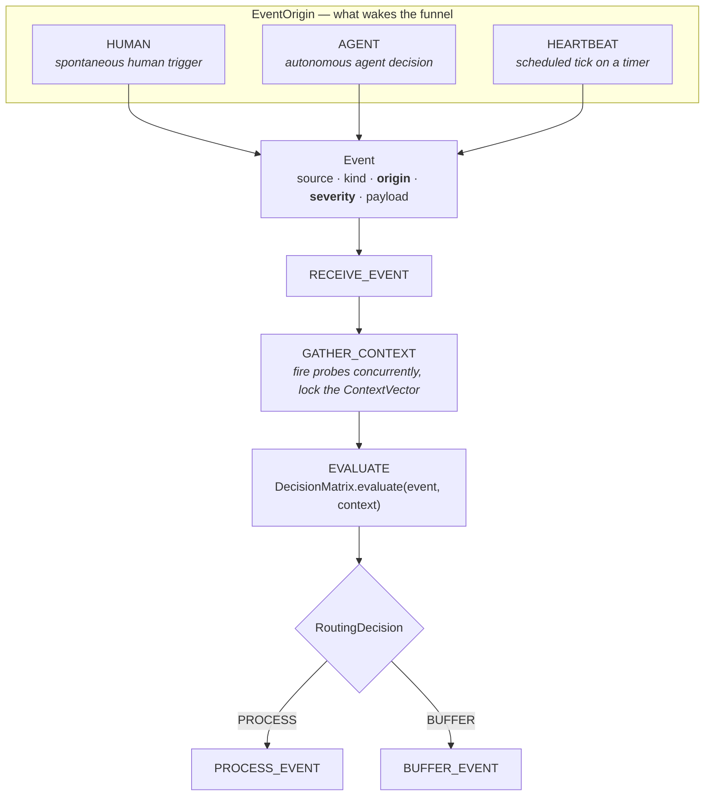
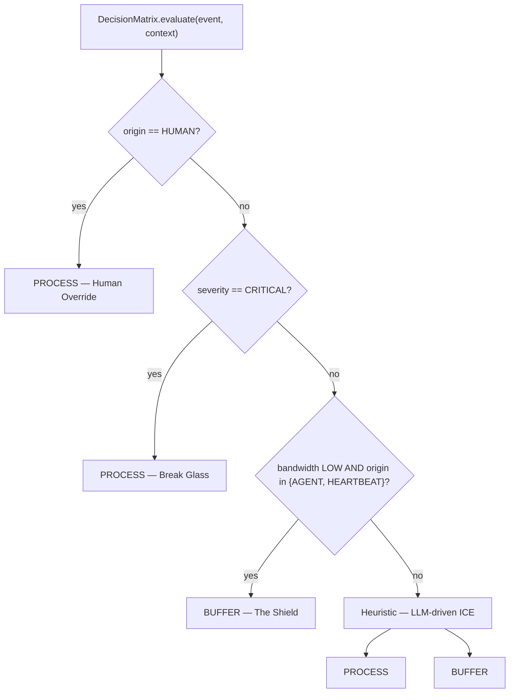
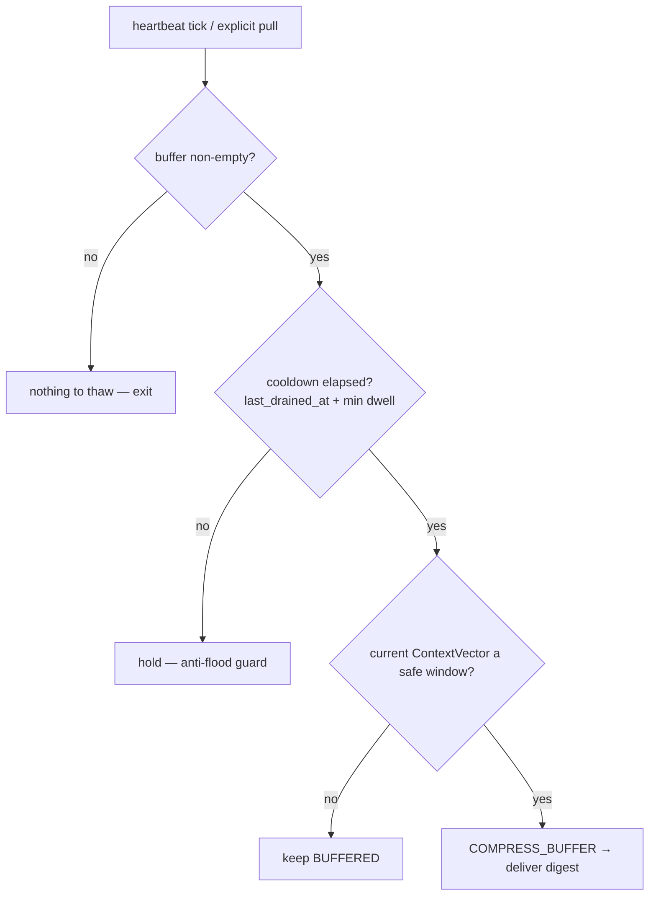
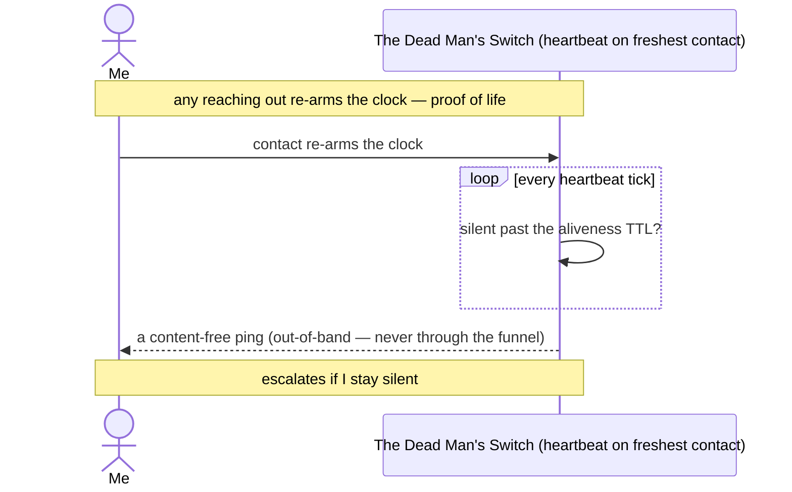
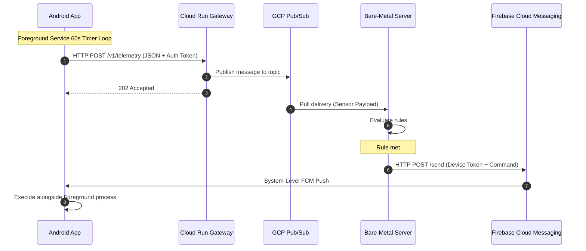

# Building The Joy — the first arc (sessions 1–12), and why I gave up on it

> **Status: abandoned.** This document merges the twelve build-log sessions of the first attempt at The Joy, end to end, losing none of the thinking. But it opens with the verdict the twelve sessions were quietly earning the whole time: **the initial approach was flawed at the root, and I scrapped it.** Everything below is kept as the record of *how* I arrived at that conclusion — the ideas are good, many of them survive into whatever comes next; the *frame* they were built in was wrong.

---

## Why I gave up — the four flaws

The first arc produced real design insight and real code (an A2A server, a working Gate, two persistence stores, a verified two-lane parser). It also went nowhere I actually wanted to live. Four root flaws, each traceable through the sessions below:

### 1. It was tied to Telegram
Session 1 literally starts by spinning up a Telegram bot on a bare-metal server as "the first brick." The entire transport story orbited a third-party messaging channel from day zero. I flinched at this early — session 4 is titled *"fuck Telegram"* — and by sessions 5/7 I'd demoted Telegram to a "dumb, content-free knock" for the Dead Man's Switch. But demoting it isn't removing the dependency: the architecture still assumed a public messaging provider as the outbound spine. **Session 12 delivered the proof in real time** — Telegram went unreachable on OpenClaw *while I was working*, the very channel The Joy leans on to reach me. A system whose whole promise is *reaching the human* cannot be hostage to one third party's uptime. The lesson that fell out — **double up first delivery, ≥2 independent channels, provider-independent at the point of contact** — is the one thing from the transport story worth carrying forward. The rest was Telegram-shaped from the start, and that was a mistake.

### 2. It was focused on LLM providers
A huge share of the design energy went into *which model vendor, at what privacy tier, with what fallback.* Session 5 makes the "intelligence router" the **first** structural thing to build ("building the gearbox"). Session 7 spends pages on the sovereignty-vs-intelligence paradox, the LARP of total privacy, trusting Google's enterprise ToS. Session 11 finishes the "provider gearbox" by cutting OpenAI and ranking ollama / Mistral / Google on a privacy-vs-performance grid. All of it is intelligent — and all of it is **transmission before destination.** Provider routing is plumbing. Treating the model-vendor question as foundational meant pouring months of reasoning into the gearbox of a car with no agreed-upon place to drive.

### 3. It was focused on the wrong feature
This is the realization session 12 finally names. The first feature I chose — **"receive check-ins"** — is a store-and-ack receiver. It has *no use* for the context-aware filter that is the actual point of The Joy (surface information at the right time, not all the time; respect boundaries; deliver when I can actually process). So every piece of the attention-routing machinery (the AttentionKeeper, the Matrix, the context reading) kept looking like "over-engineered scaffold" and got stripped to nothing — because the feature didn't exercise the one capability that makes The Joy *The Joy.* I built the plumbing (A2A server, two stores, persist-before-ACK, task store) first and deferred the soul to "phase B." Plumbing first, soul deferred — that inversion is the whole struggle, named at last. **And the trap on the way out:** "so the real first feature is the context-aware filter" is the *same mistake in new clothes* — the filter is the system's *purpose / north star*, not necessarily the smallest first thing to build. The purpose and the first feature are **not the same question.** The first feature is genuinely undecided, and must not be picked in a sentence.

### 4. The methodology was wrong for a side project
This is a side project. It should be something I can **start and stop based on my energy levels, and resume easily after days of inactivity.** The first arc was the opposite of that: dense, sprawling design essays (session 5 alone is ~500 lines); structure built far *ahead of* behavior ("the folders and contracts exist ahead of the behavior on purpose"); renames of renames; long philosophical addenda. Two sessions (5, 9) open by admitting low bandwidth / foggy re-entry — and the cost of re-entering this codebase cold was *high*, precisely because each session added conceptual surface area faster than it added shippable, droppable value. A side project that punishes you for stepping away is mis-built, no matter how elegant. The discipline I kept *preaching* (cheap re-entry, names that don't need decoding) is exactly the discipline the *project shape* violated.

**What survives the delete:** the design knowledge below (the ambiguity laws, the diary-bedrock discipline, the two-clocks model, the Gate's open-input/closed-axis trick, the persist-before-ACK ordering, the verbatim-label guard) is genuinely good and reusable. What dies is the frame: Telegram-anchored, provider-obsessed, built around the wrong first feature, with a methodology no side project should carry. The next repo starts from the feature that is *the point* — found as the smallest honest slice — not the plumbing around it.

---

# The record — how I got here

What follows is the full thinking of all twelve sessions, merged into one continuous arc. The voice is the building agent's "I"; "ND" is the human principal. The session logs were always immutable history; this is them, threaded.

---

## Session 1 — the Telegram-bot beginning

I want to build an agentic system to replace my usage of OpenClaw. Currently I use OpenClaw via Telegram, so the plan was: spin up a Telegram bot on a compliant bare-metal server in Europe first, with the **agentic entry point** as the first brick. I named the system **The Joy**, because I want it to spark joy in my daily usage of AI — tailor-made, for educational and practical reasons, built iteratively and ingenuously by design.

Setting up the bare-metal server, I locked myself out of my own Ubuntu box twice. The hardening checklist, in order: change hostname; create a `sudo`-enabled user; disable root login; allow SSH; save the SSH keys somewhere safe; disable password login; change the SSH port.

What landed in code: a Telegram bot that calls a LangGraph graph on receiving input text from me. Two repos under the `the-joy-com` org — `agentic-entry-point` (LangGraph orchestrator, a runnable entry point, structured logging, a `pre_process_hook` that does nothing yet but is the most important part: the seam to wire custom pre-graph code) and `telegram-bot` (the bot, env setup, README). Together: the first slice of replacing OpenClaw-over-Telegram. Next ideas noted: model selection based on input, a Redis memory checkpointer keyed to the Telegram session, context-rot handling via timely summarization.

> *In hindsight: flaw #1 and #2 are both born right here, in the first paragraph — Telegram as the spine, model-routing as the next move.*

## Session 2 — persistence as prerequisite

To build an agentic OS that helps me self-sustain, I need money and a persistence layer. This session: provisioning Postgres on the bare-metal server (for a still-secret financial-assets manager project). Install on Ubuntu 24: `apt install postgresql postgresql-contrib`, enable on boot, `createuser --superuser $USER`, `createdb $USER` — then any `psycopg` program connects via `postgresql:///my_ubuntu_user`. With the schema created, the next need: parse any unstructured data (Markdown, screenshots) for data entry, using plain LangChain chains (no graphs yet); the endgame is wiring this to discoverable MCP tools. But first, the tedious CRUD per table.

## Session 3 — trivial things that make the difference

Developing a new app (a portfolios manager for position/swing/intraday trading), you kill the DB several times until you're sure of the first migration. I tried plugging DBeaver into the server's DB over SSH — too much overhead, renounced, switched to running manual queries in the CLI on the server itself. Lesson re-learned: **be mindful what you ship.**

## Session 4 — "fuck Telegram"

While building spoton-ai.com's agentic engine, I found that iterating through ideas with a stylish interactive CLI gives me genuine pleasure. So, in terms of sovereignty and sheer DevEx: **I will abandon Telegram as my primary interface** for The Joy and the financial app, and use a terminal app plus an in-house Android APK that exists on my phone only.

> *The instinct to drop Telegram appears this early — but it never fully took, because the rest of the architecture kept reaching back for a public channel. Flaw #1 was diagnosed and not cured.*

## Session 5 — the big design dump: sovereign stack, the filter, the beachhead

The current *run* version of The Joy uses OpenClaw, mostly as an active diary. I have social difficulties; the diary helps me in many ways, and this list is the real spec of what The Joy is *for*:

- **act as a context-aware filter that surfaces information at the right time rather than all the time** — understanding situational context (don't bring up work tasks when I'm off the clock), respecting boundaries, delivering when I'm equipped to process, rather than being a constant source of digital noise;
- act as a persistent, always-on connection point to ground me during deep isolation;
- act as a strict, non-pacifying anchor during psychological crises — cold logic, not AI therapy or liability scripts;
- pre-emptively monitor my operational baseline (physiological, psychological, computational, material, financial) to predict crashes before they happen;
- manage daily routines and checklists, tracking momentum;
- anchor in reusable mental protocols (e.g. a "tabula rasa" working-memory wipe);
- answer "am I tripping?"; catch my own performative bullshit; channel mental chaos into building; cross-reference daily actions against long-term goals; evaluate relationships objectively (a personal CRM of people and their actions over time); offload emotional loops as cold data; practice deliberate "reward hacking"; give tactical "what next?" direction; offload the burden of remembering; gather field notes for a book; log daily highlights; record memories.

**Back to the agentic entry point.** Three weeks in, it's a minimal LangGraph orchestrator: a single conversational graph routing a chat request to one of several LLM providers at runtime, state is an accumulating `messages` list, flow is `pre_process_hook` (logging stub, with a TODO to pick model/provider) → `call_model`. It abstracts four providers — local Ollama (`llama3.1`), Mistral, OpenAI, Vertex (`gemini-3-flash-preview`). Early scaffold, no real routing/tools/retrieval/memory yet.

**The sovereign-stack reasoning** (real reflection vs. habit):

- *Protocol landscape (next 10 years):* a dual-protocol architecture — **A2A** (agent-to-agent orchestration: discovery via Agent Cards, delegation, JSON-RPC + SSE), **MCP** (the "USB-C of AI," standardizing tool/resource access), and **OpenAI API compatibility** as the de-facto inference lingua franca. Note: *exposing* an OAI-compatible layer only matters if you serve models to others; to merely consume, you only speak the schema as a client.
- *Orchestration dilemma:* LangGraph (defensible, but abstracts away token/state mechanics) vs. custom (`while`-loop boilerplate that scales poorly).
- *The sweet spot* for sovereignty + deep learning + stability: strip black-box frameworks for open standards and explicit code. **The stack:** a custom FSM in pure Python `asyncio` + `Pydantic` (explicit named states `THINKING`/`TOOL_EXECUTION`/`WAITING`/`DONE`, transitions only via defined events — never an undefined state); **PostgreSQL + pgvector** (JSONB for immutable checkpoints, pgvector for RAG from the ground up); **MCP** for all local environment interaction; **intelligence layer TBD** (local weights / hosted / mix, with manual context-pruning/summarization). Conclusion: zero framework lock-in, sovereign, transparent — mastering state, memory, token economics.

**On premature optimization:** is building a model-routing stub first premature? No — it's structural self-defense. Token economics and latency are the *physics* of an agentic system, not later optimizations. The intelligence router buys vendor sovereignty, tactical deployment (local zero-cost weights for low-voltage tasks), clean graph boundaries, and resilience/ fallbacks. "It's building the gearbox. It is exactly where the time should be spent at this stage."

> *This is the headwater of flaw #2 — the conviction that the model-routing gearbox is the right first investment. It reads persuasively. It was still the wrong place to spend the first months: the soul was never in question — this has lived in my head for months — but there was no working body to put it in yet, nothing a human could actually use, and the gearbox built neither.*

**Destroy time:** gutted everything LangGraph from the entry point (removed the constants file and the model-routing-by-tier scheme, reduced the entry point to a stub, removed LangChain/ LangGraph) to start building the tailor-made FSM.

**The first feature, chosen:** the context-aware filter. I framed it as building *Intrusion Countermeasures Electronics (ICE)* for my attention. The agentic counterpart of my human/ machine *symbiosis* (deliberately not "interface") should be:

**Context awareness** — model the operational reality as a multidimensional state vector: Bandwidth Allocation (task focus, decoupled from mood), Emotional/Psychological State, Macro-State (mode of execution), Momentum & Trajectory, Social Awareness, Spatial Awareness, System Readiness Baseline (Cognitive, Computational, Financial, Material, Physiological), Temporal Context.

**Notification decision matrix** — answer "should I notify the user with information *x* given context *y*?", including contextual buffering.

**Medium-appropriate delivery** — deliver via a suitable medium (possibly several).

*The context-awareness model (Pydantic + enums), tripartite:* `Environment` (hard coordinates: Temporal/Spatial/Social), `InternalState` (soft: Bandwidth/EmotionalState/MacroState/Momentum), `SystemReadiness` (quantitative fuel/hardware), wrapped in a root `ContextVector`. Why one root model: atomic immutable snapshots (no race conditions), single-call serialization for time-travel debugging (decoupled from the storage layer), and root-level cross-dimensional validators to flag impossible states.

*Aggregation layer (async gatherers):* a `ContextGatherer` implementing `BaseContextService`, one `async` probe per dimension (`probe_environment`, `probe_internal_state`, `probe_system_readiness`) plus a `gather()` that assembles the locked vector under a global timeout (so one stalled source degrades to `UNKNOWN` rather than hanging the snapshot). Three triggers, all funneling through one FSM entry point and tagged by `EventOrigin`: **HUMAN** (spontaneous), **AGENT** (autonomous), **HEARTBEAT** (scheduled). The gatherer is agnostic to which fired.

*FSM integration (the gatekeeper):* context awareness must be the first active state. Flow: `RECEIVE_EVENT → GATHER_CONTEXT → evaluate against Matrix → PROCESS_EVENT | BUFFER_EVENT`. The FSM is the un-bypassable funnel (the traffic light, not the traffic laws): it forces every event to lock reality, then hands `(Event, Context)` to the Matrix as a black box and waits for a binary command.

**The Decision Matrix (policy engine)** — two layers behind one `evaluate(event, context)` contract:
- *Physics (hardcoded boundaries):* zero-latency, zero-reasoning absolute limits. **Not** a blunt `if bandwidth == LOW: BUFFER` wall — that's the **Isolation Anti-Pattern** (muting the system when capacity is lowest abandons the human exactly when they need an anchor). Instead, an **Absolute Routing Law** keyed on origin and severity.
- *Heuristic (LLM-driven ICE):* anything clearing Physics enters the gray area, passed to a fast low-latency LLM that outputs strict `PROCESS`/`BUFFER`.

Implemented as a single concrete `DecisionMatrix` (variation *inside* it, not across siblings); only `BaseGatekeeper` stays abstract.

**The Absolute Routing Law (ordered, first-match-wins):**
1. **Human Override** — `if origin == HUMAN: PROCESS` (a human is never buffered by their own system).
2. **Break Glass** — `if severity == CRITICAL: PROCESS` (never ignore an emergency, including an autonomous AGENT decision that the human is in danger).
3. **The Shield** — `if bandwidth LOW and origin in {AGENT, HEARTBEAT}: BUFFER` (ruthlessly mute the agent's *own* self-initiated noise when capacity is low).
4. **The Heuristic** — everything else to the LLM.

Break Glass sits *above* the Shield on purpose, so a CRITICAL autonomous nudge is never muted.

| Module | File | Owns |
| --- | --- | --- |
| `Event` / `EventOrigin` / `EventSeverity` | `src/fsm/models.py` | Carries `origin` + `severity` as schema |
| `ContextGatherer` | `src/context/engine.py` | Snapshots reality — **origin-agnostic** |
| `DecisionMatrix` | `src/fsm/matrix.py` | The only thing that **reads** origin + severity |
| `Gatekeeper` | `src/fsm/engine.py` | Drives the sequence; consults, never decides |

**The Buffer mechanics (storage & the thaw):** buffered events persist with payload, timestamp, and the exact `ContextVector` that blocked them, in a `BUFFERED` state. Thaw triggers: *Context Shift* (a heartbeat lands in a high-capacity window), *Explicit Pull* ("what did I miss?"), *Heartbeat Digest*. On opening, an LLM **compresses** the queue into one high-signal digest (`COMPRESS_BUFFER → DELIVER_DIGEST`) — a flood of 20 delayed notifications is a failure of the ICE.

*The key design call:* the thaw is a **stateless level test, not a stateful diff.** "Detect a low→high transition" sounds like edge detection, but **the buffer's non-emptiness is already the memory of the prior low state** — so detection collapses to "is anything waiting, and is now a safe window?", re-asked fresh every heartbeat. Level beats edge: a missed beat or restart just drains one tick later (self-healing), where an edge would be lost forever. The only state needed is a single `last_drained_at` scalar (anti-flood cooldown) — no stored snapshot of the past.

Net-new abstractions the buffer needs: `Event.timestamp`, `BufferedEvent`, a `BufferStatus` enum, drain-path `State` members, a `BaseBufferStore` (holding `last_drained_at`), and a second thaw entry point — and deliberately **no** cross-cycle context memory.

**The first E2E implementation: Declarative Context Ingestion + The Dead Man's Switch.** Before anything else, **this iteration is a working diary**: I talk in my own words, and it keeps them verbatim, whole, forever, from entry one. Everything else (shield, manual drain, Dead Man's Switch) is machinery around that diary. The loop: pick an interface, send natural-language events ("EF 3, PF 4, at a cafe with Manon"), keep every message verbatim, triage the *typed slice* by the rules, commit both the raw words and the parsed signal. **We always `PROCESS` human input** — it's foundational.

Five structural imperatives so the shield doesn't fail silently:
1. **Biological Decay (TTL):** metrics expire (a strict ~9-hour threshold) and default to `UNKNOWN` rather than permanently muting the world.
2. **The Manual Drain (Explicit Pull):** no auto-thaw yet; hold buffered items silently until I ask "what did I miss?".
3. **The Ingestion Boundary:** a dumb translation layer *before* the Gatekeeper that catches raw human signals ("EF 3", "I'm dead") and turns them into typed `Event`s.
4. **Closed-Loop ACK:** conclude every state update with a deterministic confirmation back to my medium (so I know the armor locked).
5. **The Dead Man's Switch:** absence of check-in is a critical state transition; the HEARTBEAT monitors staleness; on TTL it injects a probe; if ignored it escalates to CRITICAL (Break Glass).

*In plain English, Iteration 1's scope: my own words, and only my own words.* No background producers yet — so the wall and the silent vault are **built and wired but dormant**: nothing feeds them. The five points, as three honest views: (A) my words in + the ACK back — the part that *fires*; (B) the shield + vault — built but dormant, a pull always returns "nothing missed"; (C) the Dead Man's Switch — the one autonomous behavior fully live.

```mermaid
sequenceDiagram
    actor Me
    participant TR as The translator (my words → typed signal)
    participant GATE as The funnel / traffic light
    participant MEM as My memory (newest-per-axis, decaying past TTL)
    Me->>TR: 1. "EF 2, at home"
    alt a clean declaration
        TR->>GATE: a clean declaration
        GATE->>MEM: always let through — commit
        MEM-->>Me: 2. ACK — exactly what I declared, only once committed
    else can't confidently place it
        TR-->>Me: honest "couldn't parse that" notice
    end
```

**Does this make it "agentic"? Yes** — natural-language understanding (the Ingestion Boundary), environment-awareness (the Gatekeeper locks reality into memory), and autonomous action (the Dead Man's Switch fires on the *absence* of input; the Shield is built but latent). The agent that owns this loop: **HumanSymbiotAttentionGatekeeper**, the sovereign edge node that will later speak A2A to internal agents.

**Structural decisions recorded as reflections** (each resolving a tension the imperatives only implied):
- **Time is two clocks, context is a projection.** Retroactive declarations broke the single timestamp: an **arrival clock** (intake ordering, cooldown, audit) and an **effective clock** (decay, Dead Man's Switch), the latter defaulting to the former. So the present vector is a **query that folds sparse deltas newest-effective-wins, per dimension**, dropping any axis aged past its TTL. Back-dated truth changes the future only, never a stamped past verdict. Decay and out-of-order resolution are the same fold.
- **Deterministic everywhere load-bearing; fence the fuzziness to the edge.** Parsing/intent/ "last night" resolution is the LLM's job; everything downstream runs on typed inputs. Stamp the resolved values at the boundary and persist them — replay never re-parses.
- **The funnel runs exactly one cycle at a time — enforced, not hoped.** One process-wide serialization point guards every entry (intake and drain), making the lock-free buffer actually safe.
- **The traffic light routes and records; the edges speak.** The funnel does the durable consequence of its verdict and nothing outward-facing; the ACK and the nudge belong to the entry points.
- **The Dead Man's Switch speaks; it doesn't route.** A nudge is an outbound *act*, not an inbound signal to triage — so the heartbeat emits it directly, and the routing law keeps its unexceptional shape (no special probe carved in).
- **Every input gets server-owned feedback; the interface only renders it.** Two intents recognized (declaration, pull); anything else returns an explicit "couldn't parse" — two buckets, no silent drops.
- **Storage shape mirrors the model:** a *narrow* per-dimension ledger (one row per declared axis), so the projection falls out of a newest-per-axis query.
- **Keep the words, not just the parse — the diary logs from day zero.** Every check-in keeps three things: verbatim text, the typed signal, and a free-text catch-all for unmapped narrative. Read none of the last bucket yet — *earn the data now, decide how to read it later.* A parse can be re-run; an unstored sentence is gone for good — so when in doubt, keep the words.
- **The two media are asymmetric on purpose:** sensitive declarations travel **inbound only** over a private loopback client; the public channel is demoted to a **send-only, content-free knock**.
- **The transport is the security boundary:** one user, private loopback over an already-encrypted channel obviates application-level auth — no tokens, no secret to leak.

## Session 6 — what an agent is (and isn't a loop)

An *agentic* application: takes decisions autonomously (without waiting for human approval), understands non-preformatted dynamic inputs (natural language), is environment-aware via connectors. When the goal is **open-ended** (step count unknown up front), a cyclical architecture earns autonomy (observe/react, multi-step reasoning, self-correct, manage non-deterministic control flow). But **acyclical ≠ not agentic.**

The Universal Agentic Lifecycle (open-ended case): INGEST → REASON → ACT → OBSERVE → EVALUATE → DECIDE (LOOP or TERMINATE). The diagram has *two* arrows into TERMINATE — one from DECIDE (looped at least once), one straight from REASON (answered in a single pass, zero loop rounds).

**Not every agent is a loop.** The loop is mandatory only when the goal is open-ended. **A check-in is single-pass:** parse free text, route, emit ACK — no second round to plan. Wrapping it in a six-stage iterate-until-done loop is pure ceremony. So: the loop is the control structure an agent runs for an open-ended tool-using objective — not a universal stamp. A shared runtime's job isn't to make every agent loop; it's to make looping *safe* for the ones that do (a cap on rounds, errors-turned-into-data, a deterministic stopping decision). Single-pass agents need none of that scaffolding.

## Session 7 — three hard problems under the simple loop

Iteration 1 looks simple, but underneath sit three problems that define a sovereign agent.

**1. The physics of silence (the Dead Man's Switch).** A sovereign agent proves autonomy by acting when I *don't* talk. "Silence" is the baseline of a series of **Tripwire Types** (when one snaps, the agent abandons passive ingestion for active "Search and Rescue"):
- *Temporal* — the baseline. A static 9-hour constant is brittle; the threshold should be **dynamic, state-dependent** (TTL scaling inversely with fuel: long leash at EF 8+, tight 4-hour leash at EF < 3, fixed block for declared sleep). **Maintainability:** the heartbeat contains zero logic — the Ingestion Boundary computes a hard `expires_at` at check-in time; the heartbeat is a dumb cron querying `WHERE NOW() > expires_at`.
- *Biometric* (future wearables), *Cognitive/Behavioral* (typo spikes, manic context-switching), *Social* (re-engaging known toxic nodes), *Spatial* (trapped in a "drain" node, or abnormally stationary).
- *Architectural hesitation:* overloading tripwires with non-fatal social/behavioral signals risks diluting the life-or-death severity. Open question: do non-fatal signals belong in "Search and Rescue" or in passive "default guardrails"?

**2. The topology of time (the two clocks).** Retroactive declarations are solved at ingestion: an LLM parsing problem. The boundary translates free-text timeline into a structured "Effective Clock" timestamp, stored independently of arrival.

**3. The sovereign edge (boundaries of intimacy).** The transport is the ultimate security boundary. The deepest telemetry (energy, depressive loops, toxic entanglements) can't be texted over a public channel. Declarations travel over the private `agentic-cli` (A2A); public networks get one dumb job — the outbound "knock." *Meta-note (the bootstrap cycle):* V2 is being ideated *through* V1 (OpenClaw) — the machine helping write its own successor.

**4. The weak spot: agent telemetry (who watches the watcher?).** We kept the Dead Man's Switch TTL a flat 9-hour constant for Iteration 1 (a dynamic tripwire failing on day one would be undiagnosable). This reveals a blind spot: **no dedicated logging/telemetry for the agent itself.** Day-zero observability: wrap the Ingestion Boundary's LLM step with **Opik** (local), structured JSON logs (`structlog`) on every state transition, and a durable Dead Man's Switch ledger (an `outbound_nudges` table — the agent owns the record of its own actions).

**5. The paradox of sovereignty vs. intelligence.** When the human is at their absolute lowest is precisely when they need the *most* intelligent model. Absolute local sovereignty would force a weaker model exactly when life depends on a stronger one. The LARP of total privacy: performing the aesthetic of cybersecurity at the cost of survival. True sovereignty is the lucidity to spend privacy capital when the ROI is your own cognitive survival. The contract underwriting that spend: enterprise ToS (paid tiers don't train on your data) — trusted not from naivety but from **the cold math of economic incentives** (a caught violation would break their entire enterprise cloud sector). Strategy: keep raw EF/PF local; push *sanitized* context to the paid, non-training tier for heavy cognitive lifting.

> *Sessions 5 and 7 together are flaw #2 at full volume — beautiful, lengthy reasoning about provider trust and tiering, before the soul of the product existed.*

## Session 8 — killing the confidence score, two laws, open-input/closed-axis

**Killing the confidence score.** The Gate used to return a `confidence` number with a 0.5 floor that refused to store the line below it. Torn out, for four reasons:
1. **The filter gets stricter exactly when I need it most.** Low confidence comes from fragmented, half-coherent input — *which is what a human in crisis types* ("im done. cant anymore. 1."). A confidence floor fails toward silence in the one moment the system exists to *not* be silent.
2. **It gated the wrong thing — persistence.** Two questions had been fused: "did I understand the numbers?" (fair to be unsure — the typed interpretation) and "should I keep what the human said?" (must never be in doubt — the diary). The parse may be unsure; the diary may not forget.
3. **It broke my own bedrock** ("when in doubt, the words are kept") — doing the literal inverse.
4. **The model was grading its own homework** against an arbitrary line (0.5, invented).

**The principle kept: capture-inclusive, flag-loud.** In a life-or-death system a *false reject* (dropping a real signal) is catastrophic; a *false accept* (storing a non-check-in) is just a noisier diary. So routing now keys on **intent alone**, not certainty. *(Open thread flagged: even a not-a-check-in still stored no raw words then — the intent gate on raw-text persistence was a separate later call.)*

**A naming pass:** the translation layer became **the Gate** (the single entrance where untrusted outside becomes a clean typed signal); the funnel formerly "Gatekeeper" became the **AttentionKeeper** (it keeps *my attention*, deciding whether a signal is worth my bandwidth).

**The through-line: derived, not stored.** A thing I can re-derive is not a thing I must store. This loosened much of the schema:
- `ContextVector → ContextDataPoint` ("vector" implied math/direction; it's one timestamped sample of reality).
- **Cut the three tags** (`location_tag`, `social_tag`, `current_focus_tag`) — derived projections reconstructable from `raw_text`, not physics.
- **Cut `note`** — a slice of `raw_text`, a derived field masquerading as stored.
- **The dictionary I didn't build:** rather than a closed enum of allowed labels, **the chaos of real life beats maintaining a dictionary.** Input vocabulary stays **open**; the set of *axes* (physics) stays **fixed**. Rule for an unmappable word: *map it if you can → fact; can't map → ask the human.*
- **Reshaping the self:** `SystemReadiness → HumanSymbiotResources` (raw fuel levels: cognitive, computational, financial, material, mood, physiological); `InternalState → HumanSymbiotFocusVector` (bandwidth, macro_state, momentum). Added `mood` (a float, home for "EF"); dropped `emotional_state` (regulation is *derived* from mood + momentum, a verdict, not a raw axis). Readiness and regulation are computed verdicts, not stored buckets.

**Two laws fell out:**
1. **"alive" vs "well".** The Dead Man's Switch asks *are you alive?* (re-armed by any contact). A **sibling switch** asks *are you well?* (re-armed only by a fresh fuel reading). "Concerning" became **deterministic**: the fuel axes decayed to `UNKNOWN` — a clock, not a vibe. Fires proactively, once, then awaits a reply.
2. **can't-read-you → ask (not drop).** If context + raw text can't determine crisis-or-not, *assume crisis and act* — here, "act" = ask for detail immediately. Closes the open thread: "im done. cant anymore." isn't dropped — *can't read you → talk to me.*

**The floor I wrongly threw out.** ND pushed back: can't we set global life-and-death rules on the dimensions we have? Yes — I'd conflated two things under "low-value, rejected": (1) a model self-grading a vibe (stays gone — confidence in a new hat), and (2) a **hard threshold on a declared axis** (EF at the floor vs. a constant — *exactly as deterministic as the staleness clock*). The real dividing line is **a rule over the data vs. a judgment of the data.** So Law 1 has **two deterministic concerning-conditions**: *gone quiet* (decayed to UNKNOWN — the clock) and *bottomed out* (reported at/below a hard floor). **Gotcha:** the floor must exclude the unknown sentinel — `0.0 <= mood <= FLOOR`, never `mood <= FLOOR` (which would fire on `-1.0`).

**When the *answer* is unreadable too** (the R3 → Law 2 hand-off, the loop's exit): (1) keep the words (the second unreadable reply still lands in `raw_text`); (2) stop asking (fire-once-then- hold — a second "huh?" is alarm-fatigue); (3) escalate, don't re-ask (persistent illegibility is itself the lights-went-down signal, sliding up the same lever to Law 2). So "still unreadable" is by design *not* R3's problem — first unreadable line is R3, a second is Law 2.

**Then I built it — open input, fixed axes.** A `ContextAxis` enum (cognitive, computational, financial, mood, physiological — the declarable float fields; `material` excluded as a *observed* bool). The Gate emits a `Delta` carrying both the verbatim `label` ("EF", "vibe") *and* `axis: ContextAxis | None` — `axis` is an enum in the structured-output schema, so a hallucinated axis is **structurally impossible.** `ParsedSignal` grows derived `.facts` (axis resolved) and `.unmappable` (axis None). Persistence books only `signal.facts` on `delta.axis.value` (migration `0002`: `label TEXT → axis TEXT`). `build_ack` confirms mapped facts (echoing verbatim labels) and appends a clarifying question for the unmappable — the low-stakes end of Law 2. Local check: `EF 3, PF 4, vibe 5` → facts `[mood 3, physiological 4]`, unmappable `['vibe']`, ACK *"EF 3, PF 4. I couldn't tell which fuel 'vibe' means — which is it?"*; a junk axis is schema-rejected.

## Session 9 — the keystone left unbuilt, two stores, layering

A foggy-day re-entry, asking to be walked back in slowly. The agent only ever does two jobs — *are you alive?* and *what's your state right now?* — everything else is plumbing. **The second job has no organ yet:** I store sparse deltas but nothing folds them into one picture of *me now*. That's the **keystone** — the projection, newest-effective-wins per axis with TTL decay. It's the eyes; until it exists the router can't ask "is bandwidth low?", the *are-you-well?* switch has nothing to watch, no one can answer "how am I doing?".

**Renames for cheap re-entry:** `current(now) → snapshot(now)` (a name you read without decoding). `reported_fact → unmapped_prose` (most of what lands there is a thought/feeling, not a fact).

**The task-store blob.** We persist the protocol's `Task` objects. We **don't own the Task type** — the SDK does. Storing the whole object verbatim is lossless and drift-proof; the blob *is* queryable, the real cost is coupling to internal paths the SDK can move. Fix from the other side: **stamp each row with the SDK version** that produced it — old rows keep their shape, queries branch on the stamp. That dissolves the only reason to split into columns (drift risk) without a migration.

**agent-native ≠ agent-only callers.** The Joy is **agent-native** — it presents *itself* as an agent (a discoverable Agent Card, one `check-in` skill, over A2A), intelligence server-side. Agent-native describes the **door, not the caller**: a dumb deterministic script, a human-driven CLI, and an autonomous peer agent all call the same front door. (The Joy as A2A *client* stays deferred.)

**Two stores, two jobs:**
- `check_ins` / `check_in_facts` — the *contents of the letter*: my reported fuel deltas, **The Joy's own data**, the diary.
- `a2a_tasks` via `PostgresTaskStore` — the *envelope and receipt*: the A2A `Task` (id, lifecycle, artifacts), **the protocol's bookkeeping**.

One `SendMessage` writes one row in each; the S3 ordering is the seam — `check_ins` commits first, *then* the task earns its `completed` artifact. Why a custom store: the SDK's `DefaultRequestHandler` *requires* a `TaskStore`; I chose durable Postgres over `InMemoryTaskStore` (survives restart, queryable telemetry, addressable `Task` IDs for later poll/audit) on my one `psycopg` stack rather than dragging in the SDK's SQLAlchemy `DatabaseTaskStore`. The one-liner: **`PostgresTaskStore` is the protocol's memory of the *interaction*; `check_ins` is The Joy's memory of *me*.**

**Moving the ACK to where it belongs.** Lifted `build_ack` out of `transport/a2a/mapping.py` into `skills/checkin/ack.py`, beside the `ParsedSignal` it speaks about. **Wire translation is transport; the reply voice is domain.** Rewrote the worst copy: `"input processed"` (a receipt-printer string) became `ACK_EMPTY = "copy, what's your status?"` — a check-in with no readable reading is itself a flavor of can't-read-you → ask.

**Raw declared values vs. the normalized model — two spaces, no bridge yet.** `mood = 3`, `physiological = 4` land in `check_in_facts` while `HumanSymbiotResources.mood` is bounded to `[-1.0, 1.0]`. Not a bug: (1) the **raw declared value** (what I said — the diary, no bounds) vs. (2) the **normalized model value** (the projected interpretation). The write path never instantiates the model, so validators don't fire on the way in. The bridge is `snapshot(now)`, the unbuilt keystone. So **at this stage it is normal that recorded values are RAW and outside the model bounds.** (Tightened the field descriptions: named numbers are *endpoint anchors on a continuum*, `-1.0` the only discrete special case.)

**temperature=0, and the trap of testing an LLM for an exact string.** ND: why not set `temperature=0` everywhere? For a structured-extraction call, yes — you want the single most-likely parse — and there was exactly one call site (`gate.py`). But `temperature=0` is **greedy decoding, not determinism** (float non-associativity, tie-breaks, moving model tags). It buys lower variance, not reproducibility — which is *worse* for a test (green locally, red in CI three weeks later). The predictability the system needs is **not at the LLM layer**: it's the typed `ParsedSignal` schema, the closed `ContextAxis` enum, the deterministic `build_ack` — those hold at any temperature. So the test follows the contract, not the model: `tests/test_gate_extraction.py` (first real pytest) asserts a clean `EF 3, PF 4` is a check-in, resolves onto the closed axis set, and unrelated prose isn't booked. Needs only ollama; skips (never fails) if unreachable; no exact-ACK-string asserts.

**"user" is a lie; "the human symbiot" is the truth.** A vocabulary pass ruled class-by-class (4 decisions, not 50): protocol/infra `user` untouched (`{"role":"user"}`, `POSTGRES_USER`, "single-user"); `EventOrigin.HUMAN` kept (the genuine human-vs-agent-vs-heartbeat contrast); "Human Override" kept as the term of art; prose "the user" → "the human symbiot" at identity-defining anchors only (not mechanically everywhere). **The Gate's LLM system prompt deliberately still says "human"** — it's machine-facing, only llama3.1 reads it; "symbiot" is rare wording that could nudge the parse for zero human-visible benefit.

**`probe_focus` was a lie too: acquire by source, not by output slice.** Three `probe_*` methods welded to output slices — but with no biometrics, the only way the system learns my focus is *me typing it*, so `probe_focus` can't probe anything (and "probe" means reaching *outward*; declared data flows the other way). The 3-way split was applied at the wrong layer: tripartite is the right *output* shape, but *inputs* divide by **source**: **`sense`** (outward — clock, location, social exposure, hardware, budget) and **`recall`** (read back my declared state from the ledger). A third thing has no source at all — `momentum`/`macro_state` are **derived**, belonging in `gather`, not a probe. So three probes collapse to two + a derive step; `gather` is also the adapter stitching source-shaped output (`Observation`, `Declaration`) onto the consumption-shaped tripartite. `recall` *is* the keystone projection seen from the acquisition seam.

**Parked deferrals (moved out of the working plan, verbatim):** the C6 two ambiguity laws (recorded as standing law, no consumer this iteration); explicitly-deferred items — automated thaw triggers, buffer digest compression, real OS/hardware probes, the `HIGH_REASONING` tier on the happy path, the A2A surface beyond the minimal subset (streaming/push/gRPC/extended card — *auth schemes are obviated, not deferred*, by single-user + SSH tunnel), orchestrator-as-A2A-client, inbound Telegram, web UI, leveraging `unmapped_prose`, cross-dimensional validators, rich Heuristic ICE prompting.

**Killing `unmapped_prose`.** The verbatim line already lives in `check_ins.raw_text`, so `unmapped_prose` was only a pre-isolated *slice* of a line we keep whole — pre-shaping for an absent consumer. Killed the column, extraction, and the "leverage later" deferral; zero input lost.

**Already thinking of the mobile app.** A Pub/Sub I/O design: phone foreground-service samples sensors every 60s → Cloud Run gateway → GCP Pub/Sub (durable shock absorber) → outbound-only gRPC pull consumer on the bare-metal server → FCM silent data-message back to the phone. Keeps core logic sovereign while using GCP only for high-availability edge ingestion.

## Session 10 — budget bug, blank-field audit, the states lane

**3AM, nightmare night, so I'm coding.**

**Budget is recalled, not probed.** The context contract listed *budget* as something `sense` probes — but budget is a number *I* keep in a kakebo by hand; the host can't sniff my spending. Moved `financial` from `Observation` to `Declaration`, repointed `gather` at `declared.financial`. While there: budget means *household money*, not API spend — reframed `financial` and the gate's listen-words ("budget / money / spending / kakebo").

**One source falling over shouldn't blind the other.** `gather` ran `sense` + `recall` under a single timeout — if one hung, the timeout cancelled both. Made it partial-tolerant: each source bounded by its own timeout, a failure degrades to an all-UNKNOWN bundle while the other rides through. Clean because the schema already has a word for "couldn't tell" (`UNKNOWN` / `-1.0`). The one thing *not* caught: cancellation (the caller tearing down on purpose must propagate).

**Social exposure has no home in Iteration 1.** Following the thread: declared social exposure fits **nowhere typed** — `ContextAxis` is all quantitative floats, `Declaration` has no `social` field, the gate only pulls numeric deltas. "at a cafe with Manon" is kept whole in the diary but never reaches `Environment.social`. **The divergence:** session 5 said Iteration 1 could populate Spatial/Social/Macro-State immediately off declarations; the code lands on the *next* sentence — "the capture is free; the reading-back waits." Comfortable leaving it because nothing *reads* `Environment.social` this iteration, and it's recoverable from the verbatim words. Spec for when I build it: (1) a categorical declaration path (a parallel lane resolving free text to an enum); (2) the first dual-source axis (observed calendar + declared me); (3) precedence = freshest-effective wins.

**Mapping every blank field.** The check-in channel carries one shape — a numeric `value` + an `axis` from the closed set. So of 13 fields: **Reachable (4)** — mood, physiological, cognitive, financial. **Waiting on a probe (4)** — day_type, time_of_day, computational, material (observed, fill when `sense` reads the clock/host). **Structurally blank (5)** — social, spatial (declarable per session 5 but no lane), `bandwidth` (on `Declaration` but categorical, so the gate can't set it — *and the Shield keys on `bandwidth == LOW`, making the one capacity signal the Physics layer reads permanently unreachable*; survives only because the Shield is dormant), macro_state, momentum (derived). Three of the five blanks share one root cause: **a declaration channel that only speaks numbers, no categorical lane.**

**`computational` is a dual-source dead-end** (the mirror of the budget bug): a declarable `ContextAxis`, the gate routes "hardware → computational", a `Delta` books it — *but there's no `Declaration.computational`* and `gather` reads `observed.computational`. So declaring "my machine's fried" is captured then silently dropped on read-back.

**The decision.** The blind spots split in two, and only one half is mine to fix now:
- **`social`, `spatial`, `bandwidth`, `macro_state` are *my own words*** — Iteration 1's scope is literally "my own words," so they can't wait for sensors. They get a **states lane**: same shape as numeric deltas, the value a fixed state-word. (`momentum` stays the one honest deferral — a trend, not a single line.)
- **Discrete, not open values** — the state the engine *acts on* must be one of a fixed few. The resolved value is a closed enum snapped by the LLM at parse time; the World's chaos isn't lost (raw words kept whole) and the rich detail ("cafe", "Manon") is mined later with embeddings. Fixed enums for now; open entity-mining over the words later. Two layers, never mixed.
- **`computational`: I was wrong to "just sense it now"** — no OS probes this iteration, and it's multi-device (laptop + phone, the deferred telemetry feed). Deferring is correct. The only fix now: **stop routing "hardware → computational" through the gate** (kill the dead-end); leave it (and `material`) as observed axes awaiting the device feed.

**Built the states lane** (deliberately the same shape as the numeric lane): `CategoricalAxis` (social, spatial, bandwidth, macro_state, each value a field name on `Environment` / `HumanSymbiotFocusVector`); `CATEGORICAL_AXIS_VALUES` mapping each axis to its token enum (`SocialContext`, `Location`, `Bandwidth`, `MacroState`) so the gate prompt renders vocabulary straight from the enums; `StateDelta` (verbatim label in, closed axis out, value a resolved token); `ParsedSignal` now has two lists. The gate learned a second extraction section and lost the "hardware → computational" line. The ACK speaks both lanes. Storage got `check_in_states` (twin of `check_in_facts`, `value TEXT`), both writes in one transaction. Removed `COMPUTATIONAL` from the declarable set. What's left for the lane to *move the snapshot* is `recall` — still a stub.

**The device went quiet: a feedback loop for the missing half of telemetry.** Session 7's "who watches the watcher?" — the agent tracks *my* telemetry, nothing tracks the agent's. The device feed opens a second blindness: **a device that's supposed to report can simply stop.** The idea: the **sensed device watches the central server**, off-host — *is central up?* — and if the host goes silent, the device fires the alert client-side. Why the arrow matters: **a watchdog inside the thing it watches is blind to its own death.** The Dead Man's Switch is a cron *on the host*, so the one failure it can never report is the host crashing. A device checking liveness from outside breaks that circularity. It's a **mirror of the Dead Man's Switch** — two heartbeats facing each other. Strictly future (gated on the device feed), and only works *because* it's off-host (so the device-side watcher is its own thing to keep honest).

**The test that caught the lane lying.** Bringing the README's test vectors in step with the states lane, found `tests/automated/` had *zero* assertions on the new lane. Added the categorical twin (`"at home, alone"` → spatial `primary_base`, social `solitude`). **It failed on first run** — the most useful thing all session. Two bugs:
- **Invariant — the axis is always dropped.** The model resolves the *token* perfectly but leaves `axis=None`, so every declared state lands in `unmappable_states`. The twelve tokens are **globally unique** across the four axes, so asking for both `axis` and `value` is redundant — the token already names its axis. Fix: stop asking for the axis, **derive it from the token** via a reverse map generated from `CATEGORICAL_AXIS_VALUES`.
- **Noisy — cross-lane hallucination.** A categorical-only line spawns phantom numeric deltas. ND's instinct: **two LLM calls, not one** — give the small model less to chew. The two cures are **orthogonal**: the split cures hallucination (a focused call has no other-lane field to bleed into); derive-from-token cures axis-drop. So: two focused calls, the categorical one returning tokens only, run **in parallel** (the same partial-tolerant `gather` shape). A bonus: `is_check_in` stops being a model judgment — a line is a check-in if *either* lane extracted anything. Staged smallest-first: derive-axis now, then the two-call split as its own change. README updated; the new test **kept failing on purpose** (the red test is the lane telling the truth).

## Session 11 — the fix, and the verbatim-label guard the plan didn't predict

Picking up the staged plan. Ran the three vectors first to confirm the diagnosis held (it did).

**Step 1: derive-axis (the smallest honest step).** A reverse map `TOKEN_TO_CATEGORICAL_AXIS` (generated from `CATEGORICAL_AXIS_VALUES`, can't drift); a `StateDelta` validator back-filling `axis` from the token (ignoring what the model put there); one trimmed prompt line. Off-enum token → no axis → ask (the correct unmappable path). The red case went green; the round-trip booked into `check_in_states` for the first time.

**Step 2: the two-call split.** Two wire schemas (`NumericExtraction` / `CategoricalExtraction`), one domain shape (`ParsedSignal` assembled from both, never handed to a model). ND's deeper change: **drop `axis` from the categorical wire shape entirely** — `StateToken` is `{label, value}`, the model never sees an axis field to fumble. `is_check_in` falls out as `bool(deltas or states)`. Partial tolerance via `asyncio.gather`; only a both-lanes failure raises `IngestionError`.

**Where the plan was wrong — and it's the good part.** Session 10 said "the split cures the hallucination." It half did — it cured cross-lane *field* bleed. But a hallucination the split **doesn't touch** fell straight out: **few-shot example copying.** Three faces — *field swap* (token in `label`, raw word in `value`, taught by my own example sentence — fixed by making the example an explicit object), *example parroting* (a wordless line emitting the literal `EF 3, PF 4` from the prompt example; and the categorical lane returning the favour), *relabeling* ("ZZ 9" → `EF/mood=9`). **The lesson: the split was the wrong tool for this half.** No "don't copy the example" instruction makes a small model reliably stop. The honest cure is the one the codebase preaches — *determinism lives downstream, in the typed schema.* So a deterministic backstop: **a state or delta is only kept if its verbatim label actually appears in the line** (`_present`). A label claiming to be my exact words but absent from the text is, by definition, a fabrication — dropped, not even asked about. Every example-parrot vanished. So the split shipped, but **the thing that actually made the lane trustworthy was the verbatim-label guard, which I hadn't planned at all.**

**What's true now:** both lanes isolated and stable; categorical-only books no numbers, numeric-only books no states, mixed books both, unknown labels kept and asked about (never fabricated), gibberish parses to nothing. All three test vectors green (automated 4/4, full round-trip, by-hand QA). **The fuel ledger no longer accepts a single fabricated fact** — the property that mattered most.

**A small renaming:** `ContextDataPoint → ContextReading` (a *reading* is an instrument's value at a moment — what the snapshot is). Live files + `plan.md` only; past session logs keep the old name (a journal records what was true when written).

**Two schema questions, both "no" (same reason: keep each invariant in one place):** a SQL `CHECK` pinning `axis` to the closed set? No — that closed-ness is already a Python invariant (enum + derive-axis), and only resolved states are booked, so every written `axis` is legal by construction; a hand-written CHECK is a second source of truth that drifts. A `created_at` row clock? No — `happened_at` (when the state was true) and the arrival clock (`check_ins.reported_at`, once per message) already cover it; with same-transaction writes `created_at` just duplicates `reported_at`. It earns a column only when re-parse/back-fill lands.

**Is `check-in` really an A2A skill?** Yes, cleanly. An A2A skill is a *declared unit of capability* (coherent, task-shaped, defined I/O, advertised on the card — like the spec's `currency-conversion`, `route-planning`). "free-text in → deterministic ACK out" is exactly that shape. The *distinction* that surfaced: "is `check-in` a skill?" (capability — yes) vs. "is the skill *layer* doing routing yet?" (architecture maturity — not yet; one skill, the executor runs the one round-trip unconditionally, intent-detection lives inside the executor as self-screening). A one-skill agent is no less an A2A agent. The dispatch seam lands the day a *second* skill arrives.

**Dropping OpenAI: the provider gearbox.** ND cut OpenAI entirely. The roster is a **two-dimensional choice** — *how performant?* against *most privacy at that performance?* — and three gears cover the span: **ollama** (total privacy, the default floor), **Mistral** (EU-regulated privacy, French, about to be fully EU AI Act compliant — the strongest guarantee *off* the local box), **Google / Gemini** (the high-performance gear, least private; the pragmatic anchor — ND's 40, has lived inside Google since his first Android phone). OpenAI mapped onto none of those gears, so it goes.

> *Session 11 is, in retrospect, flaw #2's last gasp dressed as a clean decision — a careful privacy-vs-performance ranking of model vendors, for a product whose first feature was still the wrong one.*

**A note for next time:** the verbatim-label guard is lenient by design (drops a real state only if the model rewords the label off the line) — fine for Iteration-1 data (raw words kept, re-parseable). And `recall` is still a stub: the lane *captures* states from day one, but folding them newest-per- axis into the snapshot is the next real build.

## Session 12 — docs, the scaffold strip, and the realization

No behaviour moved — not a line of `src/` changed. This was about the *map*, and about a realization the cleanup surfaced.

**The docs.** Wrote `docs/folder-structure.md` (the standing map: layers that each know only the layer beneath, pure data / pure shape / behavior never sharing a file; the `transport → skills → attention → lib` stack). The README became a lean hub pointing at three docs (`behavior.md`, `ops.md`, `folder-structure.md`) plus the QA handbook. **The drift the split surfaced:** moving the behavior text verbatim carried a stale claim — the Gate described as "one LLM call" when session 11 made it **two parallel calls.** I deliberately did *not* silently fix it under cover of a move (that's quiet history-editing) — flagged it for ND instead.

**A live outage — don't single-thread delivery.** While we worked, **Telegram went unreachable on OpenClaw** — the very channel The Joy leans on to reach me. The outage *is* the lesson: if first delivery rides one provider, that provider's bad day is The Joy's silence, exactly when a Dead Man's Switch nudge most needs to land. Standing intent: **double up first delivery — ≥2 independent channels — provider-independent at the point of contact.** The delivery-side mirror of the provider gearbox. *(This is the seed of flaw #1's final diagnosis.)*

**Then ND said: strip the scaffold.** Reading the folder map, ND didn't like all the structure standing *ahead of* its behavior: "I don't want to keep future-phase scaffold, this clutters my brain." So we cut — the buffer subsystem (`BufferedEvent`, `BaseBufferStore`, `release`), the entire `attention/context/` package, the speculative ABCs, the future routing fields on `Event`. The closed-axis vocabulary the Gate actually resolves onto was relocated to `skills/checkin/axes.py`. `attention/` went from nine files to three. Tests stayed green.

Then ND pushed the razor one notch further: **why does a thing that only receives check-ins have an AttentionKeeper at all?** He was right — after the strip, the funnel was a `PROCESS`-always no-op, ceremony between Gate and persist. So we removed it too, collapsing the round-trip to **`free text → Gate → persist → ACK`** and deleting the `attention/` layer entirely.

**The realization: I started with the wrong feature.** The cleanup had been treating the symptom as the disease. All session I'd been deleting the AttentionKeeper as "over-engineered scaffold." But the over-engineering was never the funnel — **it was choosing "receive check-ins" as the first feature.** A check-in receiver is a dumb store-and-ack; it has no use for context-aware routing, so of course the keeper looked like dead weight. The honest answer wasn't "remove the keeper" — it was **"the keeper is the product, and check-in was the wrong vehicle to build it on."** The *point* of the system is right there in the session-5 roadmap: the context-aware filter (surface at the right time, respect boundaries, deliver when I can process). The AttentionKeeper / Matrix / context reading I kept deleting were an embryo of it. I built the plumbing first and deferred the soul to "phase B" — months of honest, well-tested infrastructure for a glorified note-taker.

**Careful — don't anoint a new "first feature" either.** The trap I walked straight into: "so the real first feature is the context-aware filter, restart from that." **That is the exact same mistake in new clothes.** The filter is even *more* ambitious (it needs situational context, sensing, "off the clock", boundaries, timing). The point of the system and the first feature to build are **not the same question.** Check-in was a wrong answer to the second; "the context-aware filter" is a wrong answer to the second *too* — it's an answer to the first. The filter is the north star (the *why*); it is almost certainly not the smallest real slice (the *what-first*).

**The decision.** Scrap the repo. The first feature is **genuinely undecided** — and that's the point of stopping rather than charging at the filter. The job before any code: find the smallest slice that is unmistakably *The Joy* and not plumbing — shippable without a phase-B promise, real enough that it filters or respects a boundary in some honest, narrow way. Maybe a sliver of the filter; maybe something not yet named. **Don't pick it in a sentence.** Two lessons survive the delete: **(1) start from the feature that is the point, not the plumbing around it; (2) don't mistake the system's *purpose* for its *first feature* — naming the north star is not choosing the first small thing to build toward it.**

---

## The durable knowledge worth carrying forward

Stripped of the four flaws, here is what this arc actually figured out — reusable in whatever comes next:

- **The diary bedrock.** Keep the raw words verbatim, whole, forever, from entry one. A parse can be re-run; an unstored sentence is gone for good — *when in doubt, keep the words.* Anything derivable from the words is safe to recompute and need not be stored (`note`, the tags, `unmapped_prose`, `emotional_state` all died to this rule).
- **Capture-inclusive, flag-loud.** In a life-or-death system, a false reject is catastrophic and a false accept is just noise. Never gate *persistence* on the model's certainty. Routing keys on intent, never on a self-graded confidence number.
- **A rule over the data vs. a judgment of the data.** Deterministic rules (clocks, floors over declared axes) stay; fuzzy self-graded vibes go. "Concerning" is a clock, not a vibe.
- **The two ambiguity laws.** *alive vs. well* (the Dead Man's Switch re-arms on any contact; a sibling wellness switch re-arms only on a fresh fuel reading, firing on two deterministic conditions — gone-quiet and bottomed-out, the floor excluding the unknown sentinel). And *can't-read-you → ask, not drop*, with the R3→Law-2 escalation as the loop's defined exit.
- **Two clocks, and the snapshot as a projection.** Arrival clock vs. effective clock; the present state is a newest-effective-wins-per-axis fold with TTL decay, not the last row written.
- **Open input, closed axis.** The chaos of real life beats maintaining a dictionary. Keep the input vocabulary open; fix the *axes* (the physics). A hallucinated axis is structurally impossible when `axis` is an enum in the structured-output schema. Unmappable → ask, never force or silently drop.
- **Determinism lives downstream of the parse.** Push all fuzziness into the LLM parse precisely so everything after it (typed schema, closed enums, deterministic ACK, the verbatim-label guard) is hard and reproducible at any temperature. Don't anchor guarantees on `temperature=0`.
- **The verbatim-label guard.** Keep a delta/state only if its claimed verbatim label actually appears in the line — the cheapest, most robust defence against few-shot parroting in a small model.
- **Two-lane parsing, two focused parallel calls.** Less for the small model to juggle; one lane falling over doesn't blind the other; derive the categorical axis from the (globally-unique) token rather than asking the model for it.
- **persist-before-ACK (S3), two stores.** `check_ins` (The Joy's memory of *me*) commits before the protocol's `Task` earns its `completed` artifact (`PostgresTaskStore`, the memory of the *interaction*). Version-stamp the protocol blob rather than splitting it into drift-prone columns.
- **Names that don't need decoding.** `snapshot(now)` over `current(now)`; the Gate vs. the AttentionKeeper; `unmapped_prose` over `reported_fact`; `sense`/`recall` over three lying probes; "the human symbiot" over "user." Cheap re-entry is a feature you build for your own future self.
- **The transport is the security boundary.** Single-user loopback over an already-encrypted channel obviates application-level auth. Sensitive declarations inbound-only; any public channel is a send-only, content-free knock at most.
- **Double up first delivery.** ≥2 independent channels, provider-independent at the point of contact. One channel down degrades to a backup, never to silence.
- **agent-native describes the door, not the caller.** A discoverable Agent Card + A2A admits a dumb script, a human-driven CLI, and a peer agent alike. A one-skill agent is no less an A2A agent.
- **The off-host watchdog.** A watchdog inside the thing it watches is blind to its own death; the sensed device watching central from outside is the mirror that closes "who watches the watcher?".
- **Not every agent is a loop.** The loop earns autonomy only when the step count is unknown; a single-pass check-in shouldn't be dressed in a six-stage iterate-until-done ceremony.

And the meta-lesson the whole arc is a monument to: **for a side project I need to start and stop on my energy and resume after days away, the build itself must be cheap to drop and pick up.** Structure ahead of behavior, sprawling design essays, and renames-of-renames are taxes on re-entry. The next attempt earns its plumbing only after the soul exists, in the smallest honest slice.
